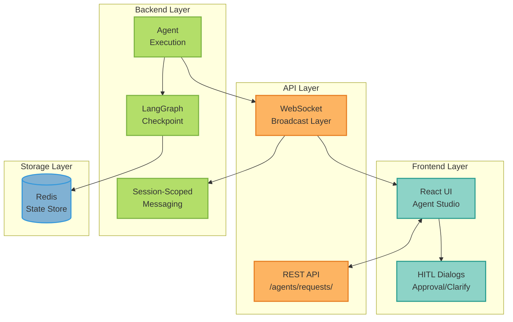
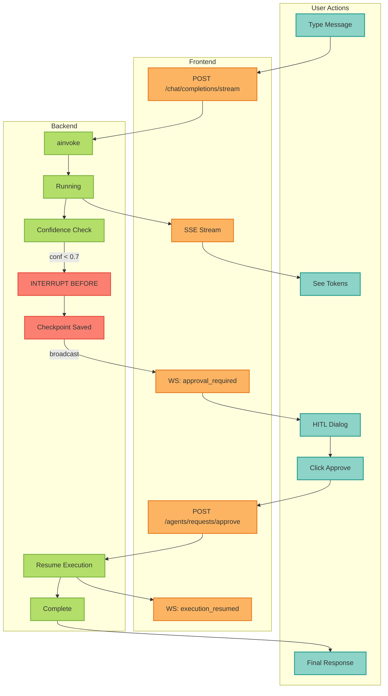
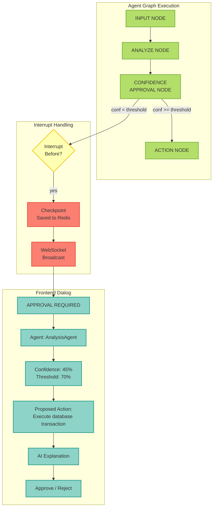
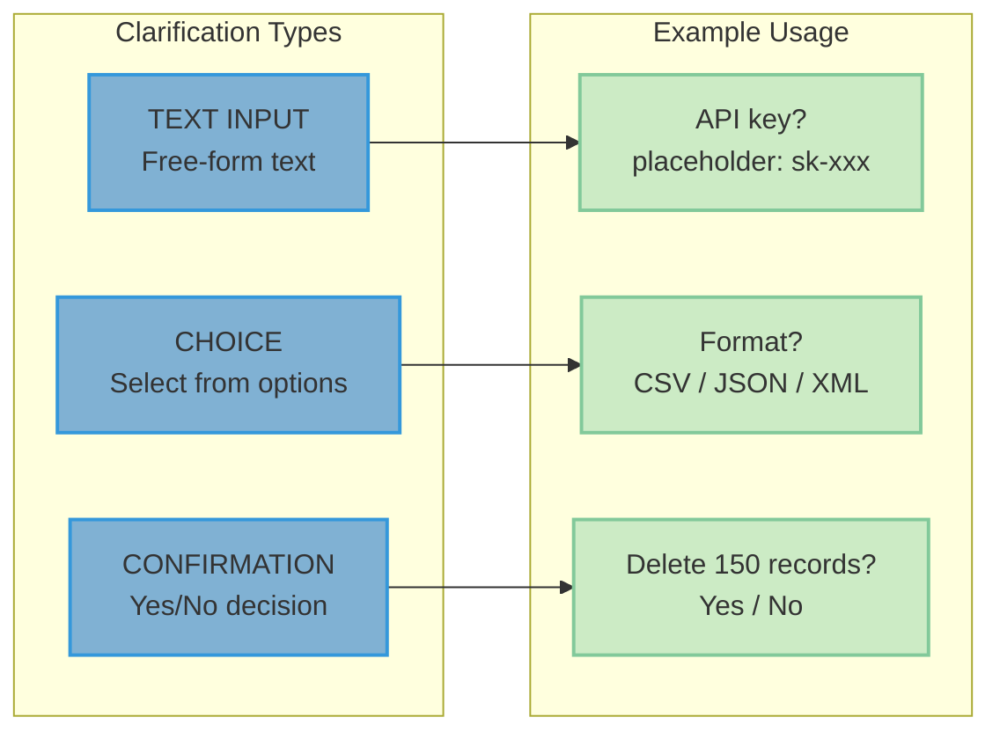
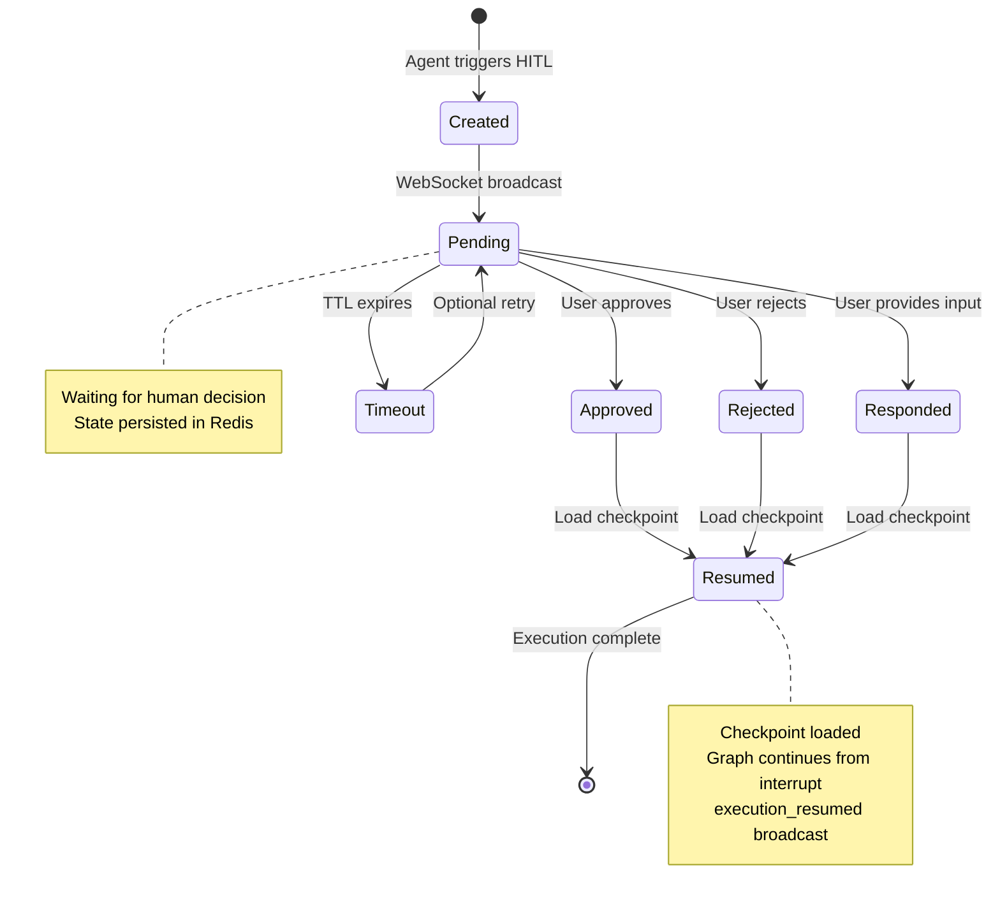
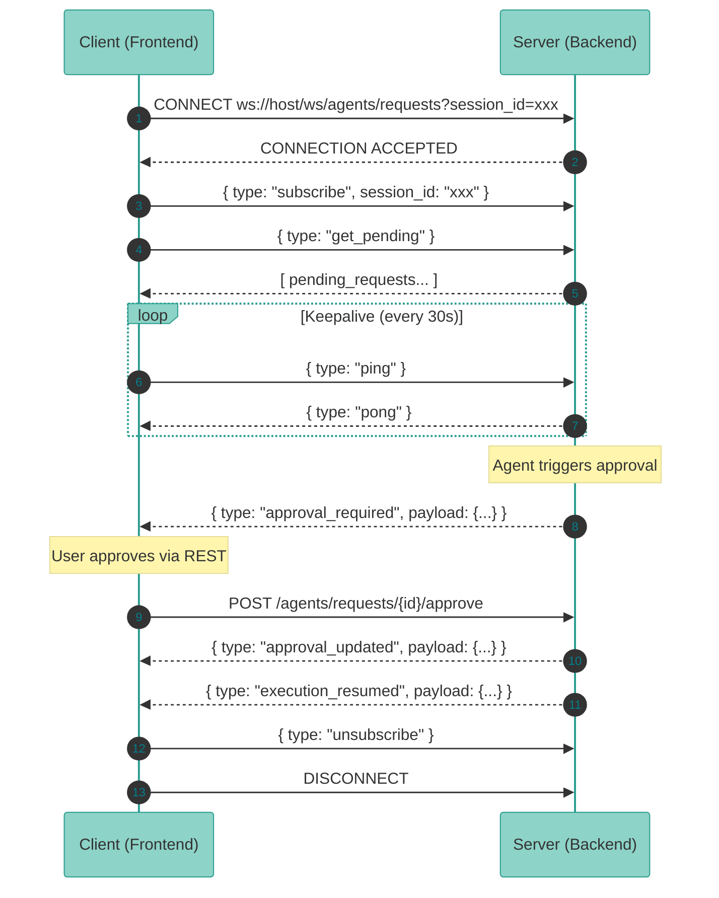
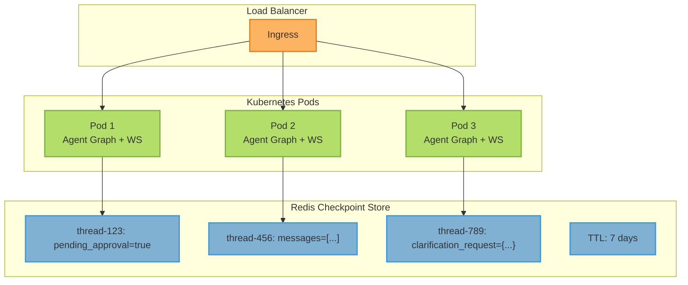
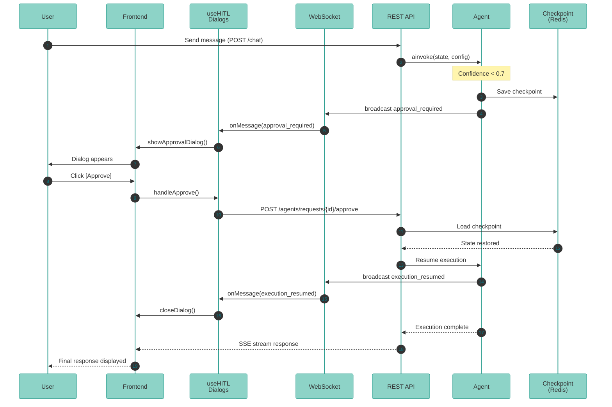

# HITL Visual Flow Diagrams

<Info>
**Last Updated**: December 2025

This guide provides comprehensive visual representations of Human-in-the-Loop (HITL) flows in chat sessions. The HITL system enables agents to pause execution, request human approval or clarification, and resume after receiving input.
</Info>

## Overview

The HITL system consists of three main flow types:

1. **Approval Flow** - Agent pauses for human approval before executing risky actions
2. **Clarification Flow** - Agent requests additional input (text, choice, or confirmation)
3. **Resume Flow** - Execution continues after human decision with checkpoint restoration

---

## 1. High-Level HITL Architecture



### Component Descriptions

| Component | Purpose |
|-----------|---------|
| **React UI** | Agent Studio frontend for chat interactions |
| **HITL Dialogs** | Modal dialogs for approval/clarification requests |
| **REST API** | Endpoints for approve/reject/respond actions |
| **WebSocket** | Real-time broadcast of HITL events |
| **Agent Execution** | LangGraph agent processing |
| **Checkpoint** | State persistence for interrupt/resume |
| **Redis** | Distributed checkpoint storage (7-day TTL) |

---

## 2. Complete Chat Session with HITL Flow



---

## 3. Approval Flow (Confidence-Based)

The approval flow triggers when agent confidence drops below the configured threshold (default: 0.7).



### Checkpoint State Structure

```json
{
  "thread_id": "session-123",
  "state": {
    "pending_approval": true,
    "current_approval_id": "approval-456",
    "routing_confidence": 0.45,
    "approval_requests": [{
      "approval_id": "approval-456",
      "risk_level": "medium",
      "action_description": "Execute database transaction"
    }]
  }
}
```

---

## 4. Clarification Flow

Three types of clarification requests are supported:



### Clarification API Endpoints

| Method | Endpoint | Description |
|--------|----------|-------------|
| POST | `/agents/requests/{id}/respond` | Submit clarification response |

**Request Body:**
```json
{
  "response_type": "text" | "choice" | "confirm",
  "value": "user-entered-text",           // For text
  "selected_option_id": "json",           // For choice
  "confirmed": true                       // For confirmation
}
```

---

## 5. State Machine: HITL Request Lifecycle



### State Descriptions

| State | Description |
|-------|-------------|
| **Created** | HITL request generated by agent |
| **Pending** | Waiting for human decision |
| **Approved** | User approved the action |
| **Rejected** | User rejected the action |
| **Responded** | User provided clarification input |
| **Timeout** | Request expired (configurable TTL) |
| **Resumed** | Execution continued with checkpoint |

---

## 6. WebSocket Message Protocol



### Message Types

| Type | Direction | Description |
|------|-----------|-------------|
| `approval_required` | Server → Client | New approval request |
| `clarification_required` | Server → Client | New clarification request |
| `approval_updated` | Server → Client | Decision made on request |
| `execution_resumed` | Server → Client | Agent execution resumed |
| `ping` | Client → Server | Keepalive ping |
| `pong` | Server → Client | Keepalive response |
| `error` | Server → Client | Error notification |

---

## 7. Multi-Replica HITL with Redis Checkpointing



### Distributed Execution Flow

1. **User sends chat** → Pod 1 receives
2. **Agent runs** → Confidence low → INTERRUPT
3. **Pod 1 saves checkpoint** to Redis
4. **Pod 1 broadcasts** `approval_required` via WebSocket
5. *...time passes (user is thinking)...*
6. **User approves** → Request hits Pod 3 (different pod!)
7. **Pod 3 loads checkpoint** from Redis
8. **Pod 3 resumes** agent execution
9. **Pod 3 broadcasts** `execution_resumed`
10. **Agent completes** on Pod 3

<Note>
Redis checkpointing enables true horizontal scaling - execution can resume on any replica with full state fidelity.
</Note>

---

## 8. Frontend Hook Architecture

```mermaid
flowchart TB
    subgraph useHITLDialogs["useHITLDialogs() Hook"]
        enabled[enabled: boolean]
        showApproval[showApprovalDialog: boolean]
        showClarify[showClarificationDialog: boolean]
        activeApproval[activeApproval: Payload | null]
        activeClarify[activeClarification: Payload | null]
        pending[pendingApprovals: Payload[]]
        actions[handleApprove / handleReject]
    end

    subgraph useAgentRequestWebSocket["useAgentRequestWebSocket() Hook"]
        connect[Connection Management]
        messages[Message Handling]
        reconnect[Reconnection Strategy]
    end

    subgraph useRealtimeSync["useRealtimeSync() Hook"]
        ws[WebSocket Management]
        backoff[Exponential Backoff]
        codes[Token Expiry: 4010<br/>Protocol Mismatch: 4009]
    end

    useHITLDialogs --> useAgentRequestWebSocket
    useAgentRequestWebSocket --> useRealtimeSync

    %% ColorBrewer2 Set3 palette - each component type uniquely colored
    classDef hookStyle fill:#8dd3c7,stroke:#2a9d8f,stroke-width:2px,color:#333
    classDef wsStyle fill:#fdb462,stroke:#e67e22,stroke-width:2px,color:#333
    classDef lowStyle fill:#bebada,stroke:#7e5eb0,stroke-width:2px,color:#333

    class enabled,showApproval,showClarify,activeApproval,activeClarify,pending,actions hookStyle
    class connect,messages,reconnect wsStyle
    class ws,backoff,codes lowStyle
```

---

## 9. End-to-End Sequence Diagram



---

## 10. Key Files Reference

| Component | File Path | Description |
|-----------|-----------|-------------|
| **Approval Node** | `src/mcp_server_langgraph/core/interrupts/approval.py` | Creates approval requests |
| **Confidence Check** | `src/mcp_server_langgraph/core/interrupts/confidence.py` | Auto-triggers based on confidence |
| **Clarification** | `src/mcp_server_langgraph/core/interrupts/clarification.py` | User input requests |
| **AI Explanation** | `src/mcp_server_langgraph/core/interrupts/ai_explanation.py` | Rich context for decisions |
| **WS Broadcaster** | `src/mcp_server_langgraph/hitl/broadcast.py` | Real-time notifications |
| **REST Endpoints** | `src/mcp_server_langgraph/api/v1/agent_requests.py` | Approve/reject/respond |
| **WS Handler** | `src/mcp_server_langgraph/websocket/handlers/agent_request.py` | WebSocket protocol |
| **Frontend Hook** | `studio/frontend/src/hooks/useAgentRequestWebSocket.ts` | WS client |
| **HITL Types** | `studio/frontend/src/types/hitl.ts` | TypeScript definitions |
| **Checkpointer** | `src/mcp_server_langgraph/core/agent.py` | Redis/Memory checkpoint |

---

## Related Documentation

<CardGroup cols={2}>
  <Card title="HITL Approval Guide" icon="check" href="/guides/agent-hitl-approval">
    Implementing human approval workflows
  </Card>
  <Card title="Confidence Thresholds" icon="gauge" href="/guides/hitl-confidence">
    Configuring confidence-based approvals
  </Card>
  <Card title="WebSocket Reference" icon="plug" href="/api-reference/websockets">
    WebSocket API documentation
  </Card>
  <Card title="Agent Architecture" icon="sitemap" href="/guides/agent-architecture">
    LangGraph agent patterns
  </Card>
</CardGroup>
