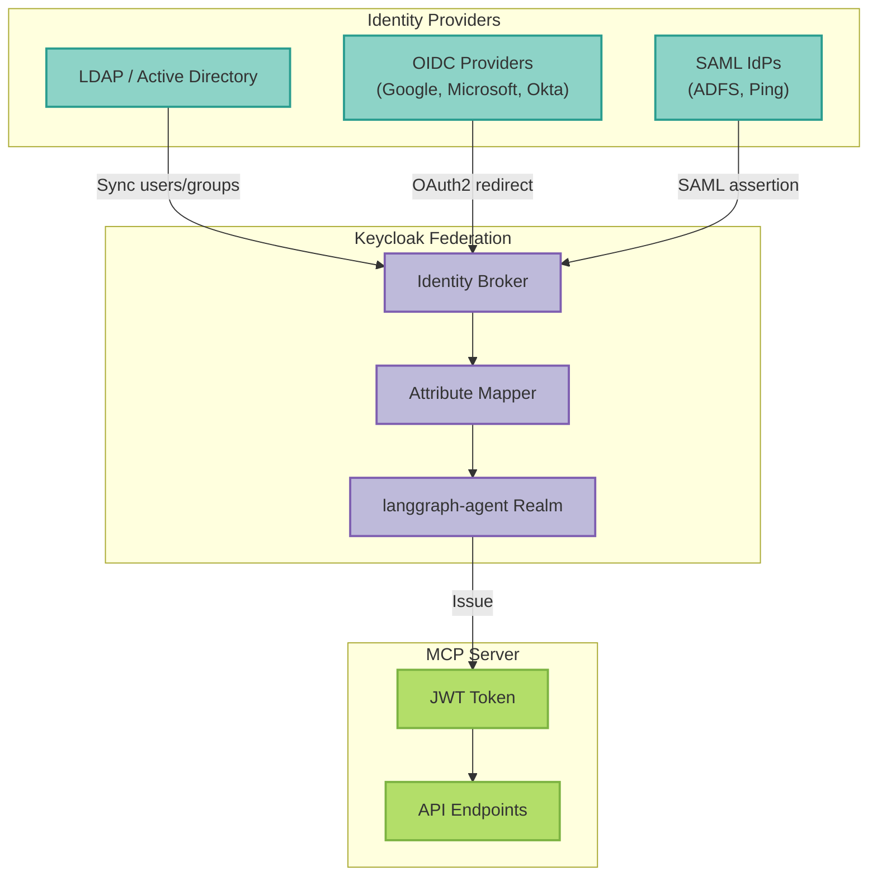
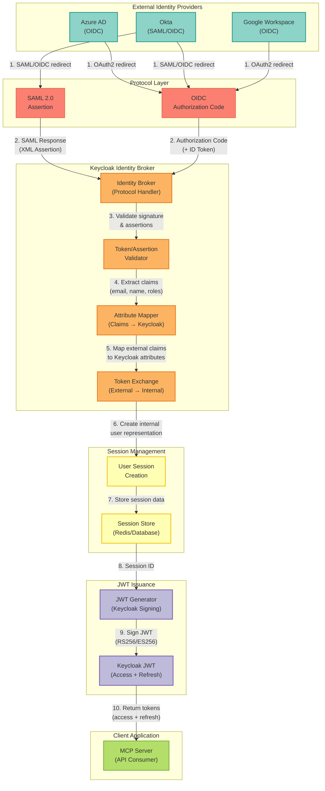
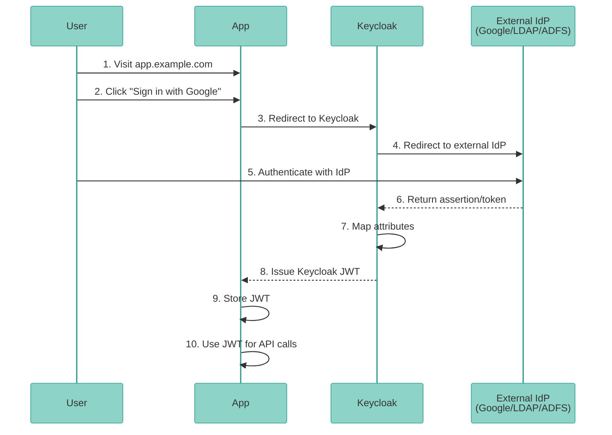

Integrate existing identity providers (LDAP, SAML, OIDC) with Keycloak for centralized authentication.



See [ADR-0037](/architecture/adr-0037-identity-federation) for architecture details.

### Identity Federation Protocol Flow

The following diagram shows the detailed protocol flow for federating external identity providers (Azure AD, Okta, Google) through Keycloak, including SAML/OIDC exchanges, token handling, and JWT issuance:



**Key Steps in the Federation Flow:**

1. **External IdP Redirect**: User authenticates with their existing identity provider (Azure AD, Okta, Google) using SAML or OIDC
2. **Protocol Response**: IdP returns SAML assertion (XML) or OIDC authorization code with ID token
3. **Signature Validation**: Keycloak broker validates signatures and assertions against IdP public keys
4. **Claim Extraction**: Broker extracts user claims (email, name, roles, groups) from the assertion/token
5. **Attribute Mapping**: External claims are mapped to Keycloak user attributes using configured mappers
6. **Token Exchange**: External tokens are exchanged for internal Keycloak user representation
7. **Session Creation**: Keycloak creates a new user session with federated identity information
8. **Session Storage**: Session data is persisted to Redis or database for scalability
9. **JWT Signing**: Keycloak generates and signs a new JWT (access + refresh tokens) using its own keys
10. **Client Response**: Signed Keycloak JWT is returned to the MCP server for API authentication

**Security Considerations:**

- **Signature Verification**: All external tokens/assertions are cryptographically verified
- **Token Exchange**: External tokens are never passed directly to clients - always exchanged for Keycloak JWTs
- **Session Isolation**: Federated sessions are isolated from local Keycloak sessions
- **Attribute Validation**: Mapped attributes are validated against Keycloak schema
- **Replay Protection**: SAML assertions include timestamp and ID validation to prevent replay attacks

### Quick Setup

#### LDAP/Active Directory

```
## Set environment variables
export LDAP_CONNECTION_URL='ldap://ad.example.com:389'
export LDAP_BIND_DN='CN=Service Account,OU=Service Accounts,DC=example,DC=com'
export LDAP_BIND_PASSWORD='your-password'
export LDAP_USERS_DN='OU=Users,DC=example,DC=com'
export LDAP_GROUPS_DN='OU=Groups,DC=example,DC=com'

## Run setup script
python scripts/setup/setup_ldap_federation.py
```
See [setup_ldap_federation.py](/reference/setup-scripts#setup_ldap_federation-py) for full documentation.

#### Google Workspace

```
## Set credentials
export GOOGLE_CLIENT_ID='your-client-id.apps.googleusercontent.com'
export GOOGLE_CLIENT_SECRET='your-secret'
export GOOGLE_HOSTED_DOMAIN='example.com'  # Optional

## Run setup
python scripts/setup/setup_oidc_idp.py --provider google
```

See [setup_oidc_idp.py](/reference/setup-scripts#setup_oidc_idp-py) for full documentation.

#### Microsoft 365 / Azure AD

```bash
export MICROSOFT_CLIENT_ID='your-app-id'
export MICROSOFT_CLIENT_SECRET='your-secret'
export MICROSOFT_TENANT_ID='common'  # or specific tenant

python scripts/setup/setup_oidc_idp.py --provider microsoft
```
#### GitHub

```bash
export GITHUB_CLIENT_ID='your-oauth-app-id'
export GITHUB_CLIENT_SECRET='your-secret'

python scripts/setup/setup_oidc_idp.py --provider github
```

#### Okta

```bash
export OKTA_CLIENT_ID='your-app-id'
export OKTA_CLIENT_SECRET='your-secret'
export OKTA_DOMAIN='example.okta.com'

python scripts/setup/setup_oidc_idp.py --provider okta
```
#### ADFS (SAML)

```bash
export SAML_ALIAS='adfs'
export SAML_SSO_URL='https://adfs.example.com/adfs/ls/'
export SAML_LOGOUT_URL='https://adfs.example.com/adfs/ls/'

python scripts/setup/setup_saml_idp.py
```

See [setup_saml_idp.py](/reference/setup-scripts#setup_saml_idp-py) for full documentation.

### Authentication Flow

#### Federated User Login



#### What Users See

All federated users receive standard Keycloak JWTs:

```json
{
  "iss": "http://keycloak:8180/realms/langgraph-agent",
  "sub": "user:alice@example.com",
  "email": "alice@example.com",
  "given_name": "Alice",
  "family_name": "Smith",
  "realm_access": {
    "roles": ["admin", "premium", "user"]
  }
}
```
### Configuration Details

#### LDAP Attribute Mapping

Edit `config/ldap_mappers.yaml` ([reference](/reference/configuration-files#config-ldap_mappers-yaml)):

```yaml
attribute_mappers:
  - name: email
    ldap_attribute: mail
    keycloak_attribute: email
  - name: department
    ldap_attribute: department
    keycloak_attribute: department
```

#### OIDC Provider Configuration

Edit `config/oidc_providers.yaml` ([reference](/reference/configuration-files#config-oidc_providers-yaml)):

```yaml
providers:
  google:
    alias: google
    config:
      client_id: ${GOOGLE_CLIENT_ID}
      hosted_domain: ${GOOGLE_HOSTED_DOMAIN}
```
### Testing

#### Test LDAP Connection

```
## In Keycloak Admin Console:
## User Federation → ldap → Test connection
## User Federation → ldap → Test authentication
## User Federation → ldap → Synchronize all users
```
#### Test OIDC Login

```
## Visit Keycloak account console
https://keycloak.example.com/realms/langgraph-agent/account

## Click "Sign in with Google" (or other provider)
## Complete OAuth2 flow
## Verify user is created in Keycloak
```
#### Verify JWT Issuance

```
## After federated login, get JWT
curl -X POST http://localhost:8080/auth/login \
  -d '{"username": "alice@example.com", "password": "federated-password"}'

## Should return Keycloak-issued JWT
```

### Troubleshooting

#### LDAP Connection Failed

**Check**:
- LDAP URL is accessible from Keycloak pod
- Bind DN and password are correct
- Users DN exists
- Firewall allows LDAP traffic (port 389/636)

#### SAML Metadata Import Failed

**Solutions**:
- Download SAML metadata from IdP
- Import manually in Keycloak Admin Console
- Verify SAML signature algorithm matches (RSA-SHA256)

#### OIDC Provider Not Found

**Check**:
- Client ID and secret are correct
- Redirect URI is configured in external IdP
- Scopes are correct (openid profile email)

### References

- ADR: [ADR-0037: Identity Federation](/architecture/adr-0037-identity-federation)
- LDAP Setup: `scripts/setup/setup_ldap_federation.py`
- SAML Setup: `scripts/setup/setup_saml_idp.py`
- OIDC Setup: `scripts/setup/setup_oidc_idp.py`
- Configuration: `config/ldap_mappers.yaml`, `config/oidc_providers.yaml`
