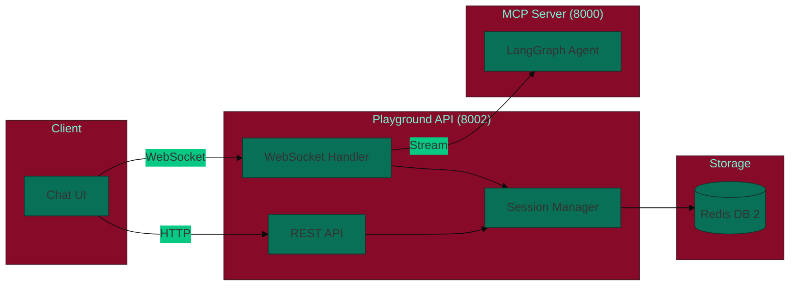
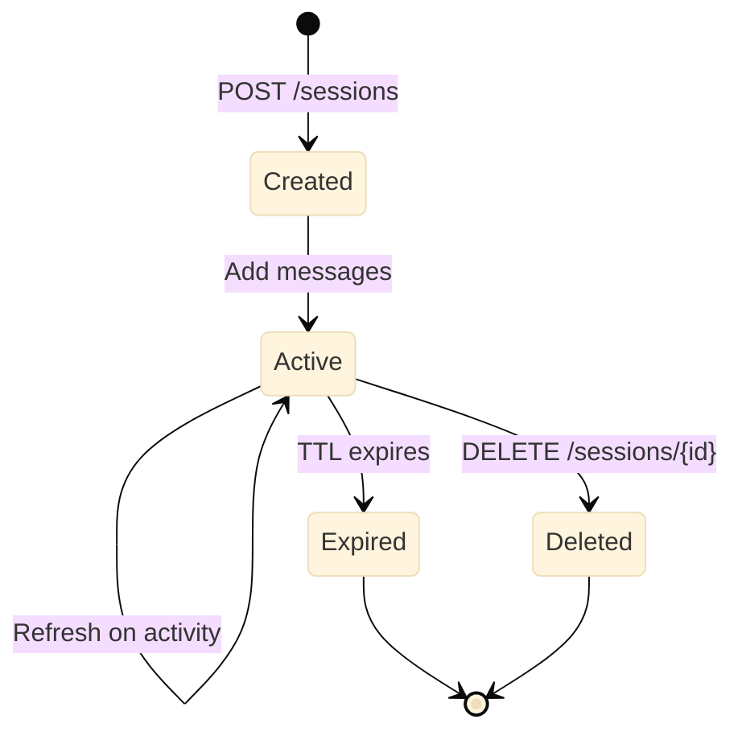

<Note>
**NEW in v2.9.0** - Interactive Playground provides a real-time chat interface for testing your LangGraph agents with WebSocket streaming support.
</Note>

## Overview

The Interactive Playground enables:

- **Real-time Streaming** - WebSocket-based message streaming
- **Session Management** - Redis-backed session persistence with TTL
- **User Isolation** - Sessions scoped by authenticated user
- **Message History** - Automatic conversation tracking per session
- **JWT Authentication** - Integrated with Keycloak SSO

## Architecture



## Quick Start

### Start Test Infrastructure

```bash
# Start all services including playground
make test-infra-full-up
```

This starts:
- **Playground API**: http://localhost:9002
- **Swagger UI**: http://localhost:9002/docs
- **ReDoc**: http://localhost:9002/redoc

### Create a Session

```bash
# Create session with JWT token
curl -X POST http://localhost:9002/api/playground/sessions \
  -H "Authorization: Bearer test-token" \
  -H "Content-Type: application/json" \
  -d '{"name": "My Test Session"}'
```

Response:
```json
{
  "id": "550e8400-e29b-41d4-a716-446655440000",
  "user_id": "test-user-123",
  "name": "My Test Session",
  "created_at": "2025-12-05T10:30:00Z",
  "expires_at": "2025-12-05T11:30:00Z",
  "message_count": 0
}
```

### Send a Message (REST)

```bash
curl -X POST http://localhost:9002/api/playground/chat \
  -H "Authorization: Bearer test-token" \
  -H "Content-Type: application/json" \
  -d '{
    "session_id": "550e8400-e29b-41d4-a716-446655440000",
    "message": "Hello, how can you help me?"
  }'
```

### WebSocket Streaming

For real-time streaming, connect via WebSocket:

```javascript
const ws = new WebSocket('ws://localhost:9002/ws/playground/SESSION_ID');

ws.onmessage = (event) => {
  const data = JSON.parse(event.data);

  switch (data.type) {
    case 'connected':
      console.log('Connected to session:', data.session_id);
      break;
    case 'token':
      // Stream tokens as they arrive
      process.stdout.write(data.content);
      break;
    case 'done':
      console.log('\nGeneration complete');
      break;
    case 'error':
      console.error('Error:', data.message);
      break;
  }
};

// Send a message
ws.send(JSON.stringify({
  type: 'message',
  content: 'What is the weather in San Francisco?'
}));

// Cancel ongoing generation
ws.send(JSON.stringify({ type: 'cancel' }));

// Keep connection alive
setInterval(() => {
  ws.send(JSON.stringify({ type: 'ping' }));
}, 30000);
```

## API Reference

### REST Endpoints

<ParamField path="GET /api/playground/health" type="endpoint">
  Health check with dependency status (Redis, MCP server)
</ParamField>

<ParamField path="POST /api/playground/sessions" type="endpoint">
  Create a new playground session
</ParamField>

<ParamField path="GET /api/playground/sessions" type="endpoint">
  List all sessions for the authenticated user
</ParamField>

<ParamField path="GET /api/playground/sessions/{id}" type="endpoint">
  Get session details by ID
</ParamField>

<ParamField path="DELETE /api/playground/sessions/{id}" type="endpoint">
  Delete a session (requires ownership)
</ParamField>

<ParamField path="POST /api/playground/chat" type="endpoint">
  Send a message and receive non-streaming response
</ParamField>

### WebSocket Protocol

<ParamField path="WS /ws/playground/{session_id}" type="endpoint">
  WebSocket endpoint for real-time streaming chat
</ParamField>

#### Incoming Messages (Client → Server)

```typescript
// Send chat message
{ "type": "message", "content": "Your message here" }

// Cancel current generation
{ "type": "cancel" }

// Heartbeat ping
{ "type": "ping" }
```

#### Outgoing Messages (Server → Client)

```typescript
// Connection established
{ "type": "connected", "session_id": "...", "timestamp": "..." }

// Streaming token
{ "type": "token", "content": "partial response text" }

// Generation complete
{ "type": "done", "message_id": "..." }

// Pong response
{ "type": "pong", "timestamp": "..." }

// Error occurred
{ "type": "error", "message": "error description" }
```

## Configuration

### Environment Variables

```bash
# Redis connection for session storage
REDIS_URL=redis://localhost:6379/2

# MCP Server URL for agent calls
MCP_SERVER_URL=http://localhost:8000

# JWT authentication
JWT_SECRET_KEY=your-secret-key

# Session configuration
SESSION_TTL_SECONDS=3600           # 1 hour default
MAX_MESSAGES_PER_SESSION=100       # Message limit per session

# Environment
ENVIRONMENT=development            # or production, test
```

### Docker Compose

The playground is included in `docker-compose.test.yml`:

```yaml
playground-test:
  build:
    context: .
    dockerfile: docker/Dockerfile.playground
  ports:
    - "9002:8002"
  environment:
    - ENVIRONMENT=test
    - MCP_SERVER_URL=http://mcp-server-test:8000
    - REDIS_URL=redis://redis-test:6379/2
  depends_on:
    mcp-server-test:
      condition: service_healthy
    redis-test:
      condition: service_healthy
```

## Session Management

### Session Lifecycle



### Features

1. **Automatic Expiration**: Sessions expire after `SESSION_TTL_SECONDS` (default: 1 hour)
2. **Activity Refresh**: TTL resets on each message
3. **Message Limits**: Max `MAX_MESSAGES_PER_SESSION` messages per session
4. **User Isolation**: Users can only access their own sessions

### Python Client Example

```python
import aiohttp
import asyncio
import json

async def chat_with_playground():
    # Create session
    async with aiohttp.ClientSession() as session:
        headers = {"Authorization": "Bearer your-jwt-token"}

        # Create playground session
        async with session.post(
            "http://localhost:9002/api/playground/sessions",
            headers=headers,
            json={"name": "Test Session"}
        ) as resp:
            data = await resp.json()
            session_id = data["id"]

        # Connect WebSocket
        async with session.ws_connect(
            f"ws://localhost:9002/ws/playground/{session_id}"
        ) as ws:
            # Wait for connection ack
            msg = await ws.receive_json()
            assert msg["type"] == "connected"

            # Send message
            await ws.send_json({
                "type": "message",
                "content": "Explain quantum computing"
            })

            # Receive streaming response
            full_response = ""
            async for msg in ws:
                data = json.loads(msg.data)
                if data["type"] == "token":
                    full_response += data["content"]
                    print(data["content"], end="", flush=True)
                elif data["type"] == "done":
                    print("\n--- Done ---")
                    break
                elif data["type"] == "error":
                    print(f"Error: {data['message']}")
                    break

asyncio.run(chat_with_playground())
```

## Testing

### Run Playground Tests

```bash
# Unit tests
uv run pytest tests/playground/ -v

# Specific test files
uv run pytest tests/playground/test_playground_api.py -v
uv run pytest tests/playground/test_playground_websocket.py -v
uv run pytest tests/playground/test_playground_session.py -v
uv run pytest tests/playground/test_playground_security.py -v
```

### Test Coverage

The playground includes comprehensive tests:

| Test File | Tests | Coverage |
|-----------|-------|----------|
| `test_playground_api.py` | 15 | API endpoints |
| `test_playground_websocket.py` | 12 | WebSocket streaming |
| `test_playground_session.py` | 10 | Session management |
| `test_playground_security.py` | 8 | Auth & security |

## Monitoring

### Health Check

```bash
curl http://localhost:9002/api/playground/health
```

Response:
```json
{
  "status": "healthy",
  "version": "0.1.0",
  "dependencies": {
    "redis": {
      "status": "healthy",
      "latency_ms": 1.2
    },
    "mcp_server": {
      "status": "healthy",
      "message": "Connection verified"
    }
  }
}
```

### Prometheus Metrics

The playground exposes metrics at `/metrics`:

- `playground_sessions_active` - Active session count
- `playground_messages_total` - Total messages sent
- `playground_websocket_connections` - Active WebSocket connections
- `playground_response_time_seconds` - Response latency histogram

## Troubleshooting

<AccordionGroup>
  <Accordion title="WebSocket connection refused">
    ```bash
    # Check playground is running
    curl http://localhost:9002/api/playground/health

    # Check Redis is accessible
    docker exec redis-test redis-cli ping

    # Check logs
    docker logs playground-test --tail=50
    ```
  </Accordion>

  <Accordion title="Session not found">
    Sessions expire after 1 hour by default. Create a new session:
    ```bash
    curl -X POST http://localhost:9002/api/playground/sessions \
      -H "Authorization: Bearer your-token" \
      -H "Content-Type: application/json" \
      -d '{"name": "New Session"}'
    ```
  </Accordion>

  <Accordion title="Authentication errors">
    - Verify JWT token is valid and not expired
    - Check `JWT_SECRET_KEY` matches between services
    - In development mode, use `test-` prefixed tokens
  </Accordion>

  <Accordion title="Messages not streaming">
    - Ensure MCP server is healthy
    - Check WebSocket connection is established
    - Verify session ID in WebSocket URL is valid
  </Accordion>
</AccordionGroup>

## Next Steps

<CardGroup cols={2}>
  <Card title="Visual Workflow Builder" icon="diagram-project" href="/guides/visual-workflow-builder">
    Design agent workflows visually
  </Card>
  <Card title="Test Infrastructure" icon="docker" href="/development/test-infrastructure">
    Full test environment setup
  </Card>
  <Card title="Authentication" icon="key" href="/getting-started/authentication">
    Configure JWT and Keycloak
  </Card>
  <Card title="Observability" icon="chart-line" href="/guides/observability">
    Monitoring and tracing
  </Card>
</CardGroup>

---

<Check>
**Interactive Playground** provides a production-ready chat interface for testing your LangGraph agents!
</Check>
