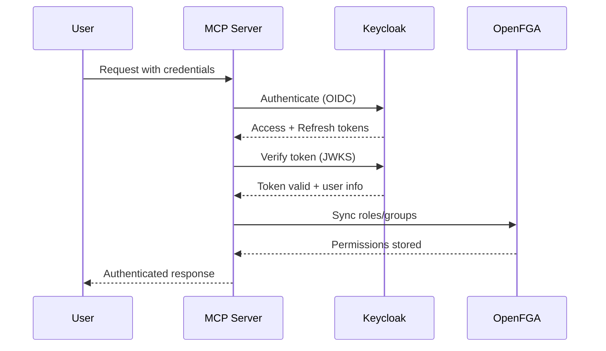

<Note>
**NEW in v2.1.0** - Complete guide to integrating Keycloak SSO with your MCP server for production-ready authentication.
</Note>

## Overview

Keycloak provides enterprise-grade authentication with:

- **OpenID Connect / OAuth2** - Standards-compliant authentication
- **Single Sign-On (SSO)** - One login for all applications
- **User Management** - Centralized identity and access management
- **Social Login** - Google, GitHub, Facebook, and more
- **Multi-Factor Authentication** - TOTP, WebAuthn, SMS
- **Role & Group Management** - Hierarchical organization

## Architecture



## Quick Start

<Steps>
  <Step title="Deploy Keycloak">
    <Tabs>
      <Tab title="Docker Compose">
        ```yaml
        # docker-compose.yml
        keycloak:
          image: quay.io/keycloak/keycloak:latest
          environment:
            KEYCLOAK_ADMIN: admin
            KEYCLOAK_ADMIN_PASSWORD: admin
            KC_DB: postgres
            KC_DB_URL: jdbc:postgresql://postgres:5432/keycloak
            KC_DB_USERNAME: keycloak
            KC_DB_PASSWORD: password
          ports:
            - "8080:8080"
          command: start-dev
        ```

        ```bash
        docker compose up -d keycloak
        ```

        Access: http://localhost:8080/admin (admin/admin)
      </Tab>

      <Tab title="Kubernetes">
        ```bash
        # Using Helm (recommended)
        helm install keycloak bitnami/keycloak \
          --namespace mcp-server-langgraph \
          --create-namespace \
          --set auth.adminUser=admin \
          --set auth.adminPassword="$(openssl rand -base64 32)" \
          --set postgresql.enabled=true \
          --set replicaCount=2 \
          --set ingress.enabled=true \
          --set ingress.hostname=sso.yourdomain.com

        # Wait for deployment
        kubectl wait --for=condition=available --timeout=300s \
          deployment/keycloak -n mcp-server-langgraph
        ```

        Access via ingress or port-forward:
        ```bash
        kubectl port-forward svc/keycloak 8080:80 -n mcp-server-langgraph
        ```
      </Tab>

      <Tab title="Cloud Run">
        Deploy Keycloak to GKE, then access from Cloud Run via VPC connector.

        See [Cloud Run Deployment](/deployment/cloud-run#keycloak-setup).
      </Tab>
    </Tabs>
  </Step>

  <Step title="Run Setup Script">
    ```bash
    # Wait for Keycloak to be ready (60+ seconds)
    sleep 60

    # Run initialization script
    python scripts/setup/setup_keycloak.py

    # Save the client secret from output
    KEYCLOAK_CLIENT_SECRET=abc123...
    ```

    This script creates:
    - **Realm**: `mcp-server-langgraph`
    - **Client**: `langgraph-client` (confidential, OIDC)
    - **Scopes**: `openid`, `profile`, `email`, `roles`
    - **Redirect URIs**: Configured for your domain
  </Step>

  <Step title="Configure Environment">
    ```bash
    # .env or Kubernetes ConfigMap
    AUTH_PROVIDER=keycloak
    AUTH_MODE=session  # or token

    KEYCLOAK_SERVER_URL=https://sso.yourdomain.com
    KEYCLOAK_REALM=mcp-server-langgraph
    KEYCLOAK_CLIENT_ID=langgraph-client
    KEYCLOAK_CLIENT_SECRET=your-client-secret-here
    KEYCLOAK_VERIFY_SSL=true
    KEYCLOAK_TIMEOUT=30
    KEYCLOAK_HOSTNAME=mcp-server-langgraph.yourdomain.com
    ```
  </Step>

  <Step title="Test Authentication">
    ```python
    from mcp_server_langgraph.auth.keycloak import KeycloakClient

    client = KeycloakClient()

    # Authenticate user
    result = await client.authenticate(
        username="alice",
        password="password123"
    )

    print(f"Access Token: {result['access_token']}")
    print(f"Refresh Token: {result['refresh_token']}")
    print(f"Expires In: {result['expires_in']} seconds")
    ```
  </Step>
</Steps>

## Manual Configuration

If you prefer to configure Keycloak manually via the admin console:

### 1. Create Realm

1. Open Keycloak admin console
2. Hover over realm dropdown (top left)
3. Click "Create Realm"
4. Name: `mcp-server-langgraph`
5. Click "Create"

### 2. Create Client

1. Go to **Clients** → **Create client**
2. Configure:
   - **Client ID**: `langgraph-client`
   - **Client type**: OpenID Connect
   - **Client authentication**: ON (confidential)
3. Click "Next"
4. Configure access:
   - **Standard flow**: ON (authorization code)
   - **Direct access grants**: ON (for testing)
   - **Service accounts**: OFF
5. Click "Next"
6. Set redirect URIs:
   - Valid redirect URIs: `https://yourdomain.com/*`
   - Web origins: `https://yourdomain.com`
7. Click "Save"

### 3. Get Client Secret

1. Go to **Clients** → `langgraph-client`
2. Click **Credentials** tab
3. Copy **Client secret**
4. Save to environment variables

### 4. Configure Client Scopes

1. Go to **Clients** → `langgraph-client` → **Client scopes**
2. Add scopes:
   - `openid` (required)
   - `profile` (user info)
   - `email` (email address)
   - `roles` (role mapping)
3. Click **Add dedicated scope** → Create `roles` scope if missing

### 5. Create Test User

1. Go to **Users** → **Add user**
2. Enter username: `alice`
3. Click "Create"
4. Go to **Credentials** tab
5. Click **Set password**
6. Enter password, set **Temporary**: OFF
7. Click "Save"

### 6. Assign Roles

1. Go to **Users** → Select `alice`
2. Click **Role mapping** tab
3. Assign roles (these map to OpenFGA):
   - `admin`
   - `user`
   - `viewer`

## Token Flow

### Authorization Code Flow (Recommended)

For web applications:

```typescript
// 1. Redirect user to Keycloak
const authUrl = `https://sso.yourdomain.com/realms/mcp-server-langgraph/protocol/openid-connect/auth?
  client_id=langgraph-client&
  redirect_uri=https://yourapp.com/callback&
  response_type=code&
  scope=openid profile email roles`;

window.location.href = authUrl;

// 2. Keycloak redirects back with code
// https://yourapp.com/callback?code=abc123&state=xyz

// 3. Exchange code for tokens
const tokens = await fetch('https://sso.yourdomain.com/realms/mcp-server-langgraph/protocol/openid-connect/token', {
  method: 'POST',
  headers: {'Content-Type': 'application/x-www-form-urlencoded'},
  body: new URLSearchParams({
    grant_type: 'authorization_code',
    code: 'abc123',
    redirect_uri: 'https://yourapp.com/callback',
    client_id: 'langgraph-client',
    client_secret: 'your-secret'
  })
});

const { access_token, refresh_token, expires_in } = await tokens.json();
```

### Direct Grant Flow (Testing Only)

For testing or CLI applications:

```python
from mcp_server_langgraph.auth.keycloak import KeycloakClient

client = KeycloakClient()

# Direct authentication
result = await client.authenticate(
    username="alice",
    password="password123"
)

access_token = result['access_token']
refresh_token = result['refresh_token']
```

<Warning>
**Never use Direct Grant in production!** Use Authorization Code flow with PKCE for web/mobile apps.
</Warning>

### Token Refresh

Refresh tokens have longer lifetime and can be used to get new access tokens:

```python
# Refresh access token
new_tokens = await client.refresh_token(refresh_token)

new_access_token = new_tokens['access_token']
new_refresh_token = new_tokens['refresh_token']  # Rotated!
```

## Role Mapping to OpenFGA

**NEW v2.1.0**: Automatic synchronization of Keycloak roles/groups to OpenFGA.

### Configuration

Edit `config/role_mappings.yaml`:

```yaml
# Simple 1:1 role mappings
simple_mappings:
  admin: admin
  user: member
  viewer: viewer

# Regex-based group mappings
group_mappings:
  - pattern: "/admins"
    relation: admin
  - pattern: "/users/.*"
    relation: member

# Conditional mappings
conditional_mappings:
  - condition:
      attribute: email_verified
      operator: ==
      value: true
    relation: member

# Role hierarchies
hierarchies:
  - parent: admin
    children: [member, viewer]
  - parent: member
    children: [viewer]
```

### Automatic Sync

When user authenticates, roles are synced to OpenFGA:

```python
from mcp_server_langgraph.auth.keycloak import sync_user_to_openfga

# Get user info from token
user_info = await client.get_user_info(access_token)

# Sync to OpenFGA
await sync_user_to_openfga(
    user_id=user_info['sub'],
    username=user_info['preferred_username'],
    roles=user_info.get('roles', []),
    groups=user_info.get('groups', []),
    email_verified=user_info.get('email_verified', False)
)
```

### Manual Sync

Trigger sync for existing users:

```python
# Sync single user
await sync_user_to_openfga(
    user_id="alice",
    username="alice",
    roles=["admin", "user"],
    groups=["/admins", "/users/engineering"]
)

# Sync all users (admin operation)
users = await client.get_all_users()
for user in users:
    await sync_user_to_openfga(
        user_id=user['id'],
        username=user['username'],
        roles=user.get('roles', []),
        groups=user.get('groups', [])
    )
```

## Production Deployment

### High Availability

Deploy Keycloak with 2+ replicas:

```yaml
# values.yaml for Helm
replicaCount: 2

# Pod anti-affinity
affinity:
  podAntiAffinity:
    preferredDuringSchedulingIgnoredDuringExecution:
      - weight: 100
        podAffinityTerm:
          labelSelector:
            matchExpressions:
              - key: app
                operator: In
                values: [keycloak]
          topologyKey: kubernetes.io/hostname

# PostgreSQL backend (required!)
postgresql:
  enabled: true
  primary:
    persistence:
      enabled: true
      size: 10Gi
```

### SSL/TLS

**Always use HTTPS in production:**

```yaml
ingress:
  enabled: true
  className: nginx
  annotations:
    cert-manager.io/cluster-issuer: letsencrypt-prod
  hosts:
    - host: sso.yourdomain.com
      paths:
        - path: /
          pathType: Prefix
  tls:
    - secretName: keycloak-tls
      hosts:
        - sso.yourdomain.com
```

Configure app:
```bash
KEYCLOAK_SERVER_URL=https://sso.yourdomain.com
KEYCLOAK_VERIFY_SSL=true  # REQUIRED!
```

### Performance Tuning

```yaml
# Kubernetes resources
resources:
  requests:
    cpu: 500m
    memory: 1Gi
  limits:
    cpu: 2000m
    memory: 2Gi

# JVM options
extraEnv:
  - name: JAVA_OPTS
    value: >-
      -Xms1024m
      -Xmx1536m
      -XX:MetaspaceSize=256m
      -XX:MaxMetaspaceSize=512m

# Connection pooling
postgresql:
  primary:
    extendedConfiguration: |
      max_connections = 200
      shared_buffers = 256MB
```

### Backup & Recovery

```bash
# Backup PostgreSQL (Keycloak database)
kubectl exec -n mcp-server-langgraph \
  $(kubectl get pod -n mcp-server-langgraph -l app=postgresql -o jsonpath='{.items[0].metadata.name}') \
  -- pg_dump -U keycloak keycloak > keycloak-backup.sql

# Restore
kubectl exec -i -n mcp-server-langgraph \
  $(kubectl get pod -n mcp-server-langgraph -l app=postgresql -o jsonpath='{.items[0].metadata.name}') \
  -- psql -U keycloak keycloak < keycloak-backup.sql
```

## Monitoring

### Health Checks

```bash
# Keycloak health
curl https://sso.yourdomain.com/health

# Readiness
curl https://sso.yourdomain.com/health/ready

# Liveness
curl https://sso.yourdomain.com/health/live
```

### Metrics

Keycloak exposes Prometheus metrics:

```yaml
# ServiceMonitor for Prometheus
apiVersion: monitoring.coreos.com/v1
kind: ServiceMonitor
metadata:
  name: keycloak
spec:
  selector:
    matchLabels:
      app: keycloak
  endpoints:
    - port: http
      path: /metrics
```

Key metrics:
```promql
# Login rate
rate(keycloak_logins_total[5m])

# Failed logins
rate(keycloak_login_failures_total[5m])

# Token creation rate
rate(keycloak_tokens_created_total[5m])

# Active sessions
keycloak_sessions_active
```

### Logging

Configure structured logging:

```yaml
extraEnv:
  - name: KC_LOG_LEVEL
    value: "info"
  - name: KC_LOG_CONSOLE_FORMAT
    value: "json"
```

## Troubleshooting

<AccordionGroup>
  <Accordion title="Connection refused">
    ```bash
    # Check Keycloak status
    kubectl get pods -l app=keycloak
    kubectl logs -l app=keycloak --tail=100

    # Test connectivity
    curl http://keycloak:8080/health
    ```
  </Accordion>

  <Accordion title="Invalid client secret">
    ```bash
    # Get correct secret from Keycloak
    # Admin console → Clients → langgraph-client → Credentials

    # Or via CLI
    kubectl get secret keycloak-client-secret \
      -o jsonpath='{.data.client-secret}' | base64 -d
    ```
  </Accordion>

  <Accordion title="Token verification failed">
    **Check**:
    - KEYCLOAK_SERVER_URL matches Keycloak issuer
    - Realm name is correct
    - Token not expired
    - JWKS endpoint accessible

    ```python
    # Debug token
    import jwt
    decoded = jwt.decode(token, options={"verify_signature": False})
    print(decoded)
    ```
  </Accordion>

  <Accordion title="SSL verification errors">
    **Development only**:
    ```bash
    KEYCLOAK_VERIFY_SSL=false
    ```

    **Production**: Fix SSL certificate or add CA cert
  </Accordion>
</AccordionGroup>

## Next Steps

<CardGroup cols={2}>
  <Card title="Session Management" icon="database" href="/guides/redis-sessions">
    Setup Redis session store
  </Card>
  <Card title="Authentication Guide" icon="key" href="/getting-started/authentication">
    Learn about auth modes
  </Card>
  <Card title="Authorization" icon="shield" href="/getting-started/authorization">
    Configure OpenFGA permissions
  </Card>
  <Card title="Production Checklist" icon="clipboard-check" href="/deployment/production-checklist">
    Pre-deployment verification
  </Card>
</CardGroup>

---

<Check>
**Production Ready**: Keycloak provides enterprise-grade SSO for your MCP server!
</Check>
