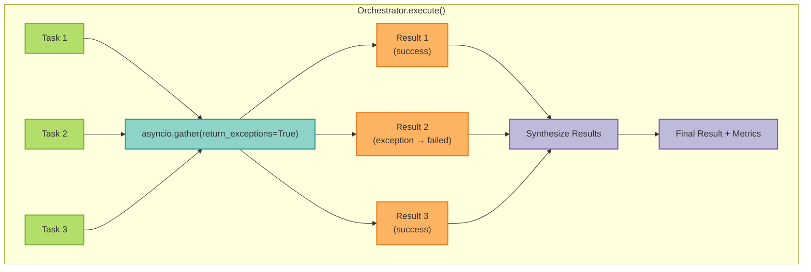

# Multi-Agent Orchestrators

MCP Server LangGraph provides multi-agent orchestrators for parallel execution of AI analysis tasks. These orchestrators improve performance by running independent analyses concurrently.

**Related Documentation**:
- [ADR-0078: Multi-Agent Orchestrator Patterns](/architecture/adr-0078-multi-agent-orchestrator-patterns)
- [Resilience Patterns](/guides/resilience-patterns)
- [Alert Management](/guides/alert-management)

## Overview

### Problem Statement

Sequential execution of multiple LLM calls creates latency bottlenecks:

```
Sequential (Before):
  analyze_persona() ──► 100ms
  analyze_disclosure() ──► 100ms
  analyze_error() ──► 100ms
  synthesize() ──► 20ms
  ────────────────────────
  Total: 320ms
```

### Parallel Solution

```
Parallel (After):
  ┌─ analyze_persona() ──► 100ms ─┐
  ├─ analyze_disclosure() ──► 100ms ─┤──► synthesize() ──► 20ms
  └─ analyze_error() ──► 100ms ─┘
  ──────────────────────────────────
  Total: 120ms (3x speedup)
```

## Architecture

### Module Structure

```
src/mcp_server_langgraph/agents/
├── base_orchestrator.py      # Abstract base with parallel execution
├── ux_orchestrator.py        # AI UX composite analysis
├── alert_orchestrator.py     # Alert correlation and root cause
├── metrics.py                # Observability metrics
├── cost_tracker.py           # Cost/budget management
└── resilience.py             # Resilience decorators
```

### Base Orchestrator

All orchestrators inherit from `BaseOrchestrator`:

```python
from mcp_server_langgraph.agents.base_orchestrator import (
    BaseOrchestrator,
    BaseTask,
    BaseResult,
)

class MyOrchestrator(BaseOrchestrator[MyTask, MyResult]):
    @property
    def feature_flag_name(self) -> str:
        return "enable_my_orchestrator"

    async def _execute_task(self, task: MyTask) -> MyResult:
        # Task execution logic
        ...

    def synthesize(self, results: list[MyResult]) -> dict[str, Any]:
        # Combine results
        ...
```

### Parallel Execution Flow



## UX Orchestrator

### Purpose

Orchestrates parallel AI UX analysis for composite user experience insights.

### Analysis Types

| Type | Description | LLM Required |
|------|-------------|--------------|
| `persona_analysis` | User behavior patterns | Yes |
| `disclosure_analysis` | Transparency recommendations | Yes |
| `error_analysis` | Error recovery suggestions | Yes |

### API Endpoint

<Note>
The orchestrator is accessed via the AI UX Service endpoint when the feature flag is enabled.
</Note>

**Endpoint**: `POST /api/v1/ai/composite-analysis`

**Request**:
```json
{
  "user_id": "user-123",
  "session_id": "session-456",
  "include_persona": true,
  "include_disclosure": true,
  "include_error": false,
  "persona_data": {
    "assigned_persona": "bob"
  },
  "disclosure_data": {
    "feature_usage": {}
  }
}
```

**Response**:
```json
{
  "user_id": "user-123",
  "session_id": "session-456",
  "analyses": {
    "persona_analysis": {
      "detected_persona": "power_user",
      "confidence": 0.85
    },
    "disclosure_analysis": {
      "current_level": "basic",
      "recommended_level": "detailed"
    }
  },
  "cross_insights": [
    "User persona 'power_user' suggests disclosure level should be 'detailed' (currently 'basic')"
  ],
  "failed_analyses": []
}
```

### Usage Example

```python
from mcp_server_langgraph.agents.ux_orchestrator import (
    UXOrchestrator,
    UXAnalysisTask,
)

# Create orchestrator with cost tracking
orchestrator = UXOrchestrator(
    ai_ux_service=service,
    cost_tracker=tracker,
    session_id="session-456",
)

# Run composite analysis
result = await orchestrator.run_composite_analysis(
    user_id="user-123",
    session_id="session-456",
    include_persona=True,
    include_disclosure=True,
    persona_data={"assigned_persona": "bob"},
    disclosure_data={"feature_usage": {}},
)

# Access cross-insights
for insight in result["cross_insights"]:
    print(insight)
```

### Feature Flag

```python
# Enable parallel UX orchestration
enable_orchestrated_ai_ux: bool = True
```

When disabled, the sequential AI UX Service is used as fallback.

## Alert Orchestrator

### Purpose

Orchestrates parallel alert analysis for multi-alert correlation and root cause detection.

### Analysis Types

| Type | Description | LLM Required |
|------|-------------|--------------|
| `correlation` | Group related alerts | No (deterministic) |
| `root_cause` | Identify root cause | Yes |
| `remediation` | Suggest fixes | Yes |
| `pattern_detection` | Detect patterns | No (rule-based) |

### API Endpoint

**Endpoint**: `POST /api/v1/alerts/correlate`

**Request**:
```json
{
  "correlation_type": "label",
  "label_key": "service",
  "include_root_cause": true,
  "include_remediation": false,
  "include_pattern_detection": true
}
```

**Response**:
```json
{
  "alert_ids": ["alert-1", "alert-2", "alert-3"],
  "analyses": {
    "correlation": {
      "groups": [
        {"service": "api", "alerts": ["alert-1", "alert-2"]},
        {"service": "db", "alerts": ["alert-3"]}
      ]
    },
    "pattern_detection": {
      "patterns": [
        {"type": "cascade", "description": "DB failure causing API errors"}
      ]
    }
  },
  "correlation_summary": {
    "total_results": 2,
    "successful": 2,
    "failed": 0,
    "alert_groups": 2,
    "patterns_detected": 1
  },
  "failed_analyses": []
}
```

### Usage Example

```python
from mcp_server_langgraph.agents.alert_orchestrator import (
    AlertOrchestrator,
    AlertAnalysisTask,
)

# Create orchestrator
orchestrator = AlertOrchestrator(
    correlation_engine=engine,
    recommendation_service=service,
    cost_tracker=tracker,
)

# Analyze alerts
result = await orchestrator.analyze_alerts(
    alert_ids=["alert-1", "alert-2"],
    include_correlation=True,
    include_root_cause=True,
    include_pattern_detection=True,
)

# Access correlation summary
print(f"Alert groups: {result['correlation_summary']['alert_groups']}")
print(f"Patterns: {result['correlation_summary']['patterns_detected']}")
```

### Feature Flag

```python
# Enable parallel alert orchestration
enable_orchestrated_alert_analysis: bool = True
```

## LoopAgent Pattern

### Purpose

The LoopAgent pattern (from Google ADK) enables iterative task execution until a termination condition is met. Useful for workflows requiring refinement, retries, or progressive processing.

### Feature Flag

```python
# Enable LoopAgent pattern
enable_loop_agent: bool = False  # Experimental
```

### Usage Example

```python
from mcp_server_langgraph.agents.loop_agent import (
    LoopAgent,
    LoopConfig,
    LoopIterationState,
)

# Define termination condition
def should_stop(state: LoopIterationState) -> bool:
    return state.result.get("done", False) or state.iteration >= 10

# Create loop agent
loop_agent = LoopAgent(
    config=LoopConfig(
        max_iterations=10,
        termination_condition=should_stop,
        iteration_delay_ms=100,  # Optional delay between iterations
    ),
    task_executor=my_task_executor,
)

# Execute iterative task
result = await loop_agent.execute(
    initial_state={"task": "refine document"},
    context={"user_id": "user-123"},
)

# Access iteration history
for iteration in result.iteration_history:
    print(f"Iteration {iteration.number}: {iteration.status}")
```

### Termination Conditions

| Condition | Description |
|-----------|-------------|
| `max_iterations` | Stop after N iterations |
| `custom_function` | User-defined termination logic |
| `result_field` | Stop when result field equals value |
| `timeout` | Stop after elapsed time |

### Use Cases

- **Document refinement**: Iteratively improve until quality threshold
- **Data validation**: Retry with corrections until valid
- **Progressive search**: Expand search until enough results found
- **Iterative calculation**: Converge to solution

### Error Handling

```python
# LoopAgent respects max_iterations as safety limit
try:
    result = await loop_agent.execute(initial_state)
except MaxIterationsExceeded:
    logger.warning("Loop hit max iterations limit")
    # Handle gracefully - partial results available
```

## Cost Tracking

Both orchestrators support integrated cost tracking:

```python
from mcp_server_langgraph.agents.cost_tracker import CostTracker

# Create cost tracker with limits
tracker = CostTracker(
    per_orchestration_limit=0.50,  # $0.50 per orchestration
    session_limit=5.00,            # $5.00 per session
    alert_thresholds=[0.5, 0.75, 0.9],
)

# Inject into orchestrator
orchestrator = UXOrchestrator(
    ai_ux_service=service,
    cost_tracker=tracker,
    session_id="session-123",
)

# Check budget
alert = orchestrator.check_budget()
if alert.status == BudgetStatus.WARNING:
    logger.warning(f"Budget warning: {alert.message}")

# Get session cost
cost = orchestrator.get_session_cost()
print(f"Session cost: ${cost}")
```

## Observability

### Metrics

The orchestrators emit comprehensive metrics:

| Metric | Type | Description |
|--------|------|-------------|
| `agent.ux_orchestration.count` | Counter | UX orchestration executions |
| `agent.alert_orchestration.count` | Counter | Alert orchestration executions |
| `agent.orchestration.parallel_speedup` | Histogram | Speedup ratio from parallelization |
| `agent.orchestration.parallel_tasks` | Histogram | Tasks per orchestration |
| `agent.orchestrator.feature_flag.check` | Counter | Feature flag checks |
| `agent.orchestration.cost.dollars` | Counter | Cost in dollars |
| `agent.orchestration.cost.alert` | Counter | Cost budget alerts |

### Grafana Dashboard

A pre-configured dashboard is available at:
`monitoring/grafana/dashboards/Application/orchestrator-metrics.json`

Key panels:
- UX/Alert orchestration rate
- Parallel speedup distribution
- Feature flag enablement
- Cost tracking
- Error rates by analysis type

### Prometheus Queries

```promql
# Orchestration rate by type
rate(agent_ux_orchestration_count_total[5m])
rate(agent_alert_orchestration_count_total[5m])

# Parallel speedup P95
histogram_quantile(0.95, rate(agent_orchestration_parallel_speedup_bucket[5m]))

# Cost per hour
rate(agent_orchestration_cost_dollars_total[1h]) * 3600

# Feature flag enablement rate
agent_orchestrator_feature_flag_check_total{enabled="true"} /
agent_orchestrator_feature_flag_check_total
```

## Error Handling

### Partial Success

Orchestrators support partial success - if some tasks fail, successful results are still returned:

```python
# Example with partial failure
result = await orchestrator.run_composite_analysis(...)

# Check for failures
if result["failed_analyses"]:
    logger.warning(f"Failed analyses: {result['failed_analyses']}")

# Successful analyses still available
for analysis_type, data in result["analyses"].items():
    process_result(analysis_type, data)
```

### Graceful Degradation

When the orchestrator feature flag is disabled, the system falls back to sequential execution:

```python
orchestrator = get_alert_orchestrator()

if orchestrator and orchestrator.is_enabled:
    # Use parallel orchestrator
    result = await orchestrator.analyze_alerts(alert_ids)
else:
    # Fall back to sequential
    result = await sequential_analyze_alerts(alert_ids)
```

## Performance

### Expected Speedup

| Scenario | Sequential | Parallel | Speedup |
|----------|------------|----------|---------|
| 3 UX analysis tasks | ~300ms | ~100ms | 3x |
| 4 alert analysis tasks | ~400ms | ~100ms | 4x |
| 5 mixed tasks | ~500ms | ~120ms | 4.2x |

<Note>
Actual speedup depends on task independence and LLM response times.
</Note>

### Optimization Tips

1. **Enable feature flags in staging first** - Test with real traffic patterns
2. **Monitor parallel_speedup metric** - Verify expected gains
3. **Set appropriate cost limits** - Prevent runaway costs
4. **Use pattern detection** - Rule-based, no LLM cost

## Rollout Strategy

### Gradual Enablement

```yaml
# values.yaml - Helm configuration
featureFlags:
  enable_orchestrated_ai_ux: false      # Start disabled
  enable_orchestrated_alert_analysis: false

# Staging
featureFlags:
  enable_orchestrated_ai_ux: true       # Enable in staging
  enable_orchestrated_alert_analysis: true

# Production (gradual)
# Week 1: 10% of traffic
# Week 2: 50% of traffic
# Week 3: 100% of traffic
```

### Monitoring During Rollout

1. Watch `parallel_speedup` histogram for expected gains
2. Monitor error rates by analysis type
3. Track cost vs sequential baseline
4. Check cross_insights quality

### Rollback

Instant rollback by disabling feature flags:

```bash
# Disable via environment variable
export ENABLE_ORCHESTRATED_AI_UX=false
export ENABLE_ORCHESTRATED_ALERT_ANALYSIS=false

# Or via ConfigMap update
kubectl patch configmap mcp-server-config -p '{"data":{"ENABLE_ORCHESTRATED_AI_UX":"false"}}'
```

## Related Resources

- [Runbook: Orchestrator Health Monitoring](/deployment/operations/orchestrator-runbook)
- [ADR-0078: Multi-Agent Orchestrator Patterns](/architecture/adr-0078-multi-agent-orchestrator-patterns)
- [Resilience Patterns Guide](/guides/resilience-patterns)
- [Cost Tracking Dashboard](/deployment/monitoring/dashboards#orchestrator-cost)

---

**Last Updated**: 2025-12-21
**API Version**: v1
