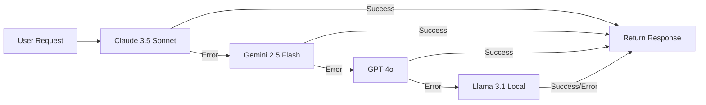

## Overview

Configure **100+ LLM providers** via LiteLLM with automatic fallback, load balancing, and cost optimization. Supports cloud providers (Anthropic, OpenAI, Google) and open-source models (Llama, Mistral, Qwen via Ollama).

<Info>
**LiteLLM** provides a unified interface to all major LLM providers with automatic retries, fallback, and intelligent routing.
</Info>

## Supported Providers

<CardGroup cols={3}>
  <Card title="Anthropic" icon="robot">
    - Claude 3.5 Sonnet
    - Claude 3 Opus
    - Claude 3 Haiku
  </Card>

  <Card title="OpenAI" icon="openai">
    - GPT-4o
    - GPT-4 Turbo
    - GPT-3.5 Turbo
  </Card>

  <Card title="Google" icon="google">
    - Gemini 2.5 Flash
    - Gemini 2.0 Pro
    - Gemini 1.5 Pro
  </Card>

  <Card title="Azure OpenAI" icon="microsoft">
    - GPT-4 (Azure)
    - GPT-3.5 (Azure)
    - Custom deployments
  </Card>

  <Card title="AWS Bedrock" icon="aws">
    - Claude (Bedrock)
    - Llama (Bedrock)
    - Titan
  </Card>

  <Card title="Ollama" icon="computer">
    - Llama 3.1
    - Mistral
    - Qwen 2.5
    - DeepSeek
  </Card>
</CardGroup>

## Quick Start

### Anthropic Claude

<Steps>
  <Step title="Get API Key">
    1. Sign up at https://console.anthropic.com
    2. Generate API key
    3. Note your organization ID
  </Step>

  <Step title="Configure">
    ```bash
    # .env
    LLM_PROVIDER=anthropic
    MODEL_NAME=claude-3-5-sonnet-20241022
    ANTHROPIC_API_KEY=sk-ant-api03-...
    MODEL_TEMPERATURE=0.7
    MODEL_MAX_TOKENS=4096
    ```
  </Step>

  <Step title="Test">
    ```python
    from mcp_server_langgraph.llm.factory import LLMFactory

    llm = LLMFactory(
        provider="anthropic",
        model_name="claude-3-5-sonnet-20241022"
    )

    response = llm.invoke([
        {"role": "user", "content": "Hello!"}
    ])
    print(response.content)
    ```
  </Step>
</Steps>

---

### OpenAI GPT

<Steps>
  <Step title="Get API Key">
    1. Sign up at https://platform.openai.com
    2. Create API key
    3. Add billing information
  </Step>

  <Step title="Configure">
    ```bash
    # .env
    LLM_PROVIDER=openai
    MODEL_NAME=gpt-4o
    OPENAI_API_KEY=sk-proj-...
    MODEL_TEMPERATURE=0.7
    MODEL_MAX_TOKENS=4096
    ```
  </Step>

  <Step title="Test">
    ```python
    llm = LLMFactory(
        provider="openai",
        model_name="gpt-4o"
    )

    response = llm.invoke([
        {"role": "user", "content": "What is AI?"}
    ])
    ```
  </Step>
</Steps>

---

### Google Gemini

<Steps>
  <Step title="Get API Key">
    1. Go to https://makersuite.google.com/app/apikey
    2. Create API key
    3. Enable Gemini API
  </Step>

  <Step title="Configure">
    ```bash
    # .env
    LLM_PROVIDER=google
    MODEL_NAME=gemini-2.5-flash-002
    GOOGLE_API_KEY=AIza...
    MODEL_TEMPERATURE=0.7
    MODEL_MAX_TOKENS=8192
    ```
  </Step>

  <Step title="Test">
    ```python
    llm = LLMFactory(
        provider="google",
        model_name="gemini-2.5-flash-002"
    )

    response = llm.invoke([
        {"role": "user", "content": "Explain quantum computing"}
    ])
    ```
  </Step>
</Steps>

---

### Azure OpenAI

<Steps>
  <Step title="Setup Azure">
    1. Create Azure OpenAI resource
    2. Deploy a model (e.g., gpt-4)
    3. Get endpoint and API key
  </Step>

  <Step title="Configure">
    ```bash
    # .env
    LLM_PROVIDER=azure
    MODEL_NAME=azure/gpt-4
    AZURE_API_KEY=your-azure-key
    AZURE_API_BASE=https://your-resource.openai.azure.com
    AZURE_API_VERSION=2024-02-15-preview
    AZURE_DEPLOYMENT_NAME=gpt-4
    ```
  </Step>

  <Step title="Test">
    ```python
    llm = LLMFactory(
        provider="azure",
        model_name="azure/gpt-4",
        api_base=os.getenv("AZURE_API_BASE"),
        api_version=os.getenv("AZURE_API_VERSION")
    )
    ```
  </Step>
</Steps>

---

### AWS Bedrock

<Steps>
  <Step title="Setup AWS">
    1. Enable Bedrock in AWS Console
    2. Request model access
    3. Configure IAM credentials
  </Step>

  <Step title="Configure">
    ```bash
    # .env
    LLM_PROVIDER=bedrock
    MODEL_NAME=bedrock/anthropic.claude-3-5-sonnet-20241022-v2:0
    AWS_ACCESS_KEY_ID=AKIA...
    AWS_SECRET_ACCESS_KEY=...
    AWS_REGION_NAME=us-east-1
    ```
  </Step>

  <Step title="Test">
    ```python
    llm = LLMFactory(
        provider="bedrock",
        model_name="bedrock/anthropic.claude-3-5-sonnet-20241022-v2:0"
    )
    ```
  </Step>
</Steps>

---

### Ollama (Local Models)

<Steps>
  <Step title="Install Ollama">
    ```bash
    # macOS / Linux
    curl -fsSL https://ollama.com/install.sh | sh

    # Or download from https://ollama.com/download
    ```
  </Step>

  <Step title="Pull Model">
    ```bash
    # Pull Llama 3.1
    ollama pull llama3.1:8b

    # Pull Mistral
    ollama pull mistral:7b

    # Pull Qwen
    ollama pull qwen2.5:7b

    # List models
    ollama list
    ```
  </Step>

  <Step title="Configure">
    ```bash
    # .env
    LLM_PROVIDER=ollama
    MODEL_NAME=ollama/llama3.1:8b
    OLLAMA_API_BASE=http://localhost:11434
    MODEL_TEMPERATURE=0.7
    MODEL_MAX_TOKENS=4096
    ```
  </Step>

  <Step title="Test">
    ```python
    llm = LLMFactory(
        provider="ollama",
        model_name="ollama/llama3.1:8b",
        api_base="http://localhost:11434"
    )

    response = llm.invoke([
        {"role": "user", "content": "Hello!"}
    ])
    ```
  </Step>
</Steps>

---

## Automatic Fallback

Configure automatic fallback when primary model fails:

```bash
# .env
LLM_PROVIDER=anthropic
MODEL_NAME=claude-3-5-sonnet-20241022
ENABLE_FALLBACK=true
FALLBACK_MODELS=gemini-2.5-flash-002,gpt-4o,ollama/llama3.1:8b
```

**Fallback Flow**:



**Configuration**:

```python
from mcp_server_langgraph.llm.factory import LLMFactory

llm = LLMFactory(
    provider="anthropic",
    model_name="claude-3-5-sonnet-20241022",
    enable_fallback=True,
    fallback_models=[
        "gemini-2.5-flash-002",
        "gpt-4o",
        "ollama/llama3.1:8b"
    ]
)

# Automatically falls back on error
response = llm.invoke(messages)
```

**Common Failure Scenarios**:
- API quota exceeded
- Rate limiting
- Model unavailable
- Timeout
- Invalid API key

---

## Model Comparison

<Tabs>
  <Tab title="Performance">
    | Model | Speed | Quality | Context | Cost |
    |-------|-------|---------|---------|------|
    | Claude 3.5 Sonnet | ⚡⚡⚡ | ⭐⭐⭐⭐⭐ | 200K | $$ |
    | GPT-4o | ⚡⚡⚡ | ⭐⭐⭐⭐⭐ | 128K | $$$ |
    | Gemini 2.5 Flash | ⚡⚡⚡⚡⚡ | ⭐⭐⭐⭐ | 1M | $ |
    | Llama 3.1 8B | ⚡⚡⚡⚡ | ⭐⭐⭐ | 128K | Free |
  </Tab>

  <Tab title="Use Cases">
    **Claude 3.5 Sonnet**: Best for complex reasoning, code generation, analysis

    **GPT-4o**: Strong general purpose, multimodal, reliable

    **Gemini 2.5 Flash**: Fast, cost-effective, huge context window

    **Llama 3.1**: Local/offline, privacy-sensitive, cost-free
  </Tab>

  <Tab title="Pricing">
    **Input / Output per 1M tokens**:

    - **Claude 3.5 Sonnet**: $3 / $15
    - **GPT-4o**: $2.50 / $10
    - **Gemini 2.5 Flash**: $0.075 / $0.30
    - **Llama 3.1 (Ollama)**: $0 / $0 (local)
  </Tab>
</Tabs>

---

## Advanced Configuration

### Load Balancing

Distribute requests across multiple providers:

```python
from litellm import Router

router = Router(
    model_list=[
        {
            "model_name": "claude-3-5-sonnet",
            "litellm_params": {
                "model": "claude-3-5-sonnet-20241022",
                "api_key": os.getenv("ANTHROPIC_API_KEY")
            }
        },
        {
            "model_name": "gpt-4o",
            "litellm_params": {
                "model": "gpt-4o",
                "api_key": os.getenv("OPENAI_API_KEY")
            }
        }
    ],
    routing_strategy="least-busy"  # or "simple-shuffle", "latency-based"
)

response = await router.acompletion(
    model="claude-3-5-sonnet",
    messages=[{"role": "user", "content": "Hello"}]
)
```

### Rate Limiting

Prevent quota exhaustion:

```python
from litellm import Router

router = Router(
    model_list=[...],
    redis_host="localhost",
    redis_port=6379,
    rpm=1000,  # Requests per minute
    tpm=100000  # Tokens per minute
)
```

### Cost Tracking

Monitor LLM costs:

```python
from litellm import completion_cost

response = llm.invoke(messages)

# Calculate cost
cost = completion_cost(
    model=model_name,
    prompt_tokens=response.usage.prompt_tokens,
    completion_tokens=response.usage.completion_tokens
)

print(f"Cost: ${cost:.4f}")
```

### Caching

Cache responses to reduce costs:

```python
from litellm import Cache

cache = Cache(
    type="redis",
    host="localhost",
    port=6379,
    ttl=3600  # 1 hour
)

# Cached completion
response = completion(
    model="claude-3-5-sonnet-20241022",
    messages=messages,
    cache=cache
)
```

---

## Configuration Reference

### Environment Variables

```bash
# Provider Selection
LLM_PROVIDER=anthropic|openai|google|azure|bedrock|ollama
MODEL_NAME=model-identifier

# Model Parameters
MODEL_TEMPERATURE=0.0-2.0  # Default: 0.7
MODEL_MAX_TOKENS=1-32000   # Default: 4096
MODEL_TIMEOUT=10-300       # Seconds, Default: 60
MODEL_TOP_P=0.0-1.0        # Default: 1.0

# Fallback
ENABLE_FALLBACK=true|false  # Default: false
FALLBACK_MODELS=model1,model2,model3

# Provider API Keys
ANTHROPIC_API_KEY=sk-ant-...
OPENAI_API_KEY=sk-proj-...
GOOGLE_API_KEY=AIza...
AZURE_API_KEY=...
AWS_ACCESS_KEY_ID=AKIA...
AWS_SECRET_ACCESS_KEY=...

# Provider-Specific
AZURE_API_BASE=https://your-resource.openai.azure.com
AZURE_API_VERSION=2024-02-15-preview
AZURE_DEPLOYMENT_NAME=gpt-4
AWS_REGION_NAME=us-east-1
OLLAMA_API_BASE=http://localhost:11434
```

### Model IDs

<Tabs>
  <Tab title="Anthropic">
    ```bash
    claude-3-5-sonnet-20241022    # Latest Sonnet
    claude-3-opus-20240229        # Opus
    claude-3-haiku-20240307       # Haiku (fast)
    ```
  </Tab>

  <Tab title="OpenAI">
    ```bash
    gpt-4o                        # GPT-4 Omni
    gpt-4-turbo                   # GPT-4 Turbo
    gpt-4                         # GPT-4
    gpt-3.5-turbo                 # GPT-3.5 (fast)
    ```
  </Tab>

  <Tab title="Google">
    ```bash
    gemini-2.5-flash-002          # Gemini 2.5 Flash
    gemini-2.0-pro                # Gemini 2.0 Pro
    gemini-1.5-pro                # Gemini 1.5 Pro
    gemini-1.5-flash              # Gemini 1.5 Flash
    ```
  </Tab>

  <Tab title="Azure">
    ```bash
    azure/gpt-4                   # Requires deployment name
    azure/gpt-35-turbo
    ```
  </Tab>

  <Tab title="Bedrock">
    ```bash
    bedrock/anthropic.claude-3-5-sonnet-20241022-v2:0
    bedrock/meta.llama3-1-70b-instruct-v1:0
    bedrock/amazon.titan-text-express-v1
    ```
  </Tab>

  <Tab title="Ollama">
    ```bash
    ollama/llama3.1:8b            # Llama 3.1 8B
    ollama/llama3.1:70b           # Llama 3.1 70B
    ollama/mistral:7b             # Mistral 7B
    ollama/qwen2.5:7b             # Qwen 2.5 7B
    ollama/deepseek-coder:6.7b    # DeepSeek Coder
    ```
  </Tab>
</Tabs>

---

## Troubleshooting

<AccordionGroup>
  <Accordion title="API key not working">
    ```bash
    # Test API key
    curl https://api.anthropic.com/v1/messages \
      -H "x-api-key: $ANTHROPIC_API_KEY" \
      -H "anthropic-version: 2023-06-01" \
      -H "content-type: application/json" \
      -d '{"model":"claude-3-5-sonnet-20241022","max_tokens":10,"messages":[{"role":"user","content":"Hi"}]}'

    # Check environment
    echo $ANTHROPIC_API_KEY
    env | grep API_KEY
    ```
  </Accordion>

  <Accordion title="Rate limit errors">
    **Solutions**:
    - Enable fallback models
    - Implement request queuing
    - Increase rate limits (paid plans)
    - Add retry with exponential backoff

    ```python
    llm = LLMFactory(
        provider="anthropic",
        enable_fallback=True,
        fallback_models=["gemini-2.5-flash-002"],
        timeout=120  # Longer timeout
    )
    ```
  </Accordion>

  <Accordion title="Ollama connection failed">
    ```bash
    # Check Ollama running
    ollama list

    # Start Ollama
    ollama serve

    # Test connection
    curl http://localhost:11434/api/tags

    # Set correct endpoint
    OLLAMA_API_BASE=http://localhost:11434
    ```
  </Accordion>

  <Accordion title="Slow responses">
    **Optimizations**:
    - Use faster models (Gemini Flash, Claude Haiku)
    - Reduce max_tokens
    - Increase temperature for faster sampling
    - Enable streaming

    ```python
    llm = LLMFactory(
        model_name="gemini-2.5-flash-002",  # Faster
        max_tokens=1024,  # Lower limit
        temperature=0.9  # Faster sampling
    )
    ```
  </Accordion>
</AccordionGroup>

---

## Next Steps

<CardGroup cols={2}>
  <Card title="Observability" icon="chart-line" href="/guides/observability">
    Track LLM usage and costs
  </Card>
  <Card title="Architecture" icon="sitemap" href="/getting-started/architecture">
    Understand LLM integration
  </Card>
  <Card title="Production Checklist" icon="clipboard-check" href="/deployment/production-checklist">
    LLM production requirements
  </Card>
  <Card title="API Reference" icon="code" href="/api-reference/introduction">
    Agent API endpoints
  </Card>
</CardGroup>

---

<Check>
**Flexible & Resilient**: Multi-LLM support with automatic fallback ensures high availability and cost optimization!
</Check>
