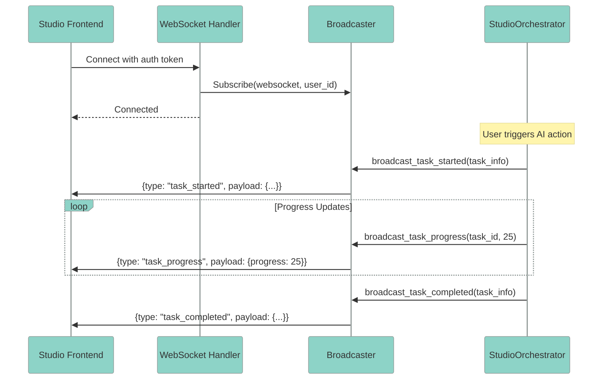

<Note>
**NEW in v2.10.0** - Real-time AI orchestrator status WebSocket for monitoring task progress, queue depth, and overall orchestrator state.
</Note>

### Overview

The Orchestrator Status WebSocket provides real-time streaming of AI orchestrator activity to the Studio frontend:

- **Task Lifecycle Events** - Track when tasks start, progress, complete, or fail
- **Progress Tracking** - Monitor long-running task progress (0-100%)
- **Queue Depth** - See how many tasks are waiting to be processed
- **Multi-tenant** - User-specific filtering for secure broadcasts
- **Reconnection Support** - Status snapshots for clients that reconnect

### Architecture



### Quick Start

<Steps>
  <Step title="Connect to WebSocket">
    The WebSocket endpoint is at `/api/v1/ws/orchestrator/status`:

    ```typescript
    const token = await getAccessToken();
    const ws = new WebSocket(
      `wss://your-domain.com/api/v1/ws/orchestrator/status?token=${token}`
    );

    ws.onopen = () => {
      console.log('Connected to orchestrator status');
    };

    ws.onmessage = (event) => {
      const message = JSON.parse(event.data);
      handleOrchestratorMessage(message);
    };
    ```
  </Step>

  <Step title="Handle Status Messages">
    Process incoming orchestrator events:

    ```typescript
    function handleOrchestratorMessage(message: OrchestratorMessage) {
      switch (message.type) {
        case 'task_started':
          showTaskSpinner(message.payload.task_id, message.payload.task_type);
          break;

        case 'task_progress':
          updateTaskProgress(message.payload.task_id, message.payload.progress);
          break;

        case 'task_completed':
          hideTaskSpinner(message.payload.task_id);
          break;

        case 'task_failed':
          showTaskError(message.payload.task_id, message.payload.error);
          break;

        case 'orchestrator_status':
          updateGlobalStatus(message.payload.status);
          break;
      }
    }
    ```
  </Step>

  <Step title="Request Current Status">
    On reconnection, request the current status snapshot:

    ```typescript
    ws.onopen = () => {
      // Request current state after reconnection
      ws.send(JSON.stringify({
        type: 'get_status',
        id: `status-${Date.now()}`
      }));
    };
    ```
  </Step>
</Steps>

### Message Types

#### Server to Client

| Message Type | Description | Payload Fields |
|--------------|-------------|----------------|
| `orchestrator_status` | Overall orchestrator state change | `status`, `message`, `task_type`, `category` |
| `task_started` | A task has begun processing | `task_id`, `task_type`, `category`, `started_at` |
| `task_progress` | Progress update for a task | `task_id`, `progress` (0-100), `message` (optional) |
| `task_completed` | Task finished successfully | `task_id`, `task_type`, `category`, `completed_at`, `success` |
| `task_failed` | Task encountered an error | `task_id`, `task_type`, `category`, `failed_at`, `error` |
| `queue_update` | Queue depth changed | `action`, `task_id`, `task_type`, `queue_depth` |
| `status` | Response to get_status request | `status`, `message`, `activeTasks`, `activeTaskProgress`, `queueDepth` |

#### Client to Server

| Message Type | Description | Payload Fields |
|--------------|-------------|----------------|
| `subscribe` | Subscribe to status updates | None |
| `unsubscribe` | Unsubscribe from updates | None |
| `get_status` | Request current status snapshot | None |

### Task Categories

The orchestrator processes tasks across several categories:

| Category | Description | Example Task Types |
|----------|-------------|-------------------|
| `ux` | UX analysis and recommendations | `persona_analysis`, `journey_mapping` |
| `session` | Session management | `session_create`, `session_restore` |
| `conversation` | Chat interactions | `message_generation`, `context_update` |
| `canvas` | Canvas artifact operations | `artifact_create`, `artifact_update` |
| `diagram` | Diagram generation | `mermaid_generation`, `diagram_export` |
| `trace` | Execution tracing | `trace_capture`, `trace_export` |
| `hitl` | Human-in-the-loop approvals | `approval_request`, `approval_complete` |
| `command` | Tool/command execution | `tool_call`, `command_run` |
| `alert` | Alert processing | `alert_analysis`, `remediation` |

### Frontend Integration

#### Using the useAIOrchestratorStatus Hook

```tsx
import { useAIOrchestratorStatus } from '@/hooks/useAIOrchestratorStatus';

function OrchestratorStatusIndicator() {
  const {
    status,
    activeTasks,
    activeTaskProgress,
    queueDepth,
    isConnected,
    error
  } = useAIOrchestratorStatus();

  if (!isConnected) {
    return <Badge variant="outline">Disconnected</Badge>;
  }

  if (status === 'idle') {
    return <Badge variant="success">Ready</Badge>;
  }

  return (
    <div className="flex items-center gap-2">
      <Badge variant="processing">
        Processing {activeTasks} task{activeTasks !== 1 ? 's' : ''}
      </Badge>

      {queueDepth > 0 && (
        <Badge variant="outline">{queueDepth} queued</Badge>
      )}

      {Object.entries(activeTaskProgress).map(([taskId, progress]) => (
        <Progress key={taskId} value={progress} />
      ))}
    </div>
  );
}
```

#### StatusBar Integration

The StatusBar component displays orchestrator status:

```tsx
import { StatusBar } from '@/layout/StatusBar';

function StudioLayout() {
  return (
    <div className="flex flex-col h-screen">
      <Header />
      <main className="flex-1">
        {/* Main content */}
      </main>
      <StatusBar />
    </div>
  );
}
```

The StatusBar shows:
- Connection status (connected/disconnected)
- Orchestrator state (idle/processing/error)
- Active task count with category badges
- Queue depth indicator
- Progress bars for long-running tasks

### Backend Integration

#### Broadcasting from Orchestrators

```python
from mcp_server_langgraph.websocket.handlers.orchestrator_status import (
    OrchestratorStatusBroadcaster,
    TaskInfo,
    TaskCategory,
    OrchestratorStatus,
)
from datetime import datetime, UTC
import uuid

class StudioOrchestrator:
    def __init__(self, broadcaster: OrchestratorStatusBroadcaster | None = None):
        self._broadcaster = broadcaster

    async def analyze_persona(self, user_id: str) -> PersonaResult:
        task_id = str(uuid.uuid4())

        # Queue the task first
        if self._broadcaster:
            await self._broadcaster.queue_task(
                task_id=task_id,
                task_type="persona_analysis",
                category=TaskCategory.UX,
                user_id=user_id,
            )

        # Mark task as started
        task_info = TaskInfo(
            task_id=task_id,
            task_type="persona_analysis",
            category=TaskCategory.UX,
            started_at=datetime.now(UTC),
        )

        if self._broadcaster:
            await self._broadcaster.broadcast_task_started(
                task_info, user_id=user_id
            )
            await self._broadcaster.broadcast_status(
                status=OrchestratorStatus.PROCESSING,
                message="Analyzing user persona...",
                task_type="persona_analysis",
                category=TaskCategory.UX,
                user_id=user_id,
            )

        try:
            # Report progress
            for step, progress in [("Gathering data", 25), ("Processing", 50), ("Finalizing", 75)]:
                if self._broadcaster:
                    await self._broadcaster.broadcast_task_progress(
                        task_id=task_id,
                        progress=progress,
                        message=step,
                        user_id=user_id,
                    )
                # ... do work ...

            result = await self._do_persona_analysis()

            # Mark completed
            task_info.completed_at = datetime.now(UTC)
            task_info.success = True

            if self._broadcaster:
                await self._broadcaster.broadcast_task_completed(
                    task_info, user_id=user_id
                )

            return result

        except Exception as e:
            task_info.completed_at = datetime.now(UTC)
            task_info.success = False
            task_info.error = str(e)

            if self._broadcaster:
                await self._broadcaster.broadcast_task_failed(
                    task_info, user_id=user_id
                )
            raise
```

#### Dependency Injection

The broadcaster is injected via dependency injection:

```python
# api/v1/studio_ai.py
from fastapi import APIRouter, Depends
from mcp_server_langgraph.websocket.handlers.orchestrator_status import (
    get_orchestrator_status_broadcaster,
    OrchestratorStatusBroadcaster,
)

router = APIRouter()

@router.post("/analyze")
async def analyze_persona(
    request: AnalyzeRequest,
    broadcaster: OrchestratorStatusBroadcaster = Depends(get_orchestrator_status_broadcaster),
):
    orchestrator = StudioOrchestrator(broadcaster=broadcaster)
    return await orchestrator.analyze_persona(request.user_id)
```

### Metrics & Monitoring

The broadcaster exposes metrics for Prometheus:

```python
# Get metrics from broadcaster
metrics = broadcaster.get_metrics()

# Returns:
{
    "subscriber_count": 15,        # Active WebSocket connections
    "active_task_count": 3,        # Currently processing tasks
    "queue_depth": 7,              # Tasks waiting to start
    "total_tasks_started": 1250,   # Lifetime counter
    "total_tasks_completed": 1200, # Lifetime counter
    "total_tasks_failed": 50,      # Lifetime counter
}
```

#### Prometheus Metrics

| Metric | Type | Description |
|--------|------|-------------|
| `orchestrator_ws_subscribers` | Gauge | Active WebSocket subscriber count |
| `orchestrator_active_tasks` | Gauge | Currently processing task count |
| `orchestrator_queue_depth` | Gauge | Pending task queue depth |
| `orchestrator_tasks_started_total` | Counter | Total tasks started |
| `orchestrator_tasks_completed_total` | Counter | Total tasks completed successfully |
| `orchestrator_tasks_failed_total` | Counter | Total tasks failed |

#### Grafana Dashboard

```json
{
  "title": "Orchestrator Status",
  "panels": [
    {
      "title": "Active Tasks",
      "type": "stat",
      "targets": [
        {
          "expr": "orchestrator_active_tasks",
          "legendFormat": "Active"
        }
      ]
    },
    {
      "title": "Queue Depth",
      "type": "gauge",
      "targets": [
        {
          "expr": "orchestrator_queue_depth",
          "legendFormat": "Queued"
        }
      ],
      "thresholds": [
        { "value": 0, "color": "green" },
        { "value": 10, "color": "yellow" },
        { "value": 50, "color": "red" }
      ]
    },
    {
      "title": "Task Success Rate",
      "type": "gauge",
      "targets": [
        {
          "expr": "rate(orchestrator_tasks_completed_total[5m]) / (rate(orchestrator_tasks_completed_total[5m]) + rate(orchestrator_tasks_failed_total[5m])) * 100",
          "legendFormat": "Success %"
        }
      ]
    },
    {
      "title": "WebSocket Subscribers",
      "type": "timeseries",
      "targets": [
        {
          "expr": "orchestrator_ws_subscribers",
          "legendFormat": "Subscribers"
        }
      ]
    }
  ]
}
```

### Security

<CardGroup cols={2}>
  <Card title="Authentication Required" icon="lock">
    WebSocket connections require a valid JWT token passed via query parameter or header.
  </Card>
  <Card title="User Isolation" icon="user-shield">
    Broadcasts are filtered by user_id ensuring users only see their own task activity.
  </Card>
  <Card title="Authorization" icon="shield">
    OpenFGA checks ensure users have `viewer` relation on `ai:orchestrator` resource.
  </Card>
  <Card title="Rate Limiting" icon="gauge">
    WebSocket message rate limited to prevent abuse (100 messages/minute).
  </Card>
</CardGroup>

### Error Handling

#### Connection Errors

```typescript
ws.onerror = (error) => {
  console.error('WebSocket error:', error);
  // Attempt reconnection with exponential backoff
  scheduleReconnect();
};

ws.onclose = (event) => {
  if (event.code !== 1000) {
    // Abnormal closure - attempt reconnection
    scheduleReconnect();
  }
};

let reconnectAttempts = 0;
const MAX_RECONNECT_ATTEMPTS = 5;

function scheduleReconnect() {
  if (reconnectAttempts >= MAX_RECONNECT_ATTEMPTS) {
    showPermanentError('Connection lost. Please refresh the page.');
    return;
  }

  const delay = Math.min(1000 * Math.pow(2, reconnectAttempts), 30000);
  reconnectAttempts++;

  setTimeout(() => {
    connectToOrchestratorStatus();
  }, delay);
}
```

#### Authentication Errors

```typescript
ws.onclose = (event) => {
  if (event.code === 1008 || event.code === 4001) {
    // Authentication failed - refresh token and reconnect
    refreshToken().then(() => {
      connectToOrchestratorStatus();
    });
  }
};
```

### Testing

#### Unit Tests

```python
@pytest.mark.asyncio
async def test_broadcast_task_progress():
    """Test that task progress broadcasts are sent correctly."""
    broadcaster = OrchestratorStatusBroadcaster()
    mock_ws = AsyncMock()
    await broadcaster.subscribe(mock_ws, user_id="user-1")

    task_info = TaskInfo(
        task_id="task-1",
        task_type="analysis",
        category=TaskCategory.UX,
        started_at=datetime.now(UTC),
    )
    await broadcaster.broadcast_task_started(task_info, user_id="user-1")
    await broadcaster.broadcast_task_progress("task-1", 50, "Processing...")

    # Verify progress message was sent
    calls = mock_ws.send_json.call_args_list
    progress_call = calls[-1]
    assert progress_call[0][0]["type"] == "task_progress"
    assert progress_call[0][0]["payload"]["progress"] == 50
```

#### E2E Tests

```python
@pytest.mark.e2e
@pytest.mark.websocket
async def test_can_connect_to_orchestrator_status_websocket():
    """Test WebSocket connection with authentication."""
    import websockets

    token = await get_test_token()
    ws_url = f"{E2E_WS_BASE_URL}/api/v1/ws/orchestrator/status?token={token}"

    async with websockets.connect(ws_url, open_timeout=10) as ws:
        assert ws.open
```

### Troubleshooting

<AccordionGroup>
  <Accordion title="WebSocket connection fails">
    1. Verify JWT token is valid and not expired
    2. Check CORS configuration allows WebSocket upgrade
    3. Verify user has `viewer` permission on `ai:orchestrator`
    4. Check server logs for authentication errors
  </Accordion>

  <Accordion title="Not receiving status updates">
    1. Verify subscription was successful (check for `subscribed` response)
    2. Ensure user_id matches the authenticated user
    3. Check if orchestrator has broadcaster injected
    4. Verify broadcaster is the singleton instance
  </Accordion>

  <Accordion title="Progress updates not showing">
    1. Verify task_id matches between `task_started` and `task_progress`
    2. Check that progress value is between 0-100
    3. Ensure frontend is handling `task_progress` message type
  </Accordion>

  <Accordion title="High queue depth">
    1. Check if orchestrator is processing tasks slowly
    2. Monitor active task count vs queue depth
    3. Consider scaling orchestrator resources
    4. Review task timeout settings
  </Accordion>
</AccordionGroup>

### Configuration

| Environment Variable | Default | Description |
|---------------------|---------|-------------|
| `ORCHESTRATOR_WS_HEARTBEAT_INTERVAL` | `30s` | WebSocket heartbeat interval |
| `ORCHESTRATOR_WS_MAX_CONNECTIONS` | `1000` | Maximum concurrent connections |
| `ORCHESTRATOR_WS_MESSAGE_RATE_LIMIT` | `100/min` | Maximum messages per minute |
| `ORCHESTRATOR_TASK_TIMEOUT` | `300s` | Task processing timeout |

### Related Guides

- [Multi-Agent Orchestrators](/guides/multi-agent-orchestrators) - Orchestrator architecture
- [Agent Architecture](/guides/agent-architecture) - Understanding agent design
- [Observability](/guides/observability) - Monitoring and tracing
- [Service Workers](/guides/service-workers) - Offline support
