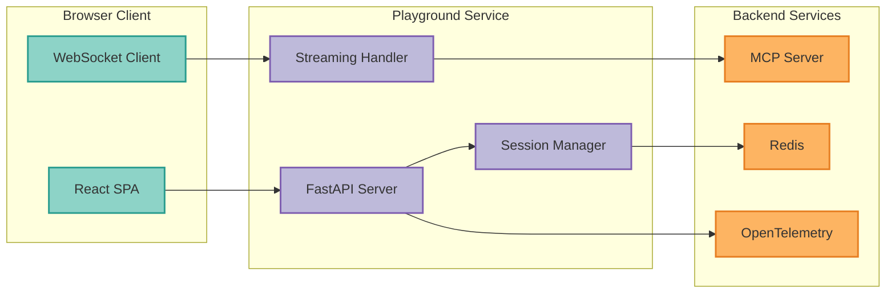

## Overview

The Interactive Playground provides a real-time testing environment for exploring AI agents built with MCP Server and LangGraph. It offers:

- **Real-time streaming** - See agent responses as they're generated
- **Session persistence** - Maintain conversation context across interactions
- **In-context observability** - View traces and metrics alongside chat
- **Tool visualization** - Watch tool calls and responses in real-time

<CardGroup cols={2}>
  <Card
    title="Quick Start"
    icon="rocket"
    href="#quick-start"
  >
    Get started in 5 minutes
  </Card>
  <Card
    title="API Reference"
    icon="code"
    href="/api-reference/playground"
  >
    Explore the Playground API
  </Card>
</CardGroup>

## Architecture



## Quick Start

### Prerequisites

- Docker and Docker Compose
- Running MCP Server instance
- Valid authentication credentials

### Starting the Playground

<Tabs>
  <Tab title="Docker Compose">
    ```bash
    # Start full infrastructure including playground
    make test-infra-full-up

    # Access the playground
    open http://localhost:9002
    ```
  </Tab>
  <Tab title="Standalone">
    ```bash
    # Set required environment variables
    export MCP_SERVER_URL=http://localhost:8000
    export REDIS_URL=redis://localhost:6379/2
    export JWT_SECRET_KEY=your-secret-key

    # Run the playground server
    uv run uvicorn src.mcp_server_langgraph.playground.api.server:app \
      --host 0.0.0.0 \
      --port 8002
    ```
  </Tab>
</Tabs>

### Your First Chat Session

<Steps>
  <Step title="Create a Session">
    Click "New Session" to create a conversation session. Sessions persist your conversation history.
  </Step>
  <Step title="Send a Message">
    Type your message and press Enter. The agent will stream its response in real-time.
  </Step>
  <Step title="View Observability">
    Click the "Traces" tab to see OpenTelemetry traces for your conversation.
  </Step>
  <Step title="Manage Sessions">
    Use the sidebar to switch between sessions or delete old ones.
  </Step>
</Steps>

## Features

### Real-Time Streaming

The playground uses WebSocket connections for real-time streaming of agent responses. This provides:

- **Immediate feedback** - See each token as it's generated
- **Tool call visualization** - Watch tool invocations in real-time
- **Cancellation support** - Stop long-running responses mid-stream

```javascript
// WebSocket message format
{
  "type": "chat",
  "session_id": "abc123",
  "message": "What is the weather today?"
}

// Streaming response chunks
{ "type": "token", "content": "The" }
{ "type": "token", "content": " weather" }
{ "type": "tool_call", "name": "get_weather", "args": {...} }
{ "type": "tool_result", "content": "72°F, sunny" }
{ "type": "token", "content": " is 72°F and sunny." }
{ "type": "end" }
```

### Session Management

Sessions provide persistent conversation context stored in Redis:

<AccordionGroup>
  <Accordion title="Session Lifecycle" icon="repeat">
    **Create** → **Active** → **Idle** → **Expired**

    - Sessions are created on first message
    - Active sessions have a sliding TTL (default: 1 hour)
    - Idle sessions expire after inactivity
    - Expired sessions are cleaned up automatically
  </Accordion>

  <Accordion title="Session Storage" icon="database">
    Sessions are stored in Redis with the following structure:

    ```json
    {
      "session_id": "abc123",
      "user_id": "alice",
      "name": "My Chat Session",
      "created_at": "2025-12-06T10:00:00Z",
      "updated_at": "2025-12-06T10:30:00Z",
      "messages": [
        {"role": "user", "content": "Hello"},
        {"role": "assistant", "content": "Hi there!"}
      ],
      "metadata": {
        "model": "gemini-2.5-flash",
        "token_count": 150
      }
    }
    ```
  </Accordion>

  <Accordion title="Multi-User Support" icon="users">
    Sessions are scoped to authenticated users:

    - Each user sees only their own sessions
    - Session IDs include user-specific prefixes
    - Admin users can view all sessions (with proper authorization)
  </Accordion>
</AccordionGroup>

### In-Context Observability

View traces and metrics directly in the playground interface:

| Feature | Description |
|---------|-------------|
| **Traces** | OpenTelemetry distributed traces for each conversation turn |
| **Logs** | Structured JSON logs filtered by session |
| **Metrics** | Token usage, latency, and error rates |
| **LangSmith** | Link to LangSmith trace view (if configured) |

## Configuration

### Environment Variables

| Variable | Description | Default |
|----------|-------------|---------|
| `MCP_SERVER_URL` | URL of the MCP server | `http://localhost:8000` |
| `REDIS_URL` | Redis connection URL | `redis://localhost:6379/2` |
| `SESSION_TTL_SECONDS` | Session expiration time | `3600` (1 hour) |
| `MAX_MESSAGES_PER_SESSION` | Maximum messages per session | `100` |
| `OTEL_EXPORTER_OTLP_ENDPOINT` | OpenTelemetry endpoint | - |
| `LANGSMITH_API_KEY` | LangSmith API key | - |

### Session Configuration

```yaml
# docker-compose.test.yml
playground-test:
  environment:
    - SESSION_TTL_SECONDS=3600
    - MAX_MESSAGES_PER_SESSION=100
    - REDIS_URL=redis://redis-test:6379/2
```

## Security

### Authentication

The playground requires JWT authentication for all API endpoints except health checks:

```bash
# Get a token from Keycloak
TOKEN=$(curl -X POST http://localhost:8080/realms/mcp-server-langgraph/protocol/openid-connect/token \
  -d "grant_type=password" \
  -d "client_id=playground" \
  -d "username=alice" \
  -d "password=password" | jq -r '.access_token')

# Use the token
curl -H "Authorization: Bearer $TOKEN" \
  http://localhost:9002/api/playground/sessions
```

### Authorization

Session access is controlled by OpenFGA:

```yaml
# OpenFGA relationship tuples
user:alice can view session:abc123
user:alice can delete session:abc123
user:bob can view session:abc123  # Shared session
```

<Warning>
Sessions contain sensitive conversation data. Ensure proper access controls are configured before deploying to production.
</Warning>

## API Endpoints

<CardGroup cols={2}>
  <Card title="Sessions API" icon="database">
    Create, list, and delete chat sessions
  </Card>
  <Card title="Chat API" icon="comments">
    Send messages and receive streaming responses
  </Card>
  <Card title="Observability API" icon="chart-line">
    Retrieve traces, logs, and metrics
  </Card>
  <Card title="WebSocket API" icon="plug">
    Real-time bidirectional communication
  </Card>
</CardGroup>

See [Playground API Reference](/api-reference/playground) for complete endpoint documentation.

## Troubleshooting

<AccordionGroup>
  <Accordion title="WebSocket connection fails" icon="plug">
    **Symptoms**: Unable to establish WebSocket connection

    **Solutions**:
    1. Check that the playground server is running
    2. Verify the WebSocket URL uses `ws://` or `wss://`
    3. Ensure authentication token is valid
    4. Check for proxy/firewall issues blocking WebSocket

    ```bash
    # Test WebSocket connectivity
    wscat -c ws://localhost:9002/ws/playground/test-session \
      -H "Authorization: Bearer $TOKEN"
    ```
  </Accordion>

  <Accordion title="Session not persisting" icon="database">
    **Symptoms**: Messages disappear after refresh

    **Solutions**:
    1. Verify Redis is running and accessible
    2. Check session TTL configuration
    3. Ensure you're using the same session ID
    4. Check Redis connection in logs

    ```bash
    # Check Redis connectivity
    redis-cli -h localhost -p 6379 -n 2 ping
    ```
  </Accordion>

  <Accordion title="Traces not appearing" icon="chart-line">
    **Symptoms**: Observability panel shows no data

    **Solutions**:
    1. Verify OpenTelemetry is configured
    2. Check OTEL exporter endpoint is reachable
    3. Ensure trace sampling is enabled
    4. Check for trace filtering by session ID
  </Accordion>
</AccordionGroup>

## Related Documentation

<CardGroup cols={2}>
  <Card title="Visual Workflow Builder" icon="diagram-project" href="/guides/visual-workflow-builder">
    Design agents visually
  </Card>
  <Card title="MCP Protocol" icon="plug" href="/api-reference/mcp/messages">
    Understand MCP messaging
  </Card>
  <Card title="Authentication" icon="key" href="/api-reference/authentication">
    Configure authentication
  </Card>
  <Card title="Observability" icon="chart-line" href="/guides/observability">
    Set up monitoring
  </Card>
</CardGroup>

---

<Check>
**Ready to test!** Start the playground and begin exploring your AI agents in real-time.
</Check>
