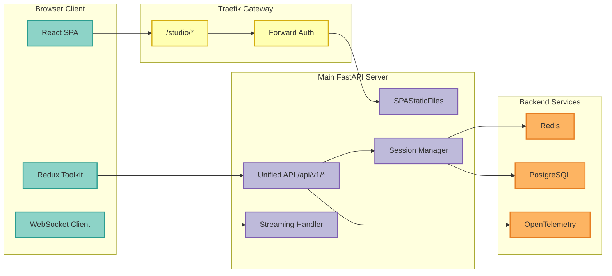

## Overview

The **Studio** is a unified frontend application that consolidates the former Playground (chat interface) and Builder (workflow editor) into a single React application. It provides:

- **Real-time streaming** - See agent responses as they're generated
- **Session persistence** - Maintain conversation context across interactions
- **Workflow builder** - Design and edit agent workflows visually
- **In-context observability** - View traces and metrics alongside chat
- **Tool visualization** - Watch tool calls and responses in real-time

<Note>
**Consolidation Note**: As of the latest release, the separate Playground (port 8002) and Builder (port 8001) services have been consolidated into the unified Studio frontend, served at `/studio` from the main application.
</Note>

<CardGroup cols={2}>
  <Card
    title="Quick Start"
    icon="rocket"
    href="#quick-start"
  >
    Get started in 5 minutes
  </Card>
  <Card
    title="API Reference"
    icon="code"
    href="/api-reference/sessions"
  >
    Explore the Unified API
  </Card>
</CardGroup>

## Architecture

The Studio is served as a Single Page Application (SPA) from the main FastAPI server using `SPAStaticFiles`:


```mermaid
flowchart LR
    subgraph Client["Browser Client"]
        UI["React SPA"]
        RTK["Redux Toolkit"]
        WS["WebSocket Client"]
    end

    subgraph Gateway["Traefik Gateway"]
        Route["/studio/*"]
        Auth["Forward Auth"]
    end

    subgraph Server["Main FastAPI Server"]
        SPA["SPAStaticFiles"]
        API["Unified API /api/v1/*"]
        Session["Session Manager"]
        Stream["Streaming Handler"]
    end

    subgraph Backend["Backend Services"]
        Redis["Redis"]
        Postgres["PostgreSQL"]
        OTEL["OpenTelemetry"]
    end

    UI --> Route
    Route --> Auth
    Auth --> SPA
    RTK --> API
    WS --> Stream
    API --> Session
    Session --> Redis
    Session --> Postgres
    API --> OTEL

    %% ColorBrewer2 Set3 palette - each component type uniquely colored
    classDef clientStyle fill:#8dd3c7,stroke:#2a9d8f,stroke-width:2px,color:#333
    classDef gatewayStyle fill:#ffffb3,stroke:#d4ac0d,stroke-width:2px,color:#333
    classDef serverStyle fill:#bebada,stroke:#7e5eb0,stroke-width:2px,color:#333
    classDef backendStyle fill:#fdb462,stroke:#e67e22,stroke-width:2px,color:#333

    class UI,RTK,WS clientStyle
    class Route,Auth gatewayStyle
    class SPA,API,Session,Stream serverStyle
    class Redis,Postgres,OTEL backendStyle
```

### Key Architecture Changes

| Before (Deprecated) | After (Current) |
|---------------------|-----------------|
| Playground on port 8002 | Unified Studio on `/studio` |
| Builder on port 8001 | Unified Studio on `/studio` |
| `/api/playground/*` | `/api/v1/sessions/*`, `/api/v1/chat/*` |
| `/api/builder/*` | `/api/v1/workflows/*` |
| Zustand state management | Redux Toolkit + RTK Query |
| Separate Docker images | Single main application image |

## Quick Start

### Prerequisites

- Docker and Docker Compose
- Running MCP Server instance
- Valid authentication credentials

### Starting Studio

<Tabs>
  <Tab title="Docker Compose">
    ```bash
    # Start the full infrastructure with Studio
    make test-studio-up

    # Access the Studio (via Traefik gateway)
    open http://localhost/studio

    # Or directly via the app (port 8000)
    open http://localhost:8000/studio
    ```
  </Tab>
  <Tab title="Development Mode">
    ```bash
    # Start the backend server
    make run-streamable

    # In another terminal, start the frontend dev server
    cd src/mcp_server_langgraph/studio/frontend
    npm install
    npm run dev

    # Access at http://localhost:5173 (Vite dev server)
    ```
  </Tab>
</Tabs>

### Your First Chat Session

<Steps>
  <Step title="Access Studio">
    Navigate to `http://localhost/studio` (with gateway) or `http://localhost:8000/studio` (direct).
  </Step>
  <Step title="Create a Session">
    Click "New Session" to create a conversation session. Sessions persist your conversation history.
  </Step>
  <Step title="Send a Message">
    Type your message and press Enter. The agent will stream its response in real-time.
  </Step>
  <Step title="View Observability">
    Click the "Traces" tab to see OpenTelemetry traces for your conversation.
  </Step>
  <Step title="Manage Sessions">
    Use the sidebar to switch between sessions or delete old ones.
  </Step>
</Steps>

## Features

### Real-Time Streaming

The Studio uses WebSocket connections for real-time streaming of agent responses. This provides:

- **Immediate feedback** - See each token as it's generated
- **Tool call visualization** - Watch tool invocations in real-time
- **Cancellation support** - Stop long-running responses mid-stream

```javascript
// WebSocket message format
{
  "type": "chat",
  "session_id": "abc123",
  "message": "What is the weather today?"
}

// Streaming response chunks
{ "type": "token", "content": "The" }
{ "type": "token", "content": " weather" }
{ "type": "tool_call", "name": "get_weather", "args": {...} }
{ "type": "tool_result", "content": "72°F, sunny" }
{ "type": "token", "content": " is 72°F and sunny." }
{ "type": "end" }
```

### Session Management

Sessions provide persistent conversation context stored in Redis:

<AccordionGroup>
  <Accordion title="Session Lifecycle" icon="repeat">
    **Create** → **Active** → **Idle** → **Expired**

    - Sessions are created on first message
    - Active sessions have a sliding TTL (default: 1 hour)
    - Idle sessions expire after inactivity
    - Expired sessions are cleaned up automatically
  </Accordion>

  <Accordion title="Session Storage" icon="database">
    Sessions are stored in Redis with the following structure:

    ```json
    {
      "session_id": "abc123",
      "user_id": "alice",
      "name": "My Chat Session",
      "created_at": "2025-12-06T10:00:00Z",
      "updated_at": "2025-12-06T10:30:00Z",
      "messages": [
        {"role": "user", "content": "Hello"},
        {"role": "assistant", "content": "Hi there!"}
      ],
      "metadata": {
        "model": "gemini-2.5-flash",
        "token_count": 150
      }
    }
    ```
  </Accordion>

  <Accordion title="Multi-User Support" icon="users">
    Sessions are scoped to authenticated users:

    - Each user sees only their own sessions
    - Session IDs include user-specific prefixes
    - Admin users can view all sessions (with proper authorization)
  </Accordion>
</AccordionGroup>

### In-Context Observability

View traces and metrics directly in the Studio interface:

| Feature | Description |
|---------|-------------|
| **Traces** | OpenTelemetry distributed traces for each conversation turn |
| **Logs** | Structured JSON logs filtered by session |
| **Metrics** | Token usage, latency, and error rates |
| **LangSmith** | Link to LangSmith trace view (if configured) |

### Redux Toolkit State Management

The Studio uses Redux Toolkit with RTK Query for state management:

```typescript
// Store structure
{
  auth: { user, token, isAuthenticated },
  ui: { sidebarCollapsed, theme, activeView },
  // RTK Query manages API state automatically
}

// RTK Query API endpoints
- workflowApi: CRUD operations for workflows
- sessionsApi: Session management
- chatApi: Streaming chat
- costApi: Cost tracking
- observabilityApi: Traces and metrics
```

## Configuration

### Environment Variables

| Variable | Description | Default |
|----------|-------------|---------|
| `PORT` | Server port | `8000` |
| `REDIS_URL` | Redis connection URL | `redis://localhost:6379` |
| `SESSION_TTL_SECONDS` | Session expiration time | `3600` (1 hour) |
| `MAX_MESSAGES_PER_SESSION` | Maximum messages per session | `100` |
| `OTEL_EXPORTER_OTLP_ENDPOINT` | OpenTelemetry endpoint | - |
| `LANGSMITH_API_KEY` | LangSmith API key | - |

### Vite Configuration

The Studio frontend uses Vite with a base path for subpath deployment:

```typescript
// vite.config.ts
export default defineConfig({
  base: '/studio/',
  // ... other config
})
```

This ensures all assets are served correctly from `/studio/` when deployed behind the Traefik gateway.

## Security

### Authentication

The Studio requires JWT authentication via Traefik forward-auth middleware:

```bash
# Authentication flow:
# 1. User accesses /studio
# 2. Traefik forward-auth checks JWT cookie
# 3. If valid, request proceeds to SPA
# 4. SPA makes API calls with JWT in Authorization header
```

### Authorization

Session and workflow access is controlled by OpenFGA:

```yaml
# OpenFGA relationship tuples
user:alice can view session:abc123
user:alice can delete session:abc123
user:bob can view session:abc123  # Shared session
```

<Warning>
Sessions contain sensitive conversation data. Ensure proper access controls are configured before deploying to production.
</Warning>

## API Endpoints

The unified API is available under `/api/v1/*`:

<CardGroup cols={2}>
  <Card title="Sessions API" icon="database">
    `/api/v1/sessions/*` - Create, list, and delete chat sessions
  </Card>
  <Card title="Chat API" icon="comments">
    `/api/v1/chat/*` - Send messages and receive streaming responses
  </Card>
  <Card title="Workflows API" icon="diagram-project">
    `/api/v1/workflows/*` - CRUD operations for workflows
  </Card>
  <Card title="Observability API" icon="chart-line">
    `/api/v1/observability/*` - Retrieve traces, logs, and metrics
  </Card>
</CardGroup>

See [Sessions API Reference](/api-reference/sessions) and [Workflows API Reference](/api-reference/workflows) for complete endpoint documentation.

## Migration from Playground/Builder

If you were using the separate Playground or Builder services:

### URL Changes

| Old URL | New URL |
|---------|---------|
| `http://localhost:8002` (Playground) | `http://localhost:8000/studio` |
| `http://localhost:8001` (Builder) | `http://localhost:8000/studio` |
| `/api/playground/sessions` | `/api/v1/sessions` |
| `/api/builder/workflows` | `/api/v1/workflows` |
| `/ws/playground/{session_id}` | `/api/v1/chat/ws/{session_id}` |

### Docker Compose Changes

```yaml
# Old (deprecated)
playground:
  image: mcp-server-langgraph:playground
  ports:
    - "8002:8002"

# New (unified)
app:
  image: mcp-server-langgraph:base
  ports:
    - "8000:8000"
  # Studio is served at /studio
```

### Makefile Targets

```bash
# Old targets (deprecated)
make test-playground-up
make test-builder-up

# New targets
make test-studio-up
make test-studio-down
```

## Troubleshooting

<AccordionGroup>
  <Accordion title="Studio page shows blank" icon="display">
    **Symptoms**: Accessing `/studio` shows a blank page

    **Solutions**:
    1. Check browser console for JavaScript errors
    2. Verify the frontend was built during Docker image creation
    3. Check that SPAStaticFiles is mounted correctly
    4. Clear browser cache and try again

    ```bash
    # Rebuild the Docker image with frontend
    docker build --target final-base -t mcp-server-langgraph:base -f docker/Dockerfile .
    ```
  </Accordion>

  <Accordion title="WebSocket connection fails" icon="plug">
    **Symptoms**: Unable to establish WebSocket connection

    **Solutions**:
    1. Check that the server is running
    2. Verify the WebSocket URL uses `ws://` or `wss://`
    3. Ensure authentication token is valid
    4. Check for proxy/firewall issues blocking WebSocket

    ```bash
    # Test WebSocket connectivity
    wscat -c ws://localhost:8000/api/v1/chat/ws/test-session \
      -H "Authorization: Bearer $TOKEN"
    ```
  </Accordion>

  <Accordion title="Session not persisting" icon="database">
    **Symptoms**: Messages disappear after refresh

    **Solutions**:
    1. Verify Redis is running and accessible
    2. Check session TTL configuration
    3. Ensure you're using the same session ID
    4. Check Redis connection in logs

    ```bash
    # Check Redis connectivity
    redis-cli -h localhost -p 6379 ping
    ```
  </Accordion>

  <Accordion title="Traces not appearing" icon="chart-line">
    **Symptoms**: Observability panel shows no data

    **Solutions**:
    1. Verify OpenTelemetry is configured
    2. Check OTEL exporter endpoint is reachable
    3. Ensure trace sampling is enabled
    4. Check for trace filtering by session ID
  </Accordion>
</AccordionGroup>

## Related Documentation

<CardGroup cols={2}>
  <Card title="Visual Workflow Builder" icon="diagram-project" href="/guides/visual-workflow-builder">
    Design agents visually
  </Card>
  <Card title="MCP Protocol" icon="plug" href="/api-reference/mcp/messages">
    Understand MCP messaging
  </Card>
  <Card title="Authentication" icon="key" href="/api-reference/authentication">
    Configure authentication
  </Card>
  <Card title="Observability" icon="chart-line" href="/guides/observability">
    Set up monitoring
  </Card>
</CardGroup>

---

<Check>
**Ready to test!** Start the Studio with `make test-studio-up` and begin exploring your AI agents at `http://localhost/studio`.
</Check>
