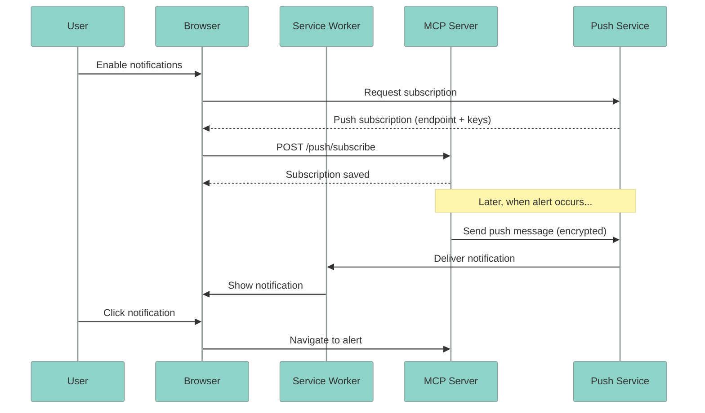
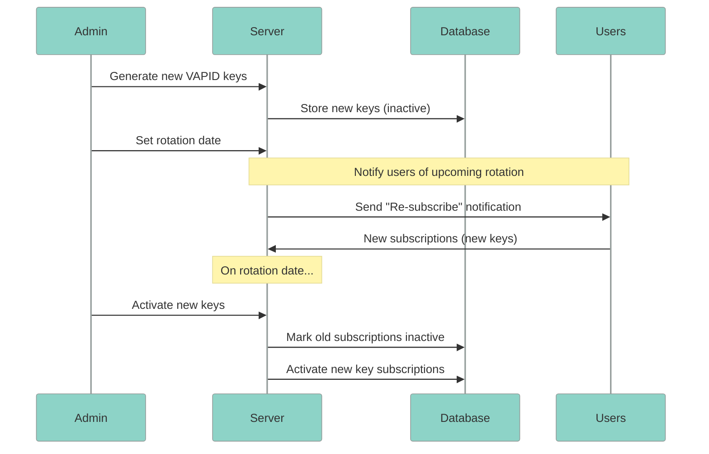
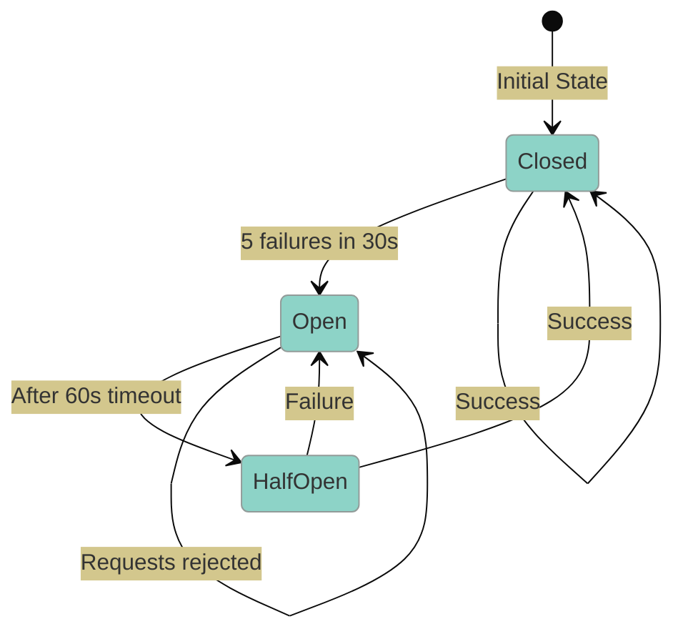

<Note>
**NEW in v2.8.0** - Web Push notifications for critical infrastructure alerts with offline support via Service Workers.
</Note>

### Overview

Web Push notifications allow the MCP Server to send real-time alerts to users' browsers, even when the application isn't open:

- **Real-time Alerts** - Immediate notification of critical events
- **Offline Support** - Service Worker handles notifications when browser is closed
- **Cross-device** - Subscribe on multiple devices (up to 5 per user)
- **Privacy-first** - VAPID authentication, no third-party services required
- **User Control** - Easy subscription management in Settings

### How Web Push Works



### Quick Start

<Steps>
  <Step title="Generate VAPID Keys">
    VAPID (Voluntary Application Server Identification) keys authenticate your server with push services:

    ```bash
    # Using web-push CLI
    npx web-push generate-vapid-keys

    # Output:
    # Public Key: BEl62iUYgUivxIkv...
    # Private Key: UUxI4O8k-x-...
    ```

    <Tip>
    Store these keys securely. The private key should never be exposed to clients.
    </Tip>
  </Step>

  <Step title="Configure Environment">
    Add VAPID keys to your environment:

    ```bash
    # .env
    VAPID_PUBLIC_KEY=BEl62iUYgUivxIkv...
    VAPID_PRIVATE_KEY=UUxI4O8k-x-...
    VAPID_CLAIMS_EMAIL=admin@yourdomain.com
    ```

    <Warning>
    The `VAPID_CLAIMS_EMAIL` must be a valid email address. Push services use it to contact you about issues.
    </Warning>
  </Step>

  <Step title="Run Database Migration">
    Apply the push subscriptions migration:

    ```bash
    # Using Alembic
    uv run alembic upgrade head

    # Or manually
    psql -U postgres -d mcp_server -f migrations/003_push_subscriptions.sql
    ```

    The migration creates:
    - `push_subscriptions` table with user associations
    - Indexes for efficient lookup by user and endpoint
    - Expiration tracking for subscription cleanup
  </Step>

  <Step title="Enable in Frontend">
    Push notifications are automatically available in the application. Users can:

    1. Go to **Settings** > **Notifications**
    2. Click **Enable Push Notifications**
    3. Grant browser permission when prompted
    4. Optionally name the device for identification
  </Step>
</Steps>

### API Reference

#### Subscribe to Push Notifications

```http
POST /api/v1/notifications/push/subscribe
Authorization: Bearer <token>
Content-Type: application/json

{
  "endpoint": "https://fcm.googleapis.com/fcm/send/abc123...",
  "keys": {
    "p256dh": "BNcRdreALRFXTkOOUHK1EtK2wtaz5Ry4YfYCA_0QTpQtUbVlUls0VJXg7A8u-Ts1XbjhazAkj7I99e8QcYP7DkM",
    "auth": "tBHItJI5svbpez7KI4CCXg"
  },
  "expirationTime": null,
  "deviceName": "Chrome on Windows"
}
```

**Response (201 Created):**
```json
{
  "success": true,
  "message": "Successfully subscribed to push notifications"
}
```

**Error Responses:**

| Status | Description |
|--------|-------------|
| 401 | Unauthorized - Invalid or missing token |
| 429 | Too Many Requests - Rate limit exceeded (10/minute) or max subscriptions reached (5 per user) |

#### List Subscriptions

```http
GET /api/v1/notifications/push/subscriptions
Authorization: Bearer <token>
```

**Response:**
```json
[
  {
    "id": "sub-123",
    "endpoint": "https://fcm.googleapis.com/fcm/send/abc...",
    "device_name": "Chrome on Windows",
    "created_at": "2024-01-15T10:00:00Z",
    "last_used_at": "2024-01-15T14:30:00Z"
  },
  {
    "id": "sub-456",
    "endpoint": "https://updates.push.services.mozilla.com/...",
    "device_name": "Firefox on Linux",
    "created_at": "2024-01-10T08:00:00Z",
    "last_used_at": null
  }
]
```

#### Unsubscribe

```http
DELETE /api/v1/notifications/push/unsubscribe
Authorization: Bearer <token>
Content-Type: application/json

{
  "endpoint": "https://fcm.googleapis.com/fcm/send/abc123..."
}
```

**Response:**
```json
{
  "success": true,
  "message": "Successfully unsubscribed from push notifications"
}
```

### Frontend Integration

#### Using the usePushNotifications Hook

```tsx
import { usePushNotifications } from '@/hooks/usePushNotifications';

function NotificationSettings() {
  const {
    isSupported,
    isSubscribed,
    permission,
    subscribe,
    unsubscribe,
    isLoading,
    error
  } = usePushNotifications();

  if (!isSupported) {
    return <p>Push notifications are not supported in this browser.</p>;
  }

  return (
    <div>
      <h3>Push Notifications</h3>

      {permission === 'denied' && (
        <Alert variant="warning">
          Notifications are blocked. Please enable them in browser settings.
        </Alert>
      )}

      {isSubscribed ? (
        <Button onClick={unsubscribe} disabled={isLoading}>
          Disable Push Notifications
        </Button>
      ) : (
        <Button onClick={subscribe} disabled={isLoading}>
          Enable Push Notifications
        </Button>
      )}

      {error && <p className="text-red-500">{error.message}</p>}
    </div>
  );
}
```

#### Manual Subscription

```typescript
// Check browser support
if (!('serviceWorker' in navigator) || !('PushManager' in window)) {
  console.log('Push notifications not supported');
  return;
}

// Request permission
const permission = await Notification.requestPermission();
if (permission !== 'granted') {
  console.log('Permission denied');
  return;
}

// Get service worker registration
const registration = await navigator.serviceWorker.ready;

// Subscribe to push
const subscription = await registration.pushManager.subscribe({
  userVisibleOnly: true,  // Required: always show notification
  applicationServerKey: urlBase64ToUint8Array(VAPID_PUBLIC_KEY)
});

// Convert keys for transmission
const p256dh = btoa(
  String.fromCharCode(...new Uint8Array(subscription.getKey('p256dh')!))
);
const auth = btoa(
  String.fromCharCode(...new Uint8Array(subscription.getKey('auth')!))
);

// Send to backend
await fetch('/api/v1/notifications/push/subscribe', {
  method: 'POST',
  headers: {
    'Content-Type': 'application/json',
    'Authorization': `Bearer ${accessToken}`
  },
  body: JSON.stringify({
    endpoint: subscription.endpoint,
    keys: { p256dh, auth },
    deviceName: getDeviceName()
  })
});

// Helper function
function urlBase64ToUint8Array(base64String: string): Uint8Array {
  const padding = '='.repeat((4 - base64String.length % 4) % 4);
  const base64 = (base64String + padding)
    .replace(/-/g, '+')
    .replace(/_/g, '/');

  const rawData = window.atob(base64);
  const outputArray = new Uint8Array(rawData.length);

  for (let i = 0; i < rawData.length; ++i) {
    outputArray[i] = rawData.charCodeAt(i);
  }
  return outputArray;
}
```

### Service Worker

The service worker handles push events when the application isn't active:

```javascript
// public/sw.js

// Handle incoming push notifications
self.addEventListener('push', (event) => {
  const data = event.data?.json() ?? {};

  const options = {
    body: data.body || 'New notification',
    icon: data.icon || '/icons/icon-192.png',
    badge: data.badge || '/icons/badge-72.png',
    tag: data.tag,                    // Group similar notifications
    data: data.data,                  // Custom data for click handling
    actions: data.actions || [],      // Notification action buttons
    vibrate: [200, 100, 200],        // Vibration pattern
    requireInteraction: data.data?.type === 'critical_alert',
  };

  event.waitUntil(
    self.registration.showNotification(data.title || 'MCP Server', options)
  );
});

// Handle notification click
self.addEventListener('notificationclick', (event) => {
  event.notification.close();

  const data = event.notification.data || {};
  let url = '/';

  // Route based on notification type
  if (data.type === 'critical_alert' && data.alert_id) {
    url = `/admin?tab=alerts&alert=${data.alert_id}`;
  } else if (data.type === 'remediation' && data.remediation_id) {
    url = `/admin?tab=alerts&remediation=${data.remediation_id}`;
  }

  // Handle action buttons
  if (event.action === 'view') {
    event.waitUntil(clients.openWindow(url));
  } else if (event.action === 'dismiss') {
    // Already closed above
  } else {
    // Default: open the app
    event.waitUntil(clients.openWindow(url));
  }
});

// Handle subscription change (browser may rotate keys)
self.addEventListener('pushsubscriptionchange', (event) => {
  event.waitUntil(
    self.registration.pushManager.subscribe({
      userVisibleOnly: true,
      applicationServerKey: VAPID_PUBLIC_KEY
    }).then((subscription) => {
      // Re-register with backend
      return fetch('/api/v1/notifications/push/subscribe', {
        method: 'POST',
        headers: { 'Content-Type': 'application/json' },
        body: JSON.stringify(subscription.toJSON())
      });
    })
  );
});
```

### Backend Implementation

#### Push Sender Service

```python
# notifications/push_sender.py
from dataclasses import dataclass
from pywebpush import webpush, WebPushException

@dataclass
class PushMessage:
    title: str
    body: str
    icon: str | None = None
    badge: str | None = None
    tag: str | None = None
    data: dict[str, Any] | None = None
    actions: list[dict[str, str]] | None = None

class PushNotificationSender:
    def __init__(
        self,
        vapid_private_key: str,
        vapid_public_key: str,
        vapid_claims: dict[str, str],
        subscription_store: PushSubscriptionStore,
    ):
        self._private_key = vapid_private_key
        self._public_key = vapid_public_key
        self._claims = vapid_claims
        self._store = subscription_store

    async def send_to_user(self, user_id: str, message: PushMessage) -> int:
        """Send push notification to all user's subscriptions."""
        subscriptions = await self._store.get_subscriptions_for_user(user_id)
        success_count = 0

        for sub in subscriptions:
            try:
                await self._send_single(sub, message)
                success_count += 1
            except WebPushException as e:
                if e.response.status_code == 410:  # Gone - subscription invalid
                    await self._store.delete_subscription(sub.endpoint)
                logger.warning(f"Push failed: {e}")

        return success_count

    async def send_critical_alert(self, alert: Alert) -> int:
        """Send push notification for critical alert to all admins."""
        message = PushMessage(
            title=f"Critical: {alert.name}",
            body=alert.message[:200],
            tag=f"alert-{alert.alert_id}",
            data={
                "alert_id": alert.alert_id,
                "type": "critical_alert"
            },
            actions=[
                {"action": "view", "title": "View Alert"},
                {"action": "dismiss", "title": "Dismiss"}
            ]
        )
        return await self.send_to_admins(message)
```

### Security

<CardGroup cols={2}>
  <Card title="Subscription Limits" icon="shield">
    Maximum 5 subscriptions per user prevents abuse and ensures manageable notification delivery.
  </Card>
  <Card title="RBAC Enforcement" icon="lock">
    Users can only view and manage their own subscriptions. Admins can manage all subscriptions.
  </Card>
  <Card title="Rate Limiting" icon="gauge">
    Subscribe endpoint limited to 10 requests/minute to prevent spam.
  </Card>
  <Card title="End-to-End Encryption" icon="key">
    Push messages are encrypted using subscription keys. Only the intended browser can decrypt.
  </Card>
</CardGroup>

### Subscription Cleanup

Expired and invalid subscriptions are automatically cleaned up:

```python
# Scheduled task (runs daily)
async def cleanup_expired_subscriptions():
    """Remove expired push subscriptions."""
    deleted = await push_store.delete_expired_subscriptions()
    logger.info(f"Cleaned up {deleted} expired push subscriptions")

    # Also clean up subscriptions that consistently fail
    failed = await push_store.delete_failed_subscriptions(threshold=5)
    logger.info(f"Cleaned up {failed} failed push subscriptions")
```

### Testing

#### Unit Tests

```python
# tests/unit/notifications/test_push_sender.py
@pytest.mark.asyncio
async def test_send_to_user_handles_gone_response():
    """Test that 410 Gone responses trigger subscription cleanup."""
    store = AsyncMock(spec=PushSubscriptionStore)
    sender = PushNotificationSender(
        vapid_private_key="...",
        vapid_public_key="...",
        vapid_claims={"sub": "mailto:test@example.com"},
        subscription_store=store
    )

    # Simulate 410 Gone
    with patch('pywebpush.webpush') as mock_push:
        mock_push.side_effect = WebPushException(
            "Gone", response=Mock(status_code=410)
        )

        await sender.send_to_user("user-1", PushMessage(
            title="Test",
            body="Test message"
        ))

        # Verify subscription was deleted
        store.delete_subscription.assert_called_once()
```

#### E2E Tests

```typescript
// e2e/push-notifications.spec.ts
test.describe('Push Notifications', () => {
  test('should register service worker on page load', async ({ page }) => {
    await page.goto('/studio');
    await page.waitForLoadState('networkidle');

    const swRegistered = await page.evaluate(async () => {
      if (!('serviceWorker' in navigator)) return { supported: false };
      const registration = await navigator.serviceWorker.getRegistration('/');
      return { supported: true, registered: !!registration };
    });

    expect(swRegistered.supported).toBe(true);
  });

  test('should handle notification permission request', async ({ page, context }) => {
    await context.grantPermissions(['notifications']);
    await page.goto('/studio/settings');

    const permissionState = await page.evaluate(async () => {
      if (!('Notification' in window)) return 'unsupported';
      return Notification.permission;
    });

    expect(['granted', 'denied', 'default', 'unsupported']).toContain(permissionState);
  });
});
```

### Troubleshooting

<AccordionGroup>
  <Accordion title="Notifications not appearing">
    1. Check notification permission: `Notification.permission` in console
    2. Verify service worker is registered: `navigator.serviceWorker.getRegistration()`
    3. Check browser notification settings (OS-level)
    4. Ensure `userVisibleOnly: true` in subscription options
  </Accordion>

  <Accordion title="Subscription failing with 429">
    Two possible causes:
    1. **Rate limit**: Wait 1 minute and try again
    2. **Device limit**: Remove unused subscriptions in Settings > Notifications
  </Accordion>

  <Accordion title="Push messages not reaching browser">
    1. Check VAPID keys match between frontend and backend
    2. Verify subscription endpoint is reachable
    3. Check server logs for WebPushException errors
    4. Ensure subscription hasn't expired (check `expirationTime`)
  </Accordion>

  <Accordion title="Service worker not updating">
    ```javascript
    // Force update
    navigator.serviceWorker.getRegistration().then(reg => {
      if (reg) reg.update();
    });

    // Or unregister and re-register
    navigator.serviceWorker.getRegistrations().then(registrations => {
      registrations.forEach(reg => reg.unregister());
    });
    ```
  </Accordion>
</AccordionGroup>

### Browser Support

| Browser | Support | Notes |
|---------|---------|-------|
| Chrome | Full | FCM-based push service |
| Firefox | Full | Mozilla push service |
| Edge | Full | FCM-based (Chromium) |
| Safari | Partial | Requires Apple Push Notification Service setup |
| iOS Safari | Limited | Only in PWA mode (iOS 16.4+) |

### VAPID Key Management

#### Generating Keys

<Tabs>
  <Tab title="Using web-push CLI">
    ```bash
    # Install web-push globally
    npm install -g web-push

    # Generate VAPID keys
    web-push generate-vapid-keys

    # Output:
    # =======================================
    # Public Key:
    # BEl62iUYgUivxIkv69yViTuUBq...
    # Private Key:
    # UUxI4O8k-x-oLuNsabF...
    # =======================================
    ```
  </Tab>
  <Tab title="Using OpenSSL">
    ```bash
    # Generate EC private key
    openssl ecparam -genkey -name prime256v1 -out vapid_private.pem

    # Extract public key
    openssl ec -in vapid_private.pem -pubout -out vapid_public.pem

    # Convert to base64url format for Web Push
    openssl ec -in vapid_private.pem -text -noout 2>/dev/null | \
      grep -A 3 "priv:" | tail -n 3 | tr -d ' \n:' | xxd -r -p | base64 | \
      tr '+/' '-_' | tr -d '='

    openssl ec -in vapid_private.pem -pubout -text -noout 2>/dev/null | \
      grep -A 5 "pub:" | tail -n 5 | tr -d ' \n:' | xxd -r -p | base64 | \
      tr '+/' '-_' | tr -d '='
    ```
  </Tab>
  <Tab title="Using Python">
    ```python
    from py_vapid import Vapid

    # Generate new VAPID keys
    vapid = Vapid()
    vapid.generate_keys()

    # Save keys
    vapid.save_key("vapid_private.pem")
    vapid.save_public_key("vapid_public.pem")

    # Get base64url-encoded keys
    print(f"Private: {vapid.private_key}")
    print(f"Public: {vapid.public_key}")
    ```
  </Tab>
</Tabs>

#### Key Rotation Strategy

<Warning>
**VAPID key rotation invalidates ALL existing subscriptions.** Users must re-subscribe after rotation.
</Warning>

**Recommended rotation approach:**



**Implementation:**

```python
# notifications/vapid_rotation.py
from datetime import datetime, timedelta

class VAPIDKeyRotationManager:
    """Manages VAPID key rotation with zero-downtime migration."""

    async def schedule_rotation(
        self,
        new_public_key: str,
        new_private_key: str,
        rotation_date: datetime,
    ) -> str:
        """
        Schedule a VAPID key rotation.

        Args:
            new_public_key: Base64url-encoded new public key
            new_private_key: Base64url-encoded new private key
            rotation_date: When to activate the new keys

        Returns:
            rotation_id for tracking
        """
        # Validate keys
        self._validate_vapid_keys(new_public_key, new_private_key)

        # Store pending rotation
        rotation_id = await self._store.save_pending_rotation(
            public_key=new_public_key,
            private_key_encrypted=self._encrypt_key(new_private_key),
            scheduled_for=rotation_date,
        )

        # Schedule notification to users (1 week before)
        notify_date = rotation_date - timedelta(days=7)
        await self._scheduler.schedule(
            notify_date,
            self._notify_users_of_rotation,
            rotation_id=rotation_id,
        )

        return rotation_id

    async def _notify_users_of_rotation(self, rotation_id: str) -> None:
        """Send push to all users asking them to re-subscribe."""
        message = PushMessage(
            title="Action Required: Update Notifications",
            body="Please re-enable push notifications to continue receiving alerts.",
            tag="vapid-rotation",
            data={"type": "vapid_rotation", "rotation_id": rotation_id},
            actions=[
                {"action": "resubscribe", "title": "Update Now"},
                {"action": "dismiss", "title": "Later"},
            ],
        )
        await self._sender.send_to_all(message)
```

### Production Deployment Checklist

<Tabs>
  <Tab title="Pre-Deployment">
    <Steps>
      <Step title="Generate Production VAPID Keys">
        Generate fresh keys for production. **Never reuse development keys.**

        ```bash
        # Generate production keys
        npx web-push generate-vapid-keys > vapid-keys.txt

        # Store securely (use secrets manager)
        kubectl create secret generic vapid-keys \
          --from-literal=public_key=BEl62... \
          --from-literal=private_key=UUxI4... \
          --from-literal=claims_email=ops@yourdomain.com
        ```
      </Step>

      <Step title="Configure Environment Variables">
        ```yaml
        # deployments/helm/values.yaml
        env:
          VAPID_PUBLIC_KEY:
            valueFrom:
              secretKeyRef:
                name: vapid-keys
                key: public_key
          VAPID_PRIVATE_KEY:
            valueFrom:
              secretKeyRef:
                name: vapid-keys
                key: private_key
          VAPID_CLAIMS_EMAIL:
            valueFrom:
              secretKeyRef:
                name: vapid-keys
                key: claims_email
        ```
      </Step>

      <Step title="Apply Database Migration">
        ```bash
        # Verify migration status
        uv run alembic history
        uv run alembic current

        # Apply migration
        uv run alembic upgrade head

        # Verify table exists
        psql -c "\\d push_subscriptions"
        ```
      </Step>

      <Step title="Configure Cleanup Job">
        ```yaml
        # Kubernetes CronJob for subscription cleanup
        apiVersion: batch/v1
        kind: CronJob
        metadata:
          name: push-subscription-cleanup
        spec:
          schedule: "0 3 * * *"  # Daily at 3 AM
          jobTemplate:
            spec:
              template:
                spec:
                  containers:
                  - name: cleanup
                    image: mcp-server-langgraph:latest
                    command:
                    - python
                    - -m
                    - mcp_server_langgraph.notifications.cleanup
                    env:
                    - name: DATABASE_URL
                      valueFrom:
                        secretKeyRef:
                          name: db-credentials
                          key: url
                  restartPolicy: OnFailure
        ```
      </Step>
    </Steps>
  </Tab>

  <Tab title="Post-Deployment">
    <Steps>
      <Step title="Verify Service Worker">
        ```bash
        # Check service worker is served correctly
        curl -I https://yourdomain.com/sw.js

        # Expected headers:
        # Content-Type: application/javascript
        # Service-Worker-Allowed: /
        # Cache-Control: no-cache
        ```
      </Step>

      <Step title="Test Push Delivery">
        ```bash
        # Send test push via API
        curl -X POST https://yourdomain.com/api/v1/notifications/push/test \
          -H "Authorization: Bearer $ADMIN_TOKEN" \
          -H "Content-Type: application/json" \
          -d '{"title": "Test", "body": "Push test successful"}'
        ```
      </Step>

      <Step title="Monitor Metrics">
        ```promql
        # Check push delivery rate
        rate(push_notifications_sent_total[5m])

        # Check failure rate
        rate(push_notifications_failed_total[5m]) /
        rate(push_notifications_sent_total[5m]) * 100

        # Check subscription count
        push_subscriptions_active_total
        ```
      </Step>

      <Step title="Set Up Alerts">
        ```yaml
        # alerting-rules/push-notifications.yaml
        groups:
        - name: push-notifications
          rules:
          - alert: PushDeliveryRateHigh
            expr: rate(push_notifications_failed_total[5m]) > 0.1
            for: 5m
            labels:
              severity: warning
            annotations:
              summary: "Push notification delivery failure rate high"
              description: "More than 10% of push notifications failing"

          - alert: NoActiveSubscriptions
            expr: push_subscriptions_active_total == 0
            for: 10m
            labels:
              severity: info
            annotations:
              summary: "No active push subscriptions"
              description: "Consider checking VAPID configuration"
        ```
      </Step>
    </Steps>
  </Tab>
</Tabs>

### Security Hardening

<CardGroup cols={2}>
  <Card title="Key Storage" icon="vault">
    **Never store VAPID private keys in:**
    - Source code or git repositories
    - Environment files committed to VCS
    - Client-side code or bundles

    **Use secure storage:**
    - Kubernetes Secrets (encrypted at rest)
    - HashiCorp Vault
    - AWS Secrets Manager / GCP Secret Manager
  </Card>

  <Card title="Transport Security" icon="shield-check">
    - All push endpoints must use HTTPS
    - VAPID claims must include valid `mailto:` or `https:` subject
    - Subscription data encrypted in transit (TLS 1.3)
    - Push payloads encrypted with subscription keys (Web Push RFC)
  </Card>

  <Card title="Access Control" icon="user-lock">
    - Subscription management requires authentication
    - Users can only manage their own subscriptions
    - Admin role required for bulk operations
    - Rate limiting on subscription endpoints (10/min)
  </Card>

  <Card title="Data Protection" icon="database-lock">
    - Subscription endpoints are user-specific (PII)
    - Audit logging for subscription changes
    - GDPR: Delete subscriptions on user account deletion
    - Retention: Auto-cleanup expired subscriptions daily
  </Card>
</CardGroup>

#### VAPID Claims Best Practices

```python
# Correct VAPID claims configuration
VAPID_CLAIMS = {
    "sub": "mailto:push-admin@yourdomain.com",  # REQUIRED
}

# Common mistakes to avoid:
# ❌ "sub": "admin@example.com"        # Missing mailto: prefix
# ❌ "sub": "mailto:test@localhost"    # Invalid domain
# ❌ "sub": "https://example.com"      # Website instead of email
# ✅ "sub": "mailto:ops@yourdomain.com"  # Correct format
```

### Metrics & Monitoring

| Metric | Type | Description |
|--------|------|-------------|
| `push_notifications_sent_total` | Counter | Total push notifications sent |
| `push_notifications_failed_total` | Counter | Failed push attempts (by error type) |
| `push_subscriptions_active_total` | Gauge | Current active subscriptions |
| `push_subscriptions_created_total` | Counter | New subscriptions created |
| `push_subscriptions_deleted_total` | Counter | Subscriptions deleted (by reason) |
| `push_delivery_latency_seconds` | Histogram | Time to deliver push message |
| `push_circuit_breaker_state` | Gauge | Circuit breaker state (0=closed, 1=open, 2=half-open) |
| `push_cleanup_deleted_total` | Counter | Subscriptions cleaned up by daily job |

#### Grafana Dashboard

```json
{
  "title": "Push Notifications",
  "panels": [
    {
      "title": "Delivery Rate",
      "type": "stat",
      "targets": [
        {
          "expr": "sum(rate(push_notifications_sent_total[5m]))",
          "legendFormat": "Sent/sec"
        }
      ]
    },
    {
      "title": "Failure Rate",
      "type": "gauge",
      "targets": [
        {
          "expr": "sum(rate(push_notifications_failed_total[5m])) / sum(rate(push_notifications_sent_total[5m])) * 100",
          "legendFormat": "Failure %"
        }
      ],
      "thresholds": [
        { "value": 0, "color": "green" },
        { "value": 5, "color": "yellow" },
        { "value": 10, "color": "red" }
      ]
    },
    {
      "title": "Active Subscriptions",
      "type": "timeseries",
      "targets": [
        {
          "expr": "push_subscriptions_active_total",
          "legendFormat": "Active"
        }
      ]
    }
  ]
}
```

### Safari & iOS Compatibility

<Warning>
Safari and iOS have unique requirements for Web Push. Follow these guidelines carefully.
</Warning>

#### Safari on macOS

Safari 16+ supports Web Push with the standard Push API, but requires:

1. **HTTPS Required**: Push only works on secure origins
2. **User Gesture**: Subscription must be triggered by user action (button click)
3. **Notification Preferences**: Users control via System Preferences > Notifications

```javascript
// Safari-specific handling
async function subscribeSafari() {
  // Safari requires user gesture
  if (!document.hasFocus()) {
    console.log('Safari requires user interaction');
    return;
  }

  // Standard Push API works in Safari 16+
  const registration = await navigator.serviceWorker.ready;
  const subscription = await registration.pushManager.subscribe({
    userVisibleOnly: true,
    applicationServerKey: urlBase64ToUint8Array(VAPID_PUBLIC_KEY)
  });

  return subscription;
}
```

#### iOS Safari (PWA Mode)

iOS 16.4+ supports Web Push, but **only in installed PWA mode**:

<Steps>
  <Step title="Add PWA Manifest">
    ```json
    // public/manifest.json
    {
      "name": "MCP Server",
      "short_name": "MCP",
      "display": "standalone",
      "start_url": "/studio",
      "scope": "/",
      "icons": [
        { "src": "/icons/icon-192.png", "sizes": "192x192", "type": "image/png" },
        { "src": "/icons/icon-512.png", "sizes": "512x512", "type": "image/png" }
      ]
    }
    ```
  </Step>

  <Step title="Add Apple-Specific Meta Tags">
    ```html
    <!-- index.html -->
    <meta name="apple-mobile-web-app-capable" content="yes">
    <meta name="apple-mobile-web-app-status-bar-style" content="default">
    <meta name="apple-mobile-web-app-title" content="MCP Server">
    <link rel="apple-touch-icon" href="/icons/icon-180.png">
    ```
  </Step>

  <Step title="Install as PWA">
    User must add to Home Screen:
    1. Open site in Safari
    2. Tap Share button
    3. Select "Add to Home Screen"
    4. Open from Home Screen icon
    5. Enable notifications in Settings
  </Step>

  <Step title="Handle iOS Quirks">
    ```typescript
    // Detect iOS PWA mode
    const isIOSPWA = () => {
      return (
        'standalone' in window.navigator &&
        (window.navigator as any).standalone === true &&
        /iPad|iPhone|iPod/.test(navigator.userAgent)
      );
    };

    // iOS-specific subscription flow
    async function subscribeIOS() {
      if (!isIOSPWA()) {
        throw new Error('Push requires PWA mode on iOS. Please add to Home Screen.');
      }

      // iOS may require specific timing
      await new Promise(resolve => setTimeout(resolve, 100));

      return navigator.serviceWorker.ready.then(reg =>
        reg.pushManager.subscribe({
          userVisibleOnly: true,
          applicationServerKey: urlBase64ToUint8Array(VAPID_PUBLIC_KEY)
        })
      );
    }
    ```
  </Step>
</Steps>

#### Browser Feature Detection

```typescript
// Comprehensive push support detection
interface PushSupport {
  serviceWorker: boolean;
  pushManager: boolean;
  notification: boolean;
  permission: NotificationPermission | 'unsupported';
  isPWA: boolean;
  isIOS: boolean;
  canSubscribe: boolean;
  reason?: string;
}

function detectPushSupport(): PushSupport {
  const isIOS = /iPad|iPhone|iPod/.test(navigator.userAgent);
  const isPWA = window.matchMedia('(display-mode: standalone)').matches ||
    (window.navigator as any).standalone === true;

  const result: PushSupport = {
    serviceWorker: 'serviceWorker' in navigator,
    pushManager: 'PushManager' in window,
    notification: 'Notification' in window,
    permission: 'Notification' in window ? Notification.permission : 'unsupported',
    isPWA,
    isIOS,
    canSubscribe: false,
  };

  // Determine if subscription is possible
  if (!result.serviceWorker) {
    result.reason = 'Service Workers not supported';
  } else if (!result.pushManager) {
    result.reason = 'Push API not supported';
  } else if (!result.notification) {
    result.reason = 'Notification API not supported';
  } else if (isIOS && !isPWA) {
    result.reason = 'iOS requires PWA mode (Add to Home Screen)';
  } else if (result.permission === 'denied') {
    result.reason = 'Notifications blocked by user';
  } else {
    result.canSubscribe = true;
  }

  return result;
}
```

### Circuit Breaker Integration

Push notification delivery is protected by a circuit breaker to prevent cascade failures:



**Configuration:**

```python
# Circuit breaker settings for push notifications
PUSH_CIRCUIT_BREAKER = {
    "fail_max": 5,           # Open after 5 consecutive failures
    "reset_timeout": 60,     # Try again after 60 seconds
    "exclude": [             # Don't count these as failures
        "WebPushException(410)",  # Gone - subscription invalid
        "WebPushException(404)",  # Not found - endpoint changed
    ],
}
```

**Fallback behavior when circuit is OPEN:**

1. Push requests are queued in Redis
2. Background worker retries when circuit closes
3. Max queue size: 10,000 messages
4. Queue TTL: 1 hour

```python
async def send_with_fallback(message: PushMessage) -> SendResult:
    """Send push with circuit breaker and queue fallback."""
    try:
        return await circuit_breaker.call(sender.send, message)
    except CircuitBreakerOpen:
        # Queue for later delivery
        await redis.lpush("push:queue", message.to_json())
        await redis.expire("push:queue", 3600)  # 1 hour TTL
        return SendResult(queued=True, delivered=False)
```

### Related Guides

- [Alert Management](/guides/alert-management) - Configure alerts and remediation
- [Service Workers](/guides/service-workers) - PWA and offline support
- [Security Best Practices](/guides/security) - Authentication and authorization
