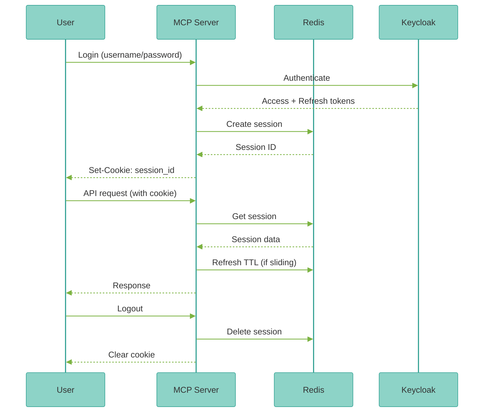

<Note>
**NEW in v2.1.0** - Enterprise session management with Redis for stateful authentication and concurrent session control.
</Note>

### Overview

Redis provides production-grade session storage with:

- **Persistent Sessions** - Survive server restarts
- **Distributed Sessions** - Share across multiple instances
- **Sliding Expiration** - Extend sessions on user activity
- **Concurrent Limits** - Control max sessions per user
- **Instant Revocation** - Immediate logout across all devices
- **Session Analytics** - Track active users and session patterns

### Why Redis Sessions?

<CardGroup cols={2}>
  <Card title="Token-based (Stateless)" icon="ticket">
    **Best for**: Serverless, Cloud Run, stateless architectures

    - No server storage required
    - Lower infrastructure costs
    - Simpler deployment
    - Cannot revoke individual tokens
  </Card>

  <Card title="Session-based (Stateful)" icon="database">
    **Best for**: Enterprise apps, multi-instance deployments

    - Longer session lifetimes (24+ hours)
    - Instant revocation
    - Concurrent session limits
    - User session tracking
  </Card>
</CardGroup>

### Quick Start

<Steps>
  <Step title="Deploy Redis">
    <Tabs>
      <Tab title="Docker Compose">
        ```yaml
        # docker-compose.yml
        redis-session:
          image: redis:7-alpine
          command: >
            redis-server
            --requirepass ${REDIS_PASSWORD}
            --maxmemory 256mb
            --maxmemory-policy allkeys-lru
          ports:
            - "6379:6379"
          volumes:
            - redis-session-data:/data
          healthcheck:
            test: ["CMD", "redis-cli", "ping"]
            interval: 10s
            timeout: 3s
            retries: 3

        volumes:
          redis-session-data:
        ```

        ```bash
        # Start Redis
        export REDIS_PASSWORD=$(openssl rand -base64 32)
        docker compose up -d redis-session

        # Test connection
        docker compose exec redis-session redis-cli -a $REDIS_PASSWORD ping
        # Expected: PONG
        ```
      </Tab>

      <Tab title="Kubernetes">
        ```bash
        # Using Helm (recommended)
        helm install redis-session bitnami/redis \
          --namespace mcp-server-langgraph \
          --create-namespace \
          --set auth.password="$(openssl rand -base64 32)" \
          --set master.persistence.enabled=true \
          --set master.persistence.size=10Gi \
          --set replica.replicaCount=2 \
          --set replica.persistence.enabled=true

        # Wait for deployment
        kubectl wait --for=condition=ready pod \
          -l app.kubernetes.io/name=redis \
          -n mcp-server-langgraph \
          --timeout=300s

        # Get password
        kubectl get secret redis-session \
          -n mcp-server-langgraph \
          -o jsonpath='{.data.redis-password}' | base64 -d
        ```
      </Tab>

      <Tab title="Cloud Managed">
        **Google Cloud Memorystore**:
        ```bash
        gcloud redis instances create sessions \
          --size=5 \
          --region=us-central1 \
          --tier=standard \
          --redis-version=redis_7_0 \
          --enable-auth

        # Get connection info
        gcloud redis instances describe sessions \
          --region=us-central1 \
          --format="get(host,port,authString)"
        ```
        **AWS ElastiCache**:
        ```bash
        aws elasticache create-replication-group \
          --replication-group-id sessions \
          --replication-group-description "Session store" \
          --engine redis \
          --cache-node-type cache.t3.medium \
          --num-cache-clusters 2 \
          --auth-token "$(openssl rand -base64 32)"
        ```
        **Azure Cache for Redis**:
        ```bash
        az redis create \
          --resource-group mcp-server-langgraph \
          --name sessions \
          --location eastus \
          --sku Standard \
          --vm-size c1 \
          --enable-non-ssl-port false
        ```
      </Tab>
    </Tabs>
  </Step>

  <Step title="Configure Application">
    ```bash
    # .env or Kubernetes ConfigMap
    AUTH_MODE=session
    SESSION_BACKEND=redis

    # Redis connection
    REDIS_URL=redis://redis-session:6379/0
    REDIS_PASSWORD=your-redis-password-here
    REDIS_SSL=false  # true for production

    # Session settings
    SESSION_TTL_SECONDS=86400  # 24 hours
    SESSION_SLIDING_WINDOW=true  # Extend on activity
    SESSION_MAX_CONCURRENT=5  # Per user
    SESSION_REFRESH_THRESHOLD=3600  # Refresh if < 1hr left
    ```
    <Warning>
    **Always use SSL/TLS in production**: Set `REDIS_SSL=true` and use `rediss://` URL scheme.
    </Warning>
  </Step>

  <Step title="Test Session Store">
    ```python
    from mcp_server_langgraph.auth.session import SessionManager

    # Initialize session manager
    session_mgr = SessionManager()

    # Create session
    session = await session_mgr.create_session(
        user_id="alice",
        metadata={"ip": "192.168.1.1", "user_agent": "..."}
    )
    print(f"Session ID: {session.session_id}")
    print(f"Expires: {session.expires_at}")

    # Get session
    retrieved = await session_mgr.get_session(session.session_id)
    print(f"User: {retrieved.user_id}")
    print(f"Active: {retrieved.is_active}")

    # Refresh session (extends TTL)
    refreshed = await session_mgr.refresh_session(session.session_id)
    print(f"New expiry: {refreshed.expires_at}")

    # Revoke session
    await session_mgr.revoke_session(session.session_id)
    ```
  </Step>

  <Step title="Verify in Redis">
    ```bash
    # Connect to Redis
    docker compose exec redis-session redis-cli -a $REDIS_PASSWORD

    # List all sessions
    KEYS session:*

    # Get session details
    GET session:abc123...

    # Check session TTL
    TTL session:abc123...
    ```
  </Step>
</Steps>

### Session Lifecycle


### Session Configuration

#### Session TTL

```
## Fixed TTL (no extension)
SESSION_TTL_SECONDS=3600  # 1 hour
SESSION_SLIDING_WINDOW=false

## Sliding window (extends on activity)
SESSION_TTL_SECONDS=86400  # 24 hours
SESSION_SLIDING_WINDOW=true
SESSION_REFRESH_THRESHOLD=3600  # Refresh if < 1hr left
```

**Fixed TTL**: Session expires exactly after TTL, regardless of activity.

**Sliding Window**: Session extends on each request, up to max TTL.

#### Concurrent Sessions

```
## Limit concurrent sessions per user
SESSION_MAX_CONCURRENT=5

## Behavior when limit exceeded:
## - Oldest session is automatically revoked
## - User notified of revoked session
```
Use cases:
- **1 session**: Single device login (revokes other devices)
- **3-5 sessions**: Normal multi-device usage
- **Unlimited**: Set to 0 or omit

#### Session Metadata

Store additional context with sessions:

```python
session = await session_mgr.create_session(
    user_id="alice",
    metadata={
        "ip_address": "192.168.1.1",
        "user_agent": "Mozilla/5.0...",
        "device_id": "mobile-abc123",
        "location": "San Francisco, CA",
        "created_at": "2025-10-12T10:00:00Z"
    }
)
```

Access metadata:
```python
session = await session_mgr.get_session(session_id)
print(f"Device: {session.metadata['device_id']}")
print(f"Location: {session.metadata['location']}")
```
### API Operations

#### Create Session

```python
from mcp_server_langgraph.auth.session import SessionManager

session_mgr = SessionManager()

## Simple session
session = await session_mgr.create_session(user_id="alice")

## With metadata
session = await session_mgr.create_session(
    user_id="alice",
    metadata={"ip": "192.168.1.1", "device": "mobile"}
)

## Custom TTL
session = await session_mgr.create_session(
    user_id="alice",
    ttl_seconds=7200  # 2 hours (overrides default)
)
```

#### Get Session

```
## Get by session ID
session = await session_mgr.get_session(session_id)

if session and session.is_active:
    print(f"User: {session.user_id}")
else:
    print("Session expired or invalid")

## Get all user sessions
sessions = await session_mgr.get_user_sessions(user_id="alice")
for s in sessions:
    print(f"{s.session_id}: {s.created_at}")
```
#### Refresh Session

```
## Manual refresh
session = await session_mgr.refresh_session(session_id)
print(f"Extended until: {session.expires_at}")

## Automatic refresh (if sliding window enabled)
## Happens automatically on get_session() calls
```

#### Revoke Session

```
## Revoke single session
await session_mgr.revoke_session(session_id)

## Revoke all user sessions (logout from all devices)
await session_mgr.revoke_user_sessions(user_id="alice")

## Revoke with reason
await session_mgr.revoke_session(
    session_id,
    reason="Password changed"
)
```
#### Session Analytics

```
## Count active sessions
total = await session_mgr.count_active_sessions()
print(f"Active sessions: {total}")

## Count user sessions
user_count = await session_mgr.count_user_sessions("alice")
print(f"Alice has {user_count} active sessions")

## List all active users
users = await session_mgr.list_active_users()
print(f"Active users: {users}")
```

### Integration with Authentication

#### Keycloak + Redis Sessions

```python
from mcp_server_langgraph.auth.keycloak import KeycloakClient
from mcp_server_langgraph.auth.session import SessionManager

keycloak = KeycloakClient()
session_mgr = SessionManager()

## Login flow
async def login(username: str, password: str):
    # Authenticate with Keycloak
    tokens = await keycloak.authenticate(username, password)

    # Create session
    session = await session_mgr.create_session(
        user_id=username,
        metadata={
            "access_token": tokens["access_token"],
            "refresh_token": tokens["refresh_token"],
            "expires_in": tokens["expires_in"]
        }
    )

    return session.session_id

## API request flow
async def authenticate_request(session_id: str):
    # Get session
    session = await session_mgr.get_session(session_id)
    if not session or not session.is_active:
        raise Unauthorized("Session expired")

    # Verify access token with Keycloak
    user_info = await keycloak.get_user_info(
        session.metadata["access_token"]
    )

    # Refresh session TTL (if sliding)
    await session_mgr.refresh_session(session_id)

    return user_info

## Logout flow
async def logout(session_id: str):
    session = await session_mgr.get_session(session_id)

    # Revoke Keycloak tokens
    await keycloak.logout(session.metadata["refresh_token"])

    # Delete session
    await session_mgr.revoke_session(session_id)
```
### Production Deployment

#### High Availability

Deploy Redis with replication:

```
## Kubernetes with Helm
helm install redis-session bitnami/redis \
  --set architecture=replication \
  --set master.persistence.enabled=true \
  --set master.persistence.size=20Gi \
  --set replica.replicaCount=2 \
  --set replica.persistence.enabled=true \
  --set sentinel.enabled=true

## Application connects to sentinel
REDIS_URL=redis-sentinel://redis-session:26379/mymaster
```python

Benefits:
- **Automatic failover** - Sentinel promotes replica on master failure
- **Zero downtime** - Sessions preserved during failover
- **Read scaling** - Read from replicas

#### Persistence

Configure Redis persistence:

```
## redis.conf
save 900 1       # Save after 900s if >= 1 key changed
save 300 10      # Save after 300s if >= 10 keys changed
save 60 10000    # Save after 60s if >= 10000 keys changed

## AOF (append-only file) for durability
appendonly yes
appendfsync everysec
```
Or use managed Redis with automatic backups (Memorystore, ElastiCache, Azure Cache).

#### Security

**Authentication**:
```
## Always use password
REDIS_PASSWORD=strong-random-password
requirepass strong-random-password
```

**Encryption**:
```
## TLS/SSL in production
REDIS_SSL=true
REDIS_URL=rediss://redis-session:6380/0

## Redis 6+ with ACL
REDIS_USERNAME=sessions
REDIS_PASSWORD=password
```
**Network isolation**:
- Private VPC/subnet
- Firewall rules (allow only app servers)
- No public IP exposure

#### Memory Management

```
## redis.conf
maxmemory 2gb
maxmemory-policy allkeys-lru  # Evict least recently used

## Or volatile-lru (evict only keys with TTL)
maxmemory-policy volatile-lru
```

Monitor memory usage:
```bash
redis-cli INFO memory
```
#### Monitoring

**Key metrics to track**:

```
## Active sessions
redis_db_keys{db="db0"}

## Memory usage
redis_memory_used_bytes / redis_memory_max_bytes

## Commands per second
rate(redis_commands_processed_total[1m])

## Hit ratio
rate(redis_keyspace_hits_total[5m]) /
  (rate(redis_keyspace_hits_total[5m]) + rate(redis_keyspace_misses_total[5m]))

## Evicted keys (should be low)
rate(redis_evicted_keys_total[5m])
```

**Alerts**:
- Memory usage > 80%
- Evicted keys > 0
- Hit ratio < 90%
- Replication lag > 5s

### Troubleshooting

<AccordionGroup>
  <Accordion title="Connection refused">
    ```bash
    # Check Redis status
    docker compose ps redis-session
    kubectl get pods -l app.kubernetes.io/name=redis

    # Test connectivity
    redis-cli -h redis-session -p 6379 -a $REDIS_PASSWORD ping

    # Check logs
    docker compose logs redis-session
    kubectl logs -l app.kubernetes.io/name=redis
    ```
  </Accordion>

  <Accordion title="Authentication failed">
    **Error**: `NOAUTH Authentication required`

    **Solutions**:
    - Check REDIS_PASSWORD environment variable
    - Verify redis.conf has `requirepass` set
    - Use `-a password` flag with redis-cli
  </Accordion>

  <Accordion title="Session not found">
    **Possible causes**:
    - Session expired (check TTL)
    - Redis evicted key (memory full)
    - Wrong Redis database (check `/0` in URL)
    - Session was revoked

    **Debug**:
    ```python
    # Check if session exists in Redis
    import redis
    r = redis.from_url(REDIS_URL, password=REDIS_PASSWORD)
    exists = r.exists(f"session:{session_id}")
    ttl = r.ttl(f"session:{session_id}")
    print(f"Exists: {exists}, TTL: {ttl}")
    ```
  </Accordion>

  <Accordion title="High memory usage">
    **Solutions**:
    1. **Reduce TTL**: Lower SESSION_TTL_SECONDS
    2. **Enable eviction**: Set `maxmemory-policy allkeys-lru`
    3. **Increase memory**: Scale up Redis instance
    4. **Clean expired**: Redis auto-expires, but run `FLUSHDB` if needed

    **Check current usage**:
    ```bash
    redis-cli INFO memory | grep used_memory_human
    redis-cli DBSIZE
    ```
  </Accordion>

  <Accordion title="Slow session operations">
    **Performance tuning**:
    - Use connection pooling (automatic in Python redis client)
    - Enable pipelining for batch operations
    - Use local Redis instance (reduce network latency)
    - Check Redis logs for slow queries

    ```bash
    # Enable slow log
    CONFIG SET slowlog-log-slower-than 10000  # 10ms
    SLOWLOG GET 10
    ```

  </Accordion>
</AccordionGroup>

### Migration from Token-based

Switching from stateless tokens to Redis sessions:

<Steps>
  <Step title="Deploy Redis">
    Deploy Redis instance (see Quick Start above)
  </Step>

  <Step title="Update Configuration">
    ```bash
    # Change auth mode
    AUTH_MODE=session  # was: token
    SESSION_BACKEND=redis

    # Add Redis config
    REDIS_URL=redis://redis-session:6379/0
    REDIS_PASSWORD=...
    ```
  </Step>

  <Step title="Dual Mode Support (Optional)">
    Support both tokens and sessions during migration:

    ```python
    # Check Authorization header
    auth_header = request.headers.get("Authorization")
    cookie = request.cookies.get("session_id")

    if auth_header:
        # Token-based auth (legacy)
        token = auth_header.replace("Bearer ", "")
        user = await auth.verify_token(token)
    elif cookie:
        # Session-based auth (new)
        session = await session_mgr.get_session(cookie)
        user = session.user_id
    else:
        raise Unauthorized()
    ```

  </Step>

  <Step title="Update Client Applications">
    Migrate clients from token to session:

    **Before** (Token):
    ```javascript
    const token = localStorage.getItem('access_token');
    fetch('/api/message', {
      headers: {'Authorization': `Bearer ${token}`}
    });
    ```
    **After** (Session):
    ```javascript
    // Session cookie sent automatically
    fetch('/api/message', {
      credentials: 'include'  // Send cookies
    });
    ```
  </Step>

  <Step title="Deprecate Token Support">
    After migration period, remove token support:

    ```bash
    # Final config
    AUTH_MODE=session
    # Remove: JWT_SECRET_KEY, JWT_EXPIRATION_SECONDS
    ```
  </Step>
</Steps>

### Next Steps

<CardGroup cols={2}>
  <Card title="Authentication" icon="key" href="/getting-started/authentication">
    Configure session mode authentication
  </Card>
  <Card title="Keycloak SSO" icon="shield" href="/guides/keycloak-sso">
    Integrate Keycloak with sessions
  </Card>
  <Card title="Kubernetes Deployment" icon="dharmachakra" href="/deployment/kubernetes">
    Deploy Redis on Kubernetes
  </Card>
  <Card title="Production Checklist" icon="clipboard-check" href="/deployment/production-checklist">
    Session security best practices
  </Card>
</CardGroup>

---

<Check>
**Production Ready**: Redis sessions provide enterprise-grade session management with instant revocation and multi-device support!
</Check>
