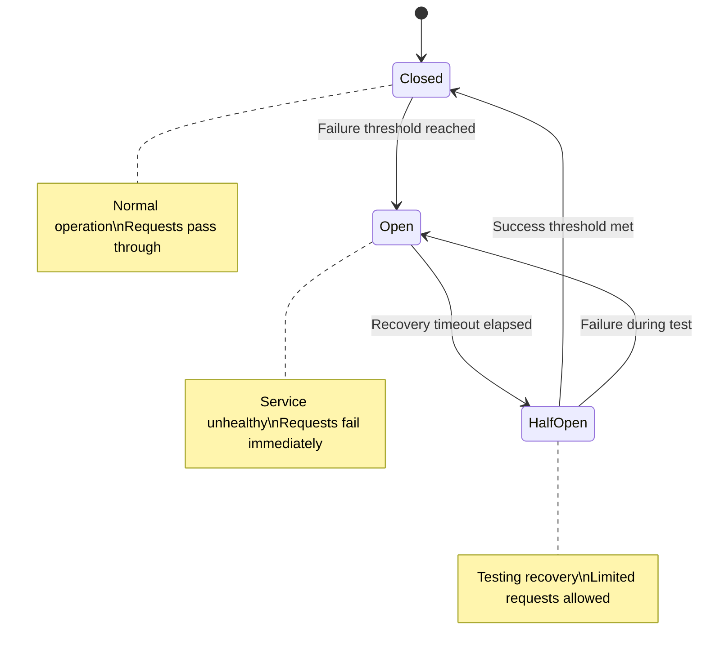

# Resilience Patterns

MCP Server LangGraph includes production-grade resilience patterns to handle failures gracefully.

See [ADR-0030: Resilience Patterns](/architecture/adr-0030-resilience-patterns) for design rationale.

## Overview

The resilience module provides five patterns:

| Pattern | Purpose | When to Use |
|---------|---------|-------------|
| **Circuit Breaker** | Prevent cascade failures | External service calls |
| **Retry with Backoff** | Handle transient failures | Network errors, rate limits |
| **Timeout** | Prevent hanging requests | Slow external APIs |
| **Bulkhead** | Isolate resource pools | Limit concurrent requests |
| **Fallback** | Graceful degradation | When all else fails |

---

## Circuit Breaker

The circuit breaker prevents cascade failures by failing fast when a service is unhealthy.

### States



- **CLOSED**: Normal operation, requests pass through
- **OPEN**: Service unhealthy, requests fail immediately
- **HALF_OPEN**: Testing if service recovered

### Usage

```python
from mcp_server_langgraph.resilience import (
    circuit_breaker,
    CircuitBreakerState,
    get_circuit_breaker_state,
    reset_circuit_breaker,
)

# Decorator approach
@circuit_breaker(
    name="llm_api",
    failure_threshold=5,      # Open after 5 failures
    recovery_timeout=30.0,    # Stay open for 30 seconds
    half_open_requests=3,     # Test with 3 requests
)
async def call_llm_api(prompt: str) -> str:
    response = await llm_client.complete(prompt)
    return response.text

# Check circuit state
state = get_circuit_breaker_state("llm_api")
if state == CircuitBreakerState.OPEN:
    print("LLM API circuit is open!")

# Manual reset (for testing/admin)
reset_circuit_breaker("llm_api")
```

### Configuration

```python
@circuit_breaker(
    name="external_service",
    failure_threshold=5,       # Failures before opening
    recovery_timeout=30.0,     # Seconds to stay open
    half_open_requests=3,      # Test requests in half-open
    success_threshold=2,       # Successes to close from half-open
)
```

---

## Retry with Backoff

Automatically retry failed operations with exponential backoff and jitter.

### Usage

```python
from mcp_server_langgraph.resilience import (
    retry_with_backoff,
    RetryPolicy,
    RetryStrategy,
)

# Decorator approach
@retry_with_backoff(
    max_retries=3,
    base_delay=1.0,
    max_delay=60.0,
    exponential_base=2,
    jitter=True,
)
async def call_rate_limited_api():
    return await api_client.request()

# Custom retry policy
policy = RetryPolicy(
    max_retries=5,
    base_delay=0.5,
    max_delay=30.0,
    exponential_base=2,
    jitter=True,
    retry_on=[ConnectionError, TimeoutError],
    retry_on_status_codes=[429, 502, 503, 504],
)

@retry_with_backoff(policy=policy)
async def call_with_custom_policy():
    return await external_service.call()
```

### Retry Strategies

```python
from mcp_server_langgraph.resilience import RetryStrategy

# Exponential backoff (default)
# Delay: 1s → 2s → 4s → 8s...
strategy = RetryStrategy.EXPONENTIAL

# Linear backoff
# Delay: 1s → 2s → 3s → 4s...
strategy = RetryStrategy.LINEAR

# Constant delay
# Delay: 1s → 1s → 1s → 1s...
strategy = RetryStrategy.CONSTANT
```

### Backoff Calculation

With exponential backoff and jitter:

```
delay = min(base_delay * (exponential_base ** attempt), max_delay)
jittered_delay = delay * random(0.5, 1.5)
```

---

## Timeout Enforcement

Prevent hanging requests with configurable timeouts.

### Usage

```python
from mcp_server_langgraph.resilience import with_timeout, TimeoutConfig
import asyncio

# Decorator approach
@with_timeout(seconds=30.0)
async def slow_operation():
    await external_api.slow_call()

# Context manager approach
async with with_timeout(seconds=5.0):
    result = await potentially_slow_operation()

# Custom timeout configuration
config = TimeoutConfig(
    seconds=30.0,
    raise_on_timeout=True,
    default_value=None,  # Return this instead of raising
)

@with_timeout(config=config)
async def operation_with_config():
    return await api.call()
```

### Handling Timeouts

```python
from mcp_server_langgraph.resilience import with_timeout
import asyncio

@with_timeout(seconds=5.0, raise_on_timeout=False, default_value={"error": "timeout"})
async def api_with_timeout_fallback():
    # If this takes > 5s, returns {"error": "timeout"} instead of raising
    return await slow_api.call()
```

---

## Bulkhead Isolation

Limit concurrent requests to prevent resource exhaustion.

### Usage

```python
from mcp_server_langgraph.resilience import with_bulkhead, BulkheadConfig, get_bulkhead

# Decorator approach
@with_bulkhead(
    name="llm_pool",
    max_concurrent=10,   # Max 10 concurrent requests
    max_waiting=100,     # Max 100 requests in queue
)
async def call_llm():
    return await llm_client.complete(prompt)

# Check bulkhead status
bulkhead = get_bulkhead("llm_pool")
print(f"Active: {bulkhead.active_count}")
print(f"Waiting: {bulkhead.waiting_count}")
print(f"Available: {bulkhead.available_permits}")
```

### Configuration

```python
config = BulkheadConfig(
    name="database_pool",
    max_concurrent=20,    # Max concurrent requests
    max_waiting=50,       # Max queued requests
    timeout=30.0,         # Wait timeout for permit
)

@with_bulkhead(config=config)
async def database_operation():
    return await db.query()
```

### Bulkhead per Service

Create separate bulkheads for different services:

```python
@with_bulkhead(name="llm", max_concurrent=10)
async def call_llm():
    ...

@with_bulkhead(name="database", max_concurrent=50)
async def call_database():
    ...

@with_bulkhead(name="redis", max_concurrent=100)
async def call_redis():
    ...
```

---

## Fallback Strategies

Define what happens when operations fail.

### Available Strategies

```python
from mcp_server_langgraph.resilience import (
    with_fallback,
    fail_open,
    fail_closed,
    return_empty_on_error,
    FallbackStrategy,
)

# Fail Open: Return default value on error
@with_fallback(strategy=fail_open(default_value={"status": "degraded"}))
async def get_status():
    return await service.get_status()

# Fail Closed: Re-raise the exception
@with_fallback(strategy=fail_closed())
async def critical_operation():
    return await critical_service.call()

# Return Empty: Return empty container on error
@with_fallback(strategy=return_empty_on_error(list))
async def get_items():
    return await api.get_items()

@with_fallback(strategy=return_empty_on_error(dict))
async def get_config():
    return await api.get_config()
```

### Custom Fallback Functions

```python
from mcp_server_langgraph.resilience import with_fallback, FallbackStrategy

async def custom_fallback(error: Exception) -> dict:
    """Custom fallback logic."""
    logger.error(f"Operation failed: {error}")

    # Try cache
    cached = await cache.get("last_known_good")
    if cached:
        return cached

    # Return default
    return {"status": "unknown", "error": str(error)}

@with_fallback(strategy=FallbackStrategy(fallback_fn=custom_fallback))
async def operation_with_custom_fallback():
    return await external_api.call()
```

---

## Combining Patterns

For production use, combine multiple patterns:

```python
from mcp_server_langgraph.resilience import (
    circuit_breaker,
    retry_with_backoff,
    with_timeout,
    with_bulkhead,
    with_fallback,
    fail_open,
)

# Full resilience stack
@with_fallback(strategy=fail_open({"status": "unavailable"}))
@circuit_breaker(name="llm_api", failure_threshold=5)
@retry_with_backoff(max_retries=3, base_delay=1.0)
@with_timeout(seconds=30.0)
@with_bulkhead(name="llm_pool", max_concurrent=10)
async def resilient_llm_call(prompt: str) -> dict:
    """
    Fully resilient LLM API call.

    Order of execution:
    1. Bulkhead: Wait for available slot
    2. Timeout: Enforce 30s limit
    3. Retry: Retry up to 3 times with backoff
    4. Circuit Breaker: Fail fast if circuit open
    5. Fallback: Return default if all fails
    """
    response = await llm_client.complete(prompt)
    return {"response": response.text}
```

### Recommended Pattern Order

```
Fallback (outermost)
  └─ Circuit Breaker
      └─ Retry
          └─ Timeout
              └─ Bulkhead (innermost)
                  └─ Actual Operation
```

---

## Configuration via Environment

Configure resilience patterns globally:

```python
from mcp_server_langgraph.resilience import ResilienceConfig, get_resilience_config

# Get configuration (respects environment variables)
config = get_resilience_config()

print(f"Circuit breaker threshold: {config.circuit_breaker_threshold}")
print(f"Default timeout: {config.default_timeout}")
print(f"Max retries: {config.max_retries}")
```

### Environment Variables

| Variable | Default | Description |
|----------|---------|-------------|
| `RESILIENCE_CIRCUIT_THRESHOLD` | 5 | Circuit breaker failure threshold |
| `RESILIENCE_RECOVERY_TIMEOUT` | 30 | Circuit recovery timeout (seconds) |
| `RESILIENCE_DEFAULT_TIMEOUT` | 30 | Default operation timeout (seconds) |
| `RESILIENCE_MAX_RETRIES` | 3 | Default max retry attempts |
| `RESILIENCE_BULKHEAD_LLM` | 10 | LLM bulkhead max concurrent |
| `RESILIENCE_BULKHEAD_DB` | 50 | Database bulkhead max concurrent |

---

## Metrics and Monitoring

All resilience patterns emit OpenTelemetry metrics:

```css
# Circuit Breaker
circuit_breaker_state{name="llm_api"} gauge
circuit_breaker_failures_total{name="llm_api"} counter
circuit_breaker_successes_total{name="llm_api"} counter

# Retry
retry_attempts_total{operation="llm_call"} counter
retry_exhausted_total{operation="llm_call"} counter

# Timeout
timeout_total{operation="llm_call"} counter
operation_duration_seconds{operation="llm_call"} histogram

# Bulkhead
bulkhead_active{name="llm_pool"} gauge
bulkhead_waiting{name="llm_pool"} gauge
bulkhead_rejected_total{name="llm_pool"} counter
```

---

## Testing Resilience

### Test Circuit Breaker

```python
import pytest
from mcp_server_langgraph.resilience import reset_circuit_breaker, get_circuit_breaker_state

@pytest.fixture(autouse=True)
def reset_circuits():
    """Reset all circuit breakers before each test."""
    reset_circuit_breaker("llm_api")
    yield

async def test_circuit_opens_after_failures():
    # Simulate failures
    for _ in range(5):
        with pytest.raises(ServiceError):
            await call_llm_api("test")

    # Circuit should be open
    state = get_circuit_breaker_state("llm_api")
    assert state == CircuitBreakerState.OPEN
```

### Test with Mocked Failures

```python
from unittest.mock import AsyncMock, patch

async def test_retry_on_transient_failure():
    mock_client = AsyncMock()
    # Fail twice, then succeed
    mock_client.complete.side_effect = [
        ConnectionError("Network error"),
        ConnectionError("Network error"),
        "Success!",
    ]

    with patch("module.llm_client", mock_client):
        result = await call_llm_api("test")

    assert result == "Success!"
    assert mock_client.complete.call_count == 3
```

---

## Related Documentation

- [ADR-0030: Resilience Patterns](/architecture/adr-0030-resilience-patterns)
- [Observability Setup](/getting-started/langsmith-tracing)
- [Alerting Configuration](/deployment/monitoring/alerting)
