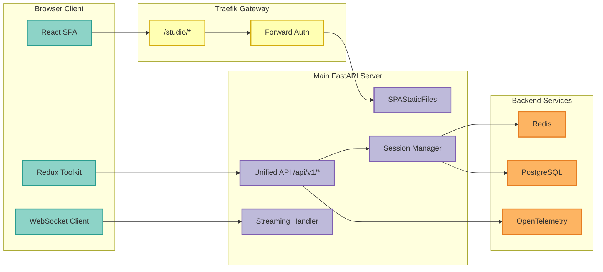
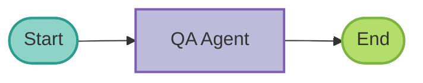
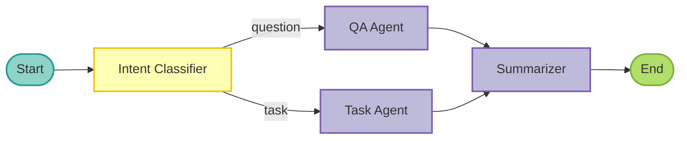
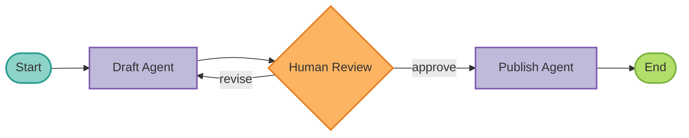

## Overview

The **Agent Studio** is a unified React frontend that provides a complete environment for designing, testing, and deploying AI agents. It consolidates what were previously separate interfaces into a single, powerful application.

<CardGroup cols={3}>
  <Card title="Visual Builder" icon="diagram-project">
    Drag-and-drop workflow design
  </Card>
  <Card title="Real-time Chat" icon="comments">
    Test agents with streaming responses
  </Card>
  <Card title="Observability" icon="chart-line">
    View traces and metrics in-context
  </Card>
</CardGroup>

### Key Features

- **Visual Workflow Builder** - Design multi-agent workflows with drag-and-drop
- **Real-time Streaming** - See agent responses as they're generated
- **Session Persistence** - Maintain conversation context across interactions
- **In-context Observability** - View traces, logs, and metrics alongside chat
- **Tool Visualization** - Watch tool calls and responses in real-time
- **[Manual Tool Selection](/guides/tool-selection)** - Control which tools the agent uses (Auto/Manual/None modes)
- **Code Generation** - Export workflows as production-ready LangGraph Python code

## Architecture

The Agent Studio is served as a Single Page Application (SPA) from the main FastAPI server:



### State Management

The Agent Studio uses **Redux Toolkit with RTK Query** for state management:

```typescript
// Store structure
{
  auth: { user, token, isAuthenticated },
  ui: { sidebarCollapsed, theme, activeView },
  sessions: { currentSession, messages },
  workflows: { currentWorkflow, nodes, edges },
  // RTK Query manages API state automatically
}

// RTK Query API endpoints
- workflowApi: CRUD operations for workflows
- sessionsApi: Session management
- chatApi: Streaming chat
- costApi: Cost tracking
- observabilityApi: Traces and metrics
```

---

## Quick Start

### Prerequisites

- Docker and Docker Compose
- Running MCP Server instance
- Valid authentication credentials

### Starting Agent Studio

<Tabs>
  <Tab title="Docker Compose">
    ```bash
    # Start the full infrastructure with Agent Studio
    make test-studio-up

    # Access the Studio (via Traefik gateway)
    open http://localhost/studio

    # Or directly via the app (port 8000)
    open http://localhost:8000/studio
    ```
  </Tab>
  <Tab title="Development Mode">
    ```bash
    # Start the backend server
    make run-streamable

    # In another terminal, start the frontend dev server
    cd src/mcp_server_langgraph/studio/frontend
    npm install
    npm run dev

    # Access at http://localhost:5173 (Vite dev server)
    ```
  </Tab>
</Tabs>

---

## Chat Interface

The chat interface provides real-time interaction with AI agents.

### Starting a Chat Session

<Steps>
  <Step title="Access Studio">
    Navigate to `http://localhost/studio` (with gateway) or `http://localhost:8000/studio` (direct).
  </Step>
  <Step title="Create a Session">
    Click "New Session" to create a conversation session. Sessions persist your conversation history.
  </Step>
  <Step title="Send a Message">
    Type your message and press Enter. The agent will stream its response in real-time.
  </Step>
  <Step title="View Observability">
    Click the "Traces" tab to see OpenTelemetry traces for your conversation.
  </Step>
  <Step title="Manage Sessions">
    Use the sidebar to switch between sessions or delete old ones.
  </Step>
</Steps>

### Real-Time Streaming

The Studio uses WebSocket connections for real-time streaming:

- **Immediate feedback** - See each token as it's generated
- **Tool call visualization** - Watch tool invocations in real-time
- **Cancellation support** - Stop long-running responses mid-stream

```javascript
// WebSocket message format
{
  "type": "chat",
  "session_id": "abc123",
  "message": "What is the weather today?"
}

// Streaming response chunks
{ "type": "token", "content": "The" }
{ "type": "token", "content": " weather" }
{ "type": "tool_call", "name": "get_weather", "args": {...} }
{ "type": "tool_result", "content": "72F, sunny" }
{ "type": "token", "content": " is 72F and sunny." }
{ "type": "end" }
```

### Session Management

Sessions provide persistent conversation context stored in Redis:

<AccordionGroup>
  <Accordion title="Session Lifecycle" icon="repeat">
    **Create** → **Active** → **Idle** → **Expired**

    - Sessions are created on first message
    - Active sessions have a sliding TTL (default: 1 hour)
    - Idle sessions expire after inactivity
    - Expired sessions are cleaned up automatically
  </Accordion>

  <Accordion title="Session Storage" icon="database">
    Sessions are stored in Redis with full message history, metadata, and token usage tracking.
  </Accordion>

  <Accordion title="Multi-User Support" icon="users">
    Sessions are scoped to authenticated users. Each user sees only their own sessions.
  </Accordion>
</AccordionGroup>

---

## Visual Workflow Builder

Design AI agent workflows through an intuitive drag-and-drop interface.

### Building a Workflow

<Steps>
  <Step title="Create New Workflow">
    Click "New Workflow" and give it a name like "Customer Support Agent".
  </Step>
  <Step title="Add a Start Node">
    Drag a **Start** node from the palette onto the canvas. This is the entry point.
  </Step>
  <Step title="Add an Agent Node">
    Drag an **Agent** node and connect it to the Start node. Configure:
    - **Name**: CustomerSupport
    - **Prompt**: "You are a helpful customer support agent..."
  </Step>
  <Step title="Add Conditional Routing">
    Add a **Router** node to direct conversations based on intent:
    - Connect Agent → Router
    - Configure conditions: "billing", "technical", "general"
  </Step>
  <Step title="Add Specialized Agents">
    Add more Agent nodes for each route:
    - BillingAgent
    - TechnicalAgent
    - GeneralAgent
  </Step>
  <Step title="Add End Node">
    Connect all paths to an **End** node to complete the workflow.
  </Step>
  <Step title="Validate and Generate">
    Click "Validate" to check your workflow, then "Generate Code" to export.
  </Step>
</Steps>

### Node Types

| Node | Description |
|------|-------------|
| **Start** | Entry point (exactly one required) |
| **Agent** | LLM-powered agent with system prompt |
| **Router** | Conditional branching based on patterns |
| **Tool** | Execute an MCP tool directly |
| **Human** | Pause for human review (HITL) |
| **End** | Termination point |

### Workflow Examples

#### Simple Q&A Bot



#### Multi-Agent Pipeline



#### Human-in-the-Loop Review



### Validation Rules

The builder validates workflows against these rules:

| Rule | Description |
|------|-------------|
| **Single Start** | Exactly one Start node required |
| **Reachable End** | All paths must lead to an End node |
| **No Orphans** | All nodes must be connected |
| **No Cycles** | Workflow must be a DAG (no loops without exit condition) |
| **Valid Configs** | All node configurations must be complete |
| **Unique IDs** | All node IDs must be unique |

### Code Generation

Export workflows as production-ready LangGraph Python code:

```python
"""
Generated workflow: Customer Support Agent
"""

from typing import TypedDict
from langgraph.graph import StateGraph, START, END


class AgentState(TypedDict):
    messages: list
    current_intent: str | None


def customer_support(state: AgentState) -> AgentState:
    """Customer support agent node."""
    return state


def router(state: AgentState) -> str:
    """Route based on detected intent."""
    intent = state.get("current_intent")
    if intent == "billing":
        return "billing_agent"
    return "general_agent"


workflow = StateGraph(AgentState)
workflow.add_node("customer_support", customer_support)
workflow.add_edge(START, "customer_support")
workflow.add_conditional_edges("customer_support", router, {...})
workflow.add_edge("billing_agent", END)

app = workflow.compile()
```

---

## In-Context Observability

View traces and metrics directly in the Studio interface:

| Feature | Description |
|---------|-------------|
| **Traces** | OpenTelemetry distributed traces for each conversation turn |
| **Logs** | Structured JSON logs filtered by session |
| **Metrics** | Token usage, latency, and error rates |
| **LangSmith** | Link to LangSmith trace view (if configured) |

---

## Configuration

### Environment Variables

| Variable | Description | Default |
|----------|-------------|---------|
| `PORT` | Server port | `8000` |
| `REDIS_URL` | Redis connection URL | `redis://localhost:6379` |
| `SESSION_TTL_SECONDS` | Session expiration time | `3600` |
| `MAX_MESSAGES_PER_SESSION` | Maximum messages per session | `100` |
| `OTEL_EXPORTER_OTLP_ENDPOINT` | OpenTelemetry endpoint | - |
| `LANGSMITH_API_KEY` | LangSmith API key | - |

---

## Keyboard Shortcuts

| Shortcut | Action |
|----------|--------|
| `Ctrl/Cmd + S` | Save workflow |
| `Ctrl/Cmd + Z` | Undo |
| `Ctrl/Cmd + Shift + Z` | Redo |
| `Delete` | Delete selected node |
| `Ctrl/Cmd + D` | Duplicate selected node |
| `Ctrl/Cmd + A` | Select all nodes |
| `Escape` | Deselect all |
| `Space + Drag` | Pan canvas |
| `Scroll` | Zoom in/out |

See [Keyboard Shortcuts](/guides/keyboard-shortcuts) for the complete list.

---

## Security

### Authentication

The Agent Studio requires JWT authentication via Traefik forward-auth middleware.

### Authorization

Session and workflow access is controlled by OpenFGA:

```yaml
# Permission model
user:alice can view session:abc123
user:alice can edit workflow:wf_abc123
user:bob can view session:abc123  # Shared session
```

<Warning>
Sessions and workflows may contain sensitive data. Ensure proper access controls before deploying to production.
</Warning>

---

## Troubleshooting

<AccordionGroup>
  <Accordion title="Studio page shows blank" icon="display">
    **Solutions**:
    1. Check browser console for JavaScript errors
    2. Verify the frontend was built during Docker image creation
    3. Check that SPAStaticFiles is mounted correctly
    4. Clear browser cache and try again
  </Accordion>

  <Accordion title="WebSocket connection fails" icon="plug">
    **Solutions**:
    1. Check that the server is running
    2. Verify the WebSocket URL uses `ws://` or `wss://`
    3. Ensure authentication token is valid
    4. Check for proxy/firewall issues blocking WebSocket
  </Accordion>

  <Accordion title="Workflow won't save" icon="floppy-disk">
    **Solutions**:
    1. Check authentication token hasn't expired
    2. Validate workflow before saving
    3. Check network connectivity to backend
  </Accordion>

  <Accordion title="Code generation fails" icon="code">
    **Solutions**:
    1. Ensure workflow passes validation first
    2. Check all agent prompts are configured
    3. Verify node connections are complete
  </Accordion>
</AccordionGroup>

---

## API Endpoints

The unified API is available under `/api/v1/*`:

<CardGroup cols={2}>
  <Card title="Sessions API" icon="database">
    `/api/v1/sessions/*` - Session management
  </Card>
  <Card title="Chat API" icon="comments">
    `/api/v1/chat/*` - Streaming chat
  </Card>
  <Card title="Workflows API" icon="diagram-project">
    `/api/v1/workflows/*` - Workflow CRUD
  </Card>
  <Card title="Observability API" icon="chart-line">
    `/api/v1/observability/*` - Traces and metrics
  </Card>
</CardGroup>

See [Agent Studio API Reference](/api-reference/studio) for complete documentation.

---

## Related Documentation

<CardGroup cols={2}>
  <Card title="Agent Studio API" icon="code" href="/api-reference/studio">
    Complete API reference
  </Card>
  <Card title="WebSocket API" icon="plug" href="/api-reference/websockets">
    Real-time WebSocket endpoints
  </Card>
  <Card title="Tool Selection" icon="wrench" href="/guides/tool-selection">
    Control which tools the agent uses
  </Card>
  <Card title="Feature Flags" icon="flag" href="/guides/studio-feature-flags">
    Studio-specific feature flags
  </Card>
  <Card title="Observability" icon="chart-line" href="/guides/observability">
    Set up monitoring
  </Card>
</CardGroup>

---

<Check>
**Ready to build!** Start the Agent Studio with `make test-studio-up` and begin designing your AI agents at `http://localhost/studio`.
</Check>
