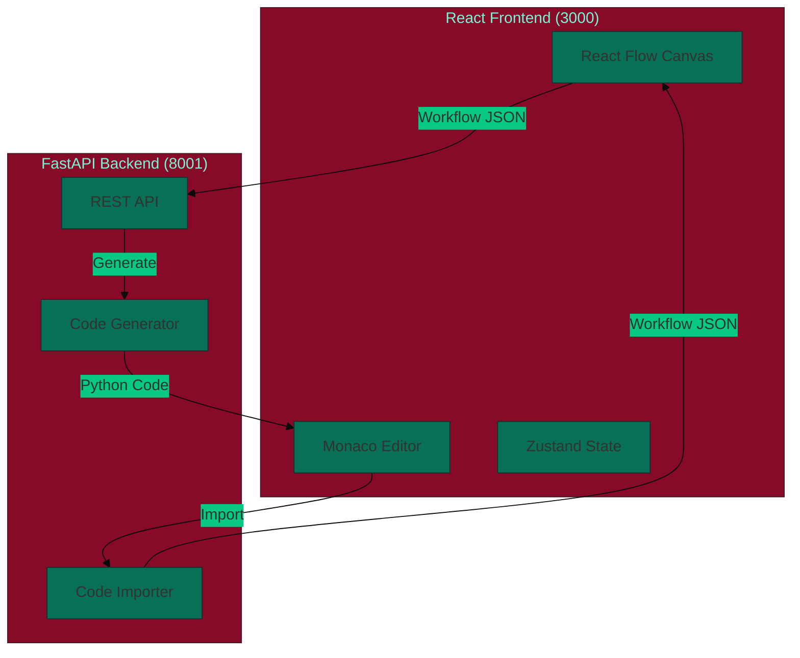
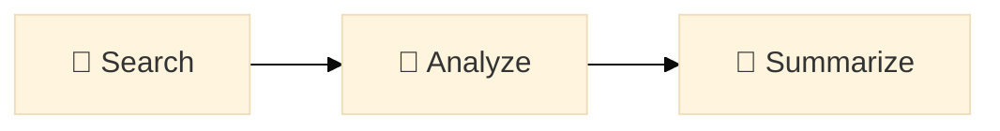
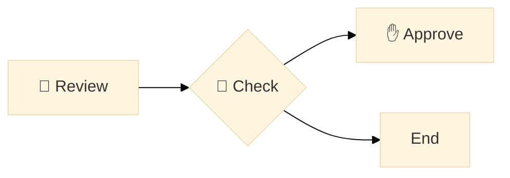
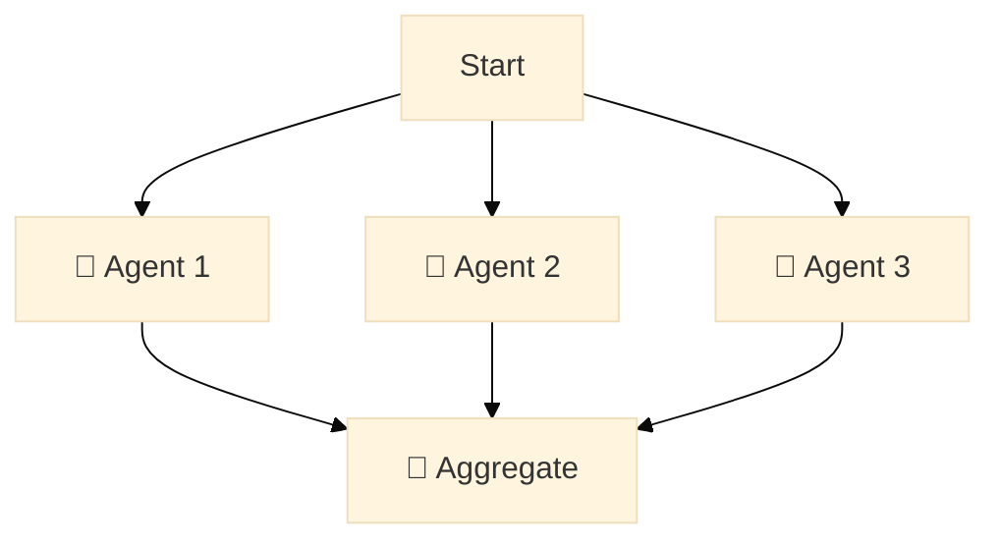

<Note>
**Visual Workflow Builder** enables non-developers to design agent workflows visually and export production-ready Python code.
</Note>

## Overview

The Visual Workflow Builder provides:

- **Drag-and-Drop Canvas** - React Flow-based visual workflow design
- **5 Node Types** - Tool, LLM, Conditional, Approval, Custom
- **Code Export** - Generate production-ready LangGraph Python code
- **Code Import** - Round-trip: import existing code back to visual
- **Templates** - Pre-built workflow patterns

### Unique Differentiator

| Feature | Our Builder | OpenAI AgentKit |
|---------|-------------|-----------------|
| Visual Design | ✅ | ✅ |
| **Code Export** | ✅ | ❌ |
| **Code Import** | ✅ | ❌ |
| Version Control | ✅ (via Git) | ❌ |
| Self-Hosted | ✅ | ❌ |
| LangGraph Native | ✅ | ❌ |
| Open Source | ✅ | ❌ |

## Architecture


```mermaid
%%{init: {'theme':'base', 'themeVariables': {'primaryColor':'#087056','secondaryColor':'#07C983'}}}%%
flowchart TB
    subgraph Frontend["React Frontend (3000)"]
        Canvas[React Flow Canvas]
        Monaco[Monaco Editor]
        Zustand[Zustand State]
    end

    subgraph Backend["FastAPI Backend (8001)"]
        API[REST API]
        Gen[Code Generator]
        Imp[Code Importer]
    end

    Canvas -->|Workflow JSON| API
    API -->|Generate| Gen
    Gen -->|Python Code| Monaco
    Monaco -->|Import| Imp
    Imp -->|Workflow JSON| Canvas
```

## Quick Start

### Start the Builder

<Tabs>
  <Tab title="Test Infrastructure">
    ```bash
    # Start all services including builder
    make test-infra-full-up

    # Access:
    # - Builder Frontend: http://localhost:13000
    # - Builder API: http://localhost:9001
    ```
  </Tab>

  <Tab title="Development Mode">
    ```bash
    # Backend
    uv run uvicorn mcp_server_langgraph.builder.api.server:app \
      --reload --port 8001

    # Frontend (in separate terminal)
    cd src/mcp_server_langgraph/builder/frontend
    npm install
    npm run dev

    # Access:
    # - Builder Frontend: http://localhost:3000
    # - Builder API: http://localhost:8001
    ```
  </Tab>
</Tabs>

### Design Your First Workflow

<Steps>
  <Step title="Add Nodes">
    Drag nodes from the palette onto the canvas:
    - **Tool Node** 🔧 - Execute functions (web search, database query)
    - **LLM Node** 🧠 - Call language models (Claude, GPT, Gemini)
    - **Conditional Node** 🔀 - Route based on state conditions
    - **Approval Node** ✋ - Human-in-the-loop checkpoints
    - **Custom Node** ⚙️ - Custom Python functions
  </Step>

  <Step title="Connect Nodes">
    Click and drag from a node's output handle to another node's input:
    - Regular edges: Direct flow
    - Conditional edges: Add conditions (e.g., `state['score'] > 0.8`)
  </Step>

  <Step title="Configure Nodes">
    Click a node to configure:
    - **Label**: Display name
    - **Config**: Node-specific settings (model, tool name, etc.)
  </Step>

  <Step title="Generate Code">
    Click **Generate Code** to see production-ready Python in the Monaco editor.
  </Step>

  <Step title="Export">
    - **Copy to Clipboard**: Quick copy
    - **Download**: Save as `.py` file
    - **Save Workflow**: Save JSON for later editing
  </Step>
</Steps>

## Node Types

### Tool Node 🔧

Execute tools and functions:

```yaml
Config:
  tool: "web_search"      # Tool name
  args: {}                # Default arguments
```

Generated code:
```python
def node_search(state):
    """Execute Search - tool: web_search."""
    result = call_tool("web_search", state)
    state["result"] = result
    return state
```

### LLM Node 🧠

Call language models:

```yaml
Config:
  model: "claude-sonnet-4-5"     # Model identifier
  temperature: 0.7                   # Sampling temperature
  system_prompt: "..."               # Optional system prompt
```

Generated code:
```python
def node_analyze(state):
    """Execute Analyze - LLM: claude-sonnet-4-5."""
    from litellm import completion

    response = completion(
        model="claude-sonnet-4-5",
        messages=[{"role": "user", "content": state["query"]}],
        temperature=0.7
    )
    state["llm_response"] = response.choices[0].message.content
    return state
```

### Conditional Node 🔀

Route based on state:

```yaml
Config:
  conditions:
    - condition: "state['score'] > 0.8"
      target: "approve"
    - condition: "state['score'] <= 0.8"
      target: "retry"
```

Generated code:
```python
def route_decision(state):
    """Route based on conditions."""
    if state['score'] > 0.8:
        return "approve"
    elif state['score'] <= 0.8:
        return "retry"
    return "default"

graph.add_conditional_edges("decision", route_decision, {
    "approve": "approve_node",
    "retry": "retry_node",
    "default": END
})
```

### Approval Node ✋

Human-in-the-loop checkpoints:

```yaml
Config:
  risk_level: "high"      # high, medium, low
  timeout: 3600           # Seconds to wait for approval
  approvers: ["admin"]    # Required approvers
```

Generated code:
```python
def node_approval(state):
    """Human approval checkpoint."""
    # Pauses workflow for human approval
    # Configured for high risk level
    return interrupt(state, approvers=["admin"], timeout=3600)
```

### Custom Node ⚙️

Flexible Python functions:

```yaml
Config:
  function_name: "process_data"
  description: "Custom data processing"
```

Generated code:
```python
def node_process(state):
    """Execute Process - custom function.

    TODO: Implement custom logic here.
    """
    # Custom implementation
    return state
```

## API Reference

### REST Endpoints

| Method | Endpoint | Description |
|--------|----------|-------------|
| `GET` | `/` | API information |
| `POST` | `/api/builder/generate` | Generate Python code from workflow |
| `POST` | `/api/builder/validate` | Validate workflow structure |
| `POST` | `/api/builder/save` | Save workflow to file |
| `GET` | `/api/builder/templates` | List workflow templates |
| `GET` | `/api/builder/templates/{id}` | Get specific template |
| `POST` | `/api/builder/import` | Import Python code to visual |
| `GET` | `/api/builder/node-types` | List available node types |

### Generate Code

```bash
curl -X POST http://localhost:8001/api/builder/generate \
  -H "Content-Type: application/json" \
  -d '{
    "name": "research_agent",
    "description": "Research and summarize topics",
    "nodes": [
      {
        "id": "search",
        "type": "tool",
        "label": "Search",
        "config": {"tool": "web_search"},
        "position": {"x": 100, "y": 100}
      },
      {
        "id": "summarize",
        "type": "llm",
        "label": "Summarize",
        "config": {"model": "claude-sonnet-4-5"},
        "position": {"x": 300, "y": 100}
      }
    ],
    "edges": [
      {"from_node": "search", "to_node": "summarize", "label": ""}
    ],
    "entry_point": "search",
    "state_schema": {"query": "str", "result": "str"}
  }'
```

Response:
```json
{
  "code": "\"\"\"Research and summarize topics...",
  "workflow_name": "research_agent",
  "nodes_count": 2,
  "edges_count": 1
}
```

### Import Code

```bash
curl -X POST http://localhost:8001/api/builder/import \
  -H "Content-Type: application/json" \
  -d '{
    "code": "from langgraph.graph import StateGraph\n...",
    "layout": "hierarchical"
  }'
```

## Workflow Templates

### Research Agent

Multi-step research with web search and summarization:


```mermaid
%%{init: {'theme':'base'}}%%
flowchart LR
    Search[🔧 Search] --> Analyze[🧠 Analyze] --> Summarize[🧠 Summarize]
```

### Approval Workflow

Document review with human approval:


```mermaid
%%{init: {'theme':'base'}}%%
flowchart LR
    Review[🧠 Review] --> Check{🔀 Check} --> Approve[✋ Approve]
    Check --> Reject[End]
```

### Multi-Agent Pipeline

Parallel agents with aggregation:


```mermaid
%%{init: {'theme':'base'}}%%
flowchart TB
    Start[Start] --> A1[🧠 Agent 1]
    Start --> A2[🧠 Agent 2]
    Start --> A3[🧠 Agent 3]
    A1 --> Agg[🔧 Aggregate]
    A2 --> Agg
    A3 --> Agg
```

## Generated Code Example

**Input Workflow**:
- Node 1: Web Search (tool)
- Node 2: Summarize (LLM)
- Edge: search → summarize

**Output Python**:

```python
"""
Research agent

Auto-generated from Visual Workflow Builder.
"""

from typing import TypedDict
from langgraph.graph import StateGraph


class ResearchAgentState(TypedDict):
    """State for research_agent workflow."""
    query: str
    result: str


def node_search(state):
    """Execute Search - tool: web_search."""
    result = call_tool("web_search", state)
    state["result"] = result
    return state


def node_summarize(state):
    """Execute Summarize - LLM: claude-sonnet-4-5."""
    from litellm import completion

    response = completion(
        model="claude-sonnet-4-5",
        messages=[{"role": "user", "content": state["query"]}]
    )
    state["llm_response"] = response.choices[0].message.content
    return state


def create_research_agent():
    """Create research_agent workflow."""
    graph = StateGraph(ResearchAgentState)

    graph.add_node("search", node_search)
    graph.add_node("summarize", node_summarize)
    graph.add_edge("search", "summarize")
    graph.set_entry_point("search")

    return graph.compile()


# Usage:
# agent = create_research_agent()
# result = agent.invoke({"query": "AI trends 2025"})
```

## Testing

### Run Builder Tests

```bash
# Backend tests
uv run pytest tests/builder/ -v

# Frontend tests
cd src/mcp_server_langgraph/builder/frontend
npm test
```

### Test Coverage

| Component | Tests | Coverage |
|-----------|-------|----------|
| API Server | 37 | 100% |
| Code Generator | 50 | 100% |
| Workflow Builder | 45 | 100% |
| Code Importer | 45 | 100% |
| Frontend | 50+ | 80%+ |

## Configuration

### Environment Variables

```bash
# Backend
BUILDER_PORT=8001
CORS_ORIGINS=http://localhost:3000,http://localhost:13000

# Frontend
VITE_API_URL=http://localhost:8001
```

### Docker Compose

```yaml
builder-api-test:
  build:
    context: .
    dockerfile: docker/Dockerfile.builder-api
  ports:
    - "9001:8001"
  environment:
    - ENVIRONMENT=test

builder-frontend-test:
  build:
    context: .
    dockerfile: docker/Dockerfile.builder-frontend
  ports:
    - "13000:80"
  depends_on:
    builder-api-test:
      condition: service_healthy
```

## Troubleshooting

<AccordionGroup>
  <Accordion title="Frontend not loading">
    ```bash
    # Check nginx serving static files
    curl http://localhost:13000

    # Check API connectivity from frontend
    curl http://localhost:9001/api/builder/node-types
    ```
  </Accordion>

  <Accordion title="Code generation fails">
    - Ensure workflow has at least one node
    - Verify `entry_point` matches a valid node ID
    - Check edges reference existing nodes
  </Accordion>

  <Accordion title="Import not working">
    - Code must use `StateGraph` from `langgraph.graph`
    - Must have `add_node` and `add_edge` calls
    - Must have `set_entry_point` call
  </Accordion>
</AccordionGroup>

## Next Steps

<CardGroup cols={2}>
  <Card title="Interactive Playground" icon="comments" href="/guides/interactive-playground">
    Test your workflows in real-time
  </Card>
  <Card title="ADR-0047" icon="book" href="/architecture/adr-0047-visual-workflow-builder">
    Architecture decision details
  </Card>
  <Card title="LangGraph Docs" icon="external-link" href="https://python.langchain.com/docs/langgraph">
    Official LangGraph documentation
  </Card>
  <Card title="Test Infrastructure" icon="docker" href="/development/test-infrastructure">
    Full test environment
  </Card>
</CardGroup>

---

<Check>
**Visual Workflow Builder** lets you design, visualize, and export LangGraph workflows in minutes!
</Check>
