# MCP Server with LangGraph - Product Roadmap

```mermaid
flowchart LR
    subgraph Current["v2.8.0 (Current)"]
        Multi["Multi-LLM"]
        Auth["Keycloak SSO"]
        Comply["Compliance Suite"]
    end

    subgraph Q4_2025["Q4 2025"]
        CICD["CI/CD Fixes"]
        TODO["Complete TODOs"]
        Security["Security Hardening"]
    end

    subgraph Q1_2026["Q1 2026"]
        Perf["Performance"]
        Cache["Caching"]
        Pool["Connection Pooling"]
    end

    subgraph Q2_2026["Q2 2026"]
        Multi_Tenant["Multi-Tenancy"]
        DX["Developer Experience"]
        AI["AI-Powered Features"]
    end

    Current --> Q4_2025 --> Q1_2026 --> Q2_2026

    %% ColorBrewer2 Set3 palette - timeline colors
    classDef currentStyle fill:#b3de69,stroke:#7cb342,stroke-width:2px,color:#333
    classDef q4Style fill:#8dd3c7,stroke:#2a9d8f,stroke-width:2px,color:#333
    classDef q1Style fill:#bebada,stroke:#7e5eb0,stroke-width:2px,color:#333
    classDef q2Style fill:#fdb462,stroke:#e67e22,stroke-width:2px,color:#333

    class Multi,Auth,Comply currentStyle
    class CICD,TODO,Security q4Style
    class Perf,Cache,Pool q1Style
    class Multi_Tenant,DX,AI q2Style
```

## Vision

Build the **most production-ready, enterprise-grade MCP server** with LangGraph, enabling teams to deploy intelligent agents with confidence through comprehensive observability, compliance, and multi-cloud support.

---

## Current Status (v2.8.0) ✅

**Released**: October 2025

### Production-Ready Features
- ✅ **Multi-LLM Support**: Google Gemini, Anthropic Claude, OpenAI GPT
- ✅ **Enterprise Authentication**: Keycloak SSO, JWT, OpenFGA authorization
- ✅ **Compliance Suite**: GDPR/SOC2/HIPAA with automated evidence collection
- ✅ **Distributed State**: Redis checkpointing for HPA auto-scaling (v2.5.0)
- ✅ **Multi-Cloud Observability**: 6 platform log aggregation (AWS, GCP, Azure, etc.)
- ✅ **Structured Logging**: OpenTelemetry trace injection with JSON formatters
- ✅ **Comprehensive Testing**: 865+ tests, 13,427 LOC test coverage
- ✅ **Complete Documentation**: 95 MDX files, 22 ADRs

### Known Limitations
- ✅ TODOs in production code: 9 resolved, 19 integration placeholders (non-blocking)
  - See: [TODO Analysis Report](https://github.com/vishnu2kmohan/mcp-server-langgraph/blob/main/reports/TODO_ANALYSIS_V2.7.0.md)
  - Deferred to v2.8.0: Storage backends, Prometheus queries, SIEM integration
- ✅ CI/CD pipeline (fixed: action versions standardized, benchmark updated to v1.20.7)
- 🟡 No rate limiting or circuit breaker patterns
- 🟡 Limited performance optimization (no caching, connection pooling)
- 🟡 No multi-tenancy support

---

## Q4 2025: Stability & Production Hardening 🛡️

**Theme**: **"Enterprise Production Ready"**

**Release**: v2.6.0 (November 2025), v2.7.0 (December 2025)

### P0: Critical Fixes (v2.6.0 - November 2025)

#### 1. CI/CD Pipeline Restoration
- **Goal**: 100% passing CI/CD workflows
- **Work Items**:
  - Fix benchmark-action version (`v1.21.0` → `v1.20.3`)
  - Resolve quality test failures
  - Update deprecated GitHub Actions
  - Validate containerized integration tests
  - Add CI status badges to README

**Success Criteria**: All 7 workflows green, < 10 min total runtime

#### 2. Complete Production TODOs (24 items)
- **Goal**: Zero TODOs in production code paths
- **Work Items**:
  - **Alerting Integration** (`src/mcp_server_langgraph/integrations/alerting.py`)
    - PagerDuty connector
    - Slack webhook integration
    - Email alerts via SendGrid/SES
    - Configurable alert routing
  - **Prometheus Client** (`src/mcp_server_langgraph/monitoring/prometheus_client.py`)
    - Real uptime/downtime queries
    - Response time metrics (p50, p95, p99)
    - Error rate calculations
    - SLA compliance metrics
  - **Storage Backend Abstraction** (`src/mcp_server_langgraph/core/storage/`)
    - Conversation storage interface
    - Audit log storage interface
    - User profile storage interface
    - PostgreSQL implementation
    - S3/GCS cold storage support
  - **User Provider Integration**
    - User enumeration API
    - Session analytics
    - MFA statistics
    - RBAC role queries

**Success Criteria**: 0 TODOs, 100% test coverage, ADR-0023 documenting decisions

#### 3. Security Hardening
- **Goal**: Production-grade security posture
- **Work Items**:
  - Rate limiting middleware (per-user, per-IP, per-endpoint)
  - Request size limits (protect against DoS)
  - CSRF protection for web endpoints
  - Security headers (HSTS, CSP, X-Frame-Options, etc.)
  - Dependency vulnerability scanning (Dependabot + Snyk)
  - `security.txt` for responsible disclosure
  - Security audit and penetration testing

**Success Criteria**: 0 critical/high vulnerabilities, security audit report, OWASP Top 10 compliance

---

[... rest of ROADMAP.md content continues ...]

---

## Questions?

- **General**: GitHub Discussions
- **Feature Requests**: [New Issue](https://github.com/vishnu2kmohan/mcp-server-langgraph/issues/new?template=feature_request.yml)
- **Roadmap Feedback**: [Roadmap Discussion](https://github.com/vishnu2kmohan/mcp-server-langgraph/discussions/categories/roadmap)

**Let's build the future of production-ready AI agents together! 🚀**
