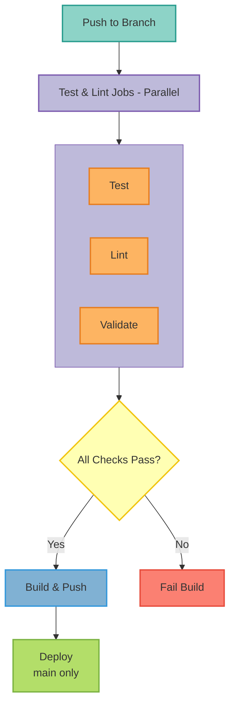
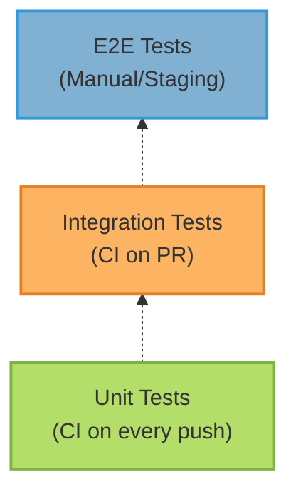

This document describes the continuous integration and continuous deployment (CI/CD) pipeline for the LangGraph MCP Agent project.

### Table of Contents

- [Overview](#overview)
- [Pipeline Architecture](#pipeline-architecture)
- [GitHub Actions Workflows](#github-actions-workflows)
- [Deployment Validation](#deployment-validation)
- [Build and Push](#build-and-push)
- [Testing Strategy](#testing-strategy)
- [Deployment Procedures](#deployment-procedures)
- [Rollback Procedures](#rollback-procedures)
- [Secrets Management](#secrets-management)
- [Troubleshooting](#troubleshooting)

### Overview

The CI/CD pipeline is implemented using GitHub Actions and provides:

- **Automated Testing**: Unit, integration, and property-based tests
- **Code Quality**: Linting, formatting, and security scanning
- **Deployment Validation**: Kubernetes manifests, Helm charts, and Docker Compose configurations
- **Container Builds**: Multi-architecture Docker images (amd64/arm64)
- **Automated Deployments**: Environment-specific deployment workflows
- **Rollback Capability**: Quick rollback to previous versions

#### Pipeline Workflow



### Pipeline Architecture

#### GitHub Actions Workflow File

**Location**: `.github/workflows/ci.yaml`

#### Jobs

1. **test**: Runs pytest with unit tests
2. **lint**: Runs flake8 and mypy
3. **security-check**: Runs Bandit security scanner
4. **validate-deployments**: Validates all deployment configurations
5. **build-and-push**: Builds and pushes Docker images
6. **deploy**: Deploys to target environment (main branch only)

### GitHub Actions Workflows

#### Main CI Workflow

```yaml
name: CI/CD Pipeline

on:
  push:
    branches: [main, develop]
  pull_request:
    branches: [main]

env:
  REGISTRY: ghcr.io
  IMAGE_NAME: ${{ github.repository }}
```

##### Test Job

```yaml
test:
  runs-on: ubuntu-latest
  steps:
    - uses: actions/checkout@v4

    - name: Set up Python
      uses: actions/setup-python@v5
      with:
        python-version: '3.12'

    - name: Install dependencies
      run: |
        curl -LsSf https://astral.sh/uv/install.sh | sh
        uv sync

    - name: Run unit tests
      run: |
        ENABLE_TRACING=false \
        ENABLE_METRICS=false \
        ENABLE_CONSOLE_EXPORT=false \
        pytest -m unit --tb=line -q
```

**Purpose**: Ensures all unit tests pass before deployment

**Environment Variables**:
- `ENABLE_TRACING=false`: Disables OpenTelemetry tracing
- `ENABLE_METRICS=false`: Disables metrics collection
- `ENABLE_CONSOLE_EXPORT=false`: Disables console export

##### Lint Job

```yaml
lint:
  runs-on: ubuntu-latest
  steps:
    - uses: actions/checkout@v4

    - name: Set up Python
      uses: actions/setup-python@v5
      with:
        python-version: '3.12'

    - name: Install dependencies
      run: |
        curl -LsSf https://astral.sh/uv/install.sh | sh
        uv pip install flake8 mypy

    - name: Run flake8
      run: |
        flake8 . --count --select=E9,F63,F7,F82 \
          --show-source --statistics --exclude=.venv,tests

    - name: Run mypy
      run: mypy src/ --ignore-missing-imports
      continue-on-error: true
```

**Purpose**: Enforces code quality standards

**Checks**:
- `flake8`: Python syntax errors and undefined names
- `mypy`: Type checking (non-blocking)

##### Security Check Job

```yaml
security-check:
  runs-on: ubuntu-latest
  steps:
    - uses: actions/checkout@v4

    - name: Set up Python
      uses: actions/setup-python@v5
      with:
        python-version: '3.12'

    - name: Install Bandit
      run: |
        curl -LsSf https://astral.sh/uv/install.sh | sh
        uv pip install bandit

    - name: Run Bandit
      run: bandit -r src/ -ll
```

**Purpose**: Identifies security vulnerabilities

**Scanner**: Bandit with low-low severity threshold

### Deployment Validation

#### Validate Deployments Job

```yaml
validate-deployments:
  name: Validate Deployment Configurations
  runs-on: ubuntu-latest
  steps:
    - uses: actions/checkout@v4

    - name: Set up Python
      uses: actions/setup-python@v5
      with:
        python-version: '3.12'

    - name: Install dependencies
      run: |
        curl -LsSf https://astral.sh/uv/install.sh | sh
        uv pip install pyyaml jsonschema

    - name: Run deployment validation script
      run: python3 scripts/validation/validate_deployments.py

    - name: Validate Docker Compose
      run: docker compose -f docker-compose.yml config --quiet

    - name: Install Helm
      uses: azure/setup-helm@v3
      with:
        version: 'v3.13.0'

    - name: Validate Helm chart
      run: |
        helm lint deployments/helm/mcp-server-langgraph
        helm template test-release deployments/helm/mcp-server-langgraph --dry-run > /dev/null

    - name: Install kubectl
      uses: azure/setup-kubectl@v3
      with:
        version: 'v1.28.0'

    - name: Validate Kustomize overlays
      run: |
        for env in dev staging production; do
          echo "Validating $env overlay..."
          kubectl kustomize deployments/kustomize/overlays/$env > /dev/null
        done
```

**Purpose**: Ensures all deployment configurations are valid before merge

**Validations**:
1. **Python Validation Script**: Comprehensive YAML and configuration checks
2. **Docker Compose**: Syntax and structure validation
3. **Helm Chart**: Linting and template rendering
4. **Kustomize Overlays**: Validation for dev, staging, and production

#### Validation Script

**Location**: `scripts/validation/validate_deployments.py`

**Features**:
- YAML syntax validation
- Kubernetes manifest validation
- Cross-platform configuration consistency
- Resource specifications validation
- Environment variable completeness
- Probe configuration validation

**Usage**:
```bash
python3 scripts/validation/validate_deployments.py
```

**Example Output**:
```
✓ Validating YAML syntax...
✓ Validating Kubernetes manifests...
✓ Validating Docker Compose...
✓ Validating Helm chart...
✓ Validating configuration consistency...

All validations passed!
```

### Build and Push

#### Docker Image Build

```yaml
build-and-push:
  needs: [test, lint, security-check, validate-deployments]
  runs-on: ubuntu-latest
  permissions:
    contents: read
    packages: write

  steps:
    - uses: actions/checkout@v4

    - name: Set up Docker Buildx
      uses: docker/setup-buildx-action@v3

    - name: Log in to Container Registry
      uses: docker/login-action@v3
      with:
        registry: ${{ env.REGISTRY }}
        username: ${{ github.actor }}
        password: ${{ secrets.GITHUB_TOKEN }}

    - name: Extract metadata
      id: meta
      uses: docker/metadata-action@v5
      with:
        images: ${{ env.REGISTRY }}/${{ env.IMAGE_NAME }}
        tags: |
          type=ref,event=branch
          type=ref,event=pr
          type=semver,pattern={{version}}
          type=semver,pattern={{major}}.{{minor}}
          type=sha

    - name: Build and push Docker image
      uses: docker/build-push-action@v5
      with:
        context: .
        platforms: linux/amd64,linux/arm64
        push: true
        tags: ${{ steps.meta.outputs.tags }}
        labels: ${{ steps.meta.outputs.labels }}
        cache-from: type=gha
        cache-to: type=gha,mode=max
```

**Features**:
- **Multi-architecture builds**: amd64 and arm64
- **Automatic tagging**: Branch names, PRs, semantic versions, commit SHAs
- **Layer caching**: GitHub Actions cache for faster builds
- **Dependency**: Only runs after all validation jobs pass
- **SBOM generation**: Automatic Software Bill of Materials creation

**Image Tags**:
- `main`: Latest stable version
- `develop`: Development version
- `v2.1.0`: Semantic version tags
- `sha-abc1234`: Commit SHA tags

### Software Bill of Materials (SBOM)

Every release automatically generates an SBOM for supply chain security:

**Format:** SPDX JSON
**Tool:** Anchore SBOM Action
**Location:** Attached to GitHub release

**Usage:**
```bash
## Download SBOM from latest release
gh release download v2.1.0 --pattern 'sbom-*.spdx.json'

## Analyze with tools
grype sbom:sbom-linux-amd64.spdx.json
syft sbom-linux-amd64.spdx.json -o table
```

**Benefits:**
- Supply chain transparency
- Vulnerability tracking
- License compliance
- Security audits

### Testing Strategy

#### Test Pyramid



#### Test Execution

**Local Testing**:
```bash
## Unit tests only
make test-unit

## All automated tests
make test

## With coverage
make test-coverage

## Property-based tests
make test-property

## Benchmark tests
pytest -m benchmark -v --benchmark-only

## Mutation tests (slow!)
make test-mutation
```

**CI Testing**:
```bash
## Exact CI command
ENABLE_TRACING=false \
ENABLE_METRICS=false \
ENABLE_CONSOLE_EXPORT=false \
pytest -m unit --tb=line -q
```

#### Test Markers

- `unit`: Fast, isolated unit tests
- `integration`: Tests requiring external services
- `property`: Property-based tests with Hypothesis
- `contract`: MCP protocol compliance tests
- `regression`: Performance regression tests
- `benchmark`: Performance benchmarks
- `mutation`: Mutation testing (weekly schedule)

#### Mutation Testing

**Purpose:** Measure test effectiveness

**Schedule:** Weekly (too slow for every PR)

**Command:**
```bash
## Local execution
make test-mutation

## Or directly
mutmut run --paths-to-mutate=src/mcp_server_langgraph/
mutmut results
mutmut html  # Open html/index.html
```

**Target Score:** 80%+ mutation kills

#### Benchmark Testing

**Purpose:** Track performance regressions

**Execution:** Every PR + weekly

**Thresholds:**
- Agent response: p95 < 5s
- LLM call: p95 < 10s
- Authorization: p95 < 50ms

**Alert:** Automatic PR comment if 20%+ slower

**Baseline Tracking:**
```bash
## Run benchmarks
pytest -m benchmark -v --benchmark-only --benchmark-autosave

## Compare against baseline
pytest -m benchmark --benchmark-compare
```

### Deployment Procedures

#### Environment Strategy

```
Development → Staging → Production
    ↓           ↓          ↓
 Kustomize   Kustomize   Helm
   (dev)     (staging)  (release)
```

#### Development Deployment

**Trigger**: Automatic on push to `develop` branch (manual gate)

**Method**: Kustomize with dev overlay

```bash
make deploy-dev
```

**Configuration**:
- Namespace: `mcp-server-langgraph-dev`
- Auth: `inmemory` (no Keycloak)
- Sessions: `memory` (no Redis)
- Replicas: 1
- Resources: Low limits

#### Staging Deployment

**Trigger**: Manual deployment after dev validation

**Method**: Kustomize with staging overlay

```bash
make deploy-staging
```

**Configuration**:
- Namespace: `staging-mcp-server-langgraph`
- Auth: `keycloak`
- Sessions: `redis` (12-hour TTL)
- Replicas: 2
- Resources: Medium limits
- Full observability enabled

#### Production Deployment

**Trigger**: Manual deployment with confirmation

**Method**: Helm chart

```bash
make deploy-production
```

**Configuration**:
- Namespace: `mcp-server-langgraph`
- Auth: `keycloak` (SSL verified)
- Sessions: `redis` (SSL enabled, 24-hour TTL)
- Replicas: 3+ (HPA enabled)
- Resources: Production limits
- High availability configured

**Safety Features**:
- 10-second confirmation delay
- Health check validation
- Rolling update strategy
- Pod disruption budgets

### Rollback Procedures

#### Quick Rollback Commands

**Development**:
```bash
make deploy-rollback-dev
```

**Staging**:
```bash
make deploy-rollback-staging
```

**Production**:
```bash
make deploy-rollback-production
```

#### Manual Rollback

**Kubernetes Deployment**:
```bash
## List rollout history
kubectl rollout history deployment/mcp-server-langgraph -n mcp-server-langgraph

## Rollback to previous version
kubectl rollout undo deployment/mcp-server-langgraph -n mcp-server-langgraph

## Rollback to specific revision
kubectl rollout undo deployment/mcp-server-langgraph -n mcp-server-langgraph --to-revision=3

## Monitor rollback
kubectl rollout status deployment/mcp-server-langgraph -n mcp-server-langgraph
```

**Helm Rollback**:
```bash
## List release history
helm history mcp-server-langgraph -n mcp-server-langgraph

## Rollback to previous release
helm rollback mcp-server-langgraph -n mcp-server-langgraph

## Rollback to specific revision
helm rollback mcp-server-langgraph 2 -n mcp-server-langgraph
```

### Secrets Management

#### GitHub Secrets

Required secrets for CI/CD:

| Secret | Purpose | Used By |
|--------|---------|---------|
| `GITHUB_TOKEN` | Container registry authentication | build-and-push |
| `KUBECONFIG` | Kubernetes cluster access | deploy |

#### Kubernetes Secrets

Created manually or via secrets operator:

```bash
kubectl create secret generic mcp-server-langgraph-secrets \
  --from-literal=anthropic-api-key="<key>" \
  --from-literal=jwt-secret-key="<secret>" \
  --from-literal=redis-password="`<password>`" \
  --from-literal=postgres-password="`<password>`" \
  --from-literal=keycloak-client-secret="<secret>" \
  --from-literal=keycloak-admin-password="`<password>`" \
  --from-literal=openfga-store-id="<id>" \
  --from-literal=openfga-model-id="<id>" \
  -n mcp-server-langgraph
```

#### Secret Rotation

1. Update secret in Kubernetes
2. Trigger rolling restart:
   ```bash
   kubectl rollout restart deployment/mcp-server-langgraph -n mcp-server-langgraph
   ```

### Troubleshooting

#### Build Failures

**Issue**: Docker build fails

**Solution**:
1. Check Dockerfile syntax
2. Verify base image availability
3. Check dependency installation
4. Review build logs in GitHub Actions

#### Test Failures

**Issue**: Tests fail in CI but pass locally

**Solution**:
1. Ensure same Python version (3.12)
2. Check environment variables
3. Verify test isolation
4. Review CI logs for specific errors

#### Deployment Validation Failures

**Issue**: Validation script reports errors

**Solution**:
1. Run validation locally:
   ```bash
   python3 scripts/validation/validate_deployments.py
   ```
2. Fix reported configuration issues
3. Validate specific components:
   ```bash
   docker compose config
   helm lint deployments/helm/mcp-server-langgraph
   kubectl kustomize deployments/kustomize/overlays/dev
   ```

#### Deployment Failures

**Issue**: Deployment fails or pods crash

**Solution**:
1. Check pod status:
   ```bash
   kubectl get pods -n mcp-server-langgraph
   kubectl describe pod <pod-name> -n mcp-server-langgraph
   ```
2. Review logs:
   ```bash
   kubectl logs -n mcp-server-langgraph <pod-name>
   ```
3. Verify secrets exist:
   ```bash
   kubectl get secrets -n mcp-server-langgraph
   ```
4. Check resource availability:
   ```bash
   kubectl top nodes
   kubectl top pods -n mcp-server-langgraph
   ```

#### Rollback Issues

**Issue**: Rollback doesn't restore service

**Solution**:
1. Verify rollback completed:
   ```bash
   kubectl rollout status deployment/mcp-server-langgraph -n mcp-server-langgraph
   ```
2. Check if database migrations need rollback
3. Verify configuration compatibility
4. Review pod events for errors

### Best Practices

1. **Always test locally before pushing**: Run `make test` and `make validate-all`
2. **Use feature branches**: Never commit directly to `main`
3. **Write meaningful commit messages**: Follow conventional commits
4. **Update tests with code changes**: Maintain test coverage
5. **Validate deployment configs**: Run validation before creating PRs
6. **Monitor deployments**: Watch logs and metrics after deployment
7. **Test rollbacks in staging**: Practice rollback procedures
8. **Keep secrets secure**: Never commit secrets to git
9. **Document changes**: Update CHANGELOG.md
10. **Review before merge**: Always have PRs reviewed
11. **Monitor workflow efficiency**: Review Actions usage monthly
12. **Update dependencies**: Keep GitHub Actions up to date
13. **Cache strategically**: Balance cache hits vs maintenance
14. **Use artifact retention**: Don't store artifacts forever
15. **Review SBOM regularly**: Check for new vulnerabilities
16. **Run mutation tests**: Verify test effectiveness monthly
17. **Track benchmarks**: Monitor performance trends over time
18. **Leverage concurrency controls**: Prevent duplicate workflow runs

### References

- [GitHub Actions Documentation](https://docs.github.com/en/actions)
- [Docker Build Documentation](https://docs.docker.com/engine/reference/commandline/build/)
- [Helm Documentation](https://helm.sh/docs/)
- [Kustomize Documentation](https://kubectl.docs.kubernetes.io/references/kustomize/)
- [Deployment Quickstart](https://github.com/vishnu2kmohan/mcp-server-langgraph/blob/main/deployments/QUICKSTART.md)
- [Deployment README](https://github.com/vishnu2kmohan/mcp-server-langgraph/blob/main/deployments/README.md)
