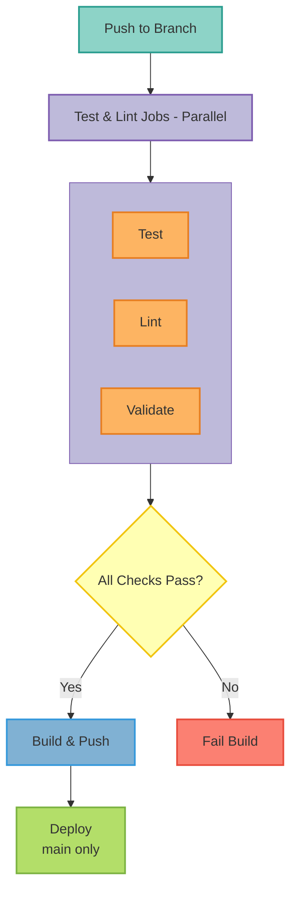

This document describes the continuous integration and continuous deployment (CI/CD) pipeline for the LangGraph MCP Agent project.

### Table of Contents

- [Overview](#overview)
- [Pipeline Architecture](#pipeline-architecture)
- [GitHub Actions Workflows](#github-actions-workflows)
- [Deployment Validation](#deployment-validation)
- [Build and Push](#build-and-push)
- [Testing Strategy](#testing-strategy)
- [Deployment Procedures](#deployment-procedures)
- [Rollback Procedures](#rollback-procedures)
- [Secrets Management](#secrets-management)
- [Troubleshooting](#troubleshooting)

### Overview

The CI/CD pipeline is implemented using GitHub Actions and provides:

- **Automated Testing**: Unit, integration, and property-based tests
- **Code Quality**: Linting, formatting, and security scanning
- **Deployment Validation**: Kubernetes manifests, Helm charts, and Docker Compose configurations
- **Container Builds**: Multi-architecture Docker images (amd64/arm64)
- **Automated Deployments**: Environment-specific deployment workflows
- **Rollback Capability**: Quick rollback to previous versions

#### Pipeline Workflow

### Pipeline Architecture

#### GitHub Actions Workflow File

**Location**: `.github/workflows/ci.yaml`

#### Jobs

1. **test**: Runs pytest with unit tests
2. **lint**: Runs flake8 and mypy
3. **security-check**: Runs Bandit security scanner
4. **validate-deployments**: Validates all deployment configurations
5. **build-and-push**: Builds and pushes Docker images
6. **deploy**: Deploys to target environment (main branch only)

## Pipeline Topics

<CardGroup cols={2}>
  <Card title="GitHub Actions Workflows" icon="github" href="./workflows">
    Workflow configuration, jobs, and deployment validation
  </Card>
  <Card title="Testing Strategy" icon="flask" href="./testing">
    Unit, integration, property-based, and mutation testing
  </Card>
  <Card title="Deployment Procedures" icon="rocket" href="./deployment">
    Deployment and rollback procedures
  </Card>
  <Card title="Troubleshooting" icon="wrench" href="./troubleshooting">
    Secrets management, debugging, and best practices
  </Card>
</CardGroup>
