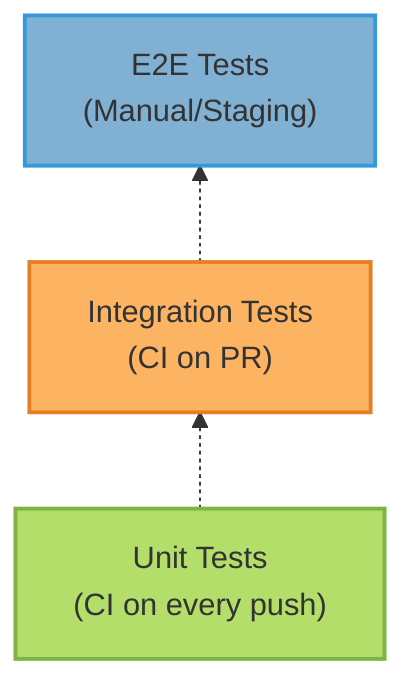

### Testing Strategy

#### Test Pyramid



#### Test Execution

**Local Testing**:
```bash
## Unit tests only
make test-unit

## All automated tests
make test

## With coverage
make test-coverage

## Property-based tests
make test-property

## Benchmark tests
pytest -m benchmark -v --benchmark-only

## Mutation tests (slow!)
make test-mutation
```

**CI Testing**:
```bash
## Exact CI command
ENABLE_TRACING=false \
ENABLE_METRICS=false \
ENABLE_CONSOLE_EXPORT=false \
pytest -m unit --tb=line -q
```

#### Test Markers

- `unit`: Fast, isolated unit tests
- `integration`: Tests requiring external services
- `property`: Property-based tests with Hypothesis
- `contract`: MCP protocol compliance tests
- `regression`: Performance regression tests
- `benchmark`: Performance benchmarks
- `mutation`: Mutation testing (weekly schedule)

#### Mutation Testing

**Purpose:** Measure test effectiveness

**Schedule:** Weekly (too slow for every PR)

**Command:**
```bash
## Local execution
make test-mutation

## Or directly
mutmut run --paths-to-mutate=src/mcp_server_langgraph/
mutmut results
mutmut html  # Open html/index.html
```

**Target Score:** 80%+ mutation kills

#### Benchmark Testing

**Purpose:** Track performance regressions

**Execution:** Every PR + weekly

**Thresholds:**
- Agent response: p95 < 5s
- LLM call: p95 < 10s
- Authorization: p95 < 50ms

**Alert:** Automatic PR comment if 20%+ slower

**Baseline Tracking:**
```bash
## Run benchmarks
pytest -m benchmark -v --benchmark-only --benchmark-autosave

## Compare against baseline
pytest -m benchmark --benchmark-compare
```


## Next Steps

<CardGroup cols={2}>
  <Card title="Workflows" icon="github" href="./workflows">
    Configure test workflows
  </Card>
  <Card title="Deployment" icon="rocket" href="./deployment">
    Deploy tested code
  </Card>
  <Card title="Back to Overview" icon="arrow-left" href="./overview">
    Return to CI/CD overview
  </Card>
</CardGroup>
