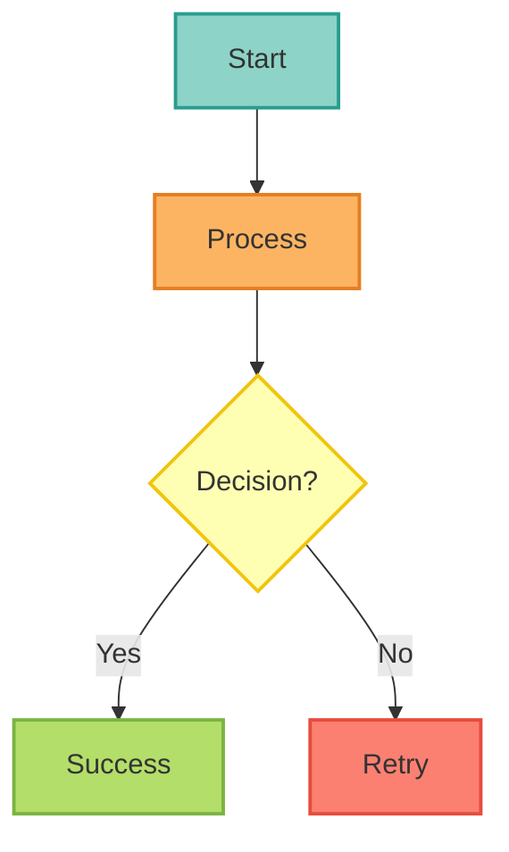
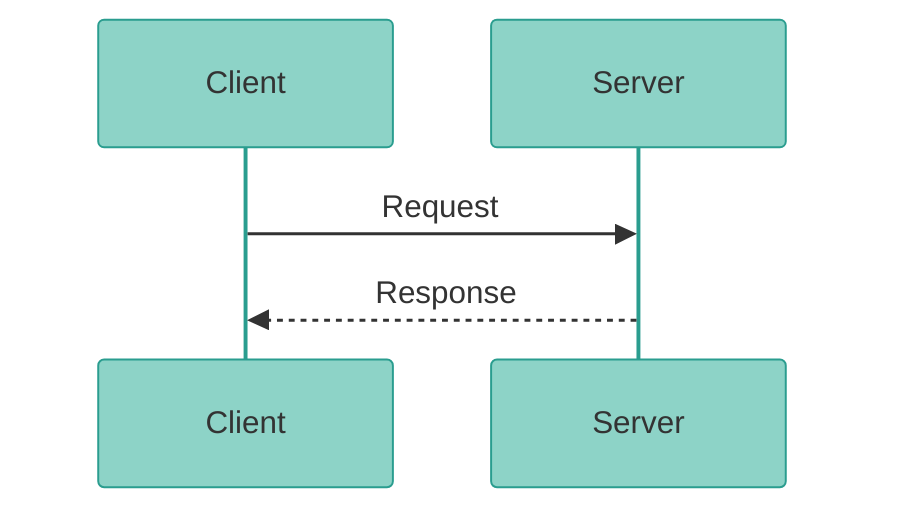
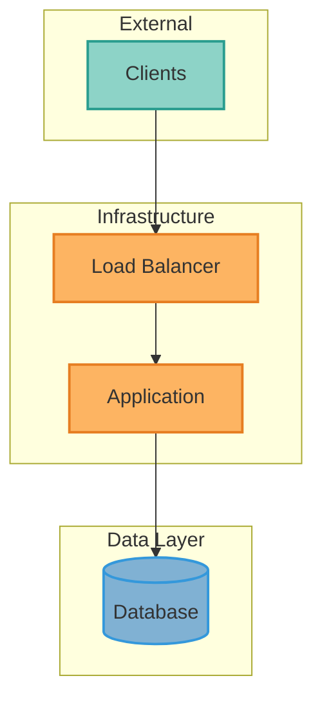

<Info>
**Last Updated**: November 15, 2025
**Mermaid Version**: 11.4.1+
**Total Diagrams**: 82+ across 67+ files
**Compliance**: 100% production diagrams
</Info>

## MANDATORY REQUIREMENTS

<Warning>
All new Mermaid diagrams MUST:

1. ✅ Use **modern syntax** (`flowchart TD/TB/LR/BT` instead of `graph TB`)
2. ✅ Apply **ColorBrewer2 Set3 palette** styling
3. ✅ Include **standard comment**: `%% ColorBrewer2 Set3 palette - each component type uniquely colored`
4. ✅ Use **semantic color assignments** (see palette guide below)
5. ✅ Follow **accessibility guidelines** (WCAG AA contrast ratios)

These requirements apply to ALL user-facing documentation (docs/*.mdx).
</Warning>

---

## Current State

### Quality Metrics

| Metric | Status |
|--------|--------|
| **Total diagrams** | 82+ across 67+ files |
| **ColorBrewer2 Set3 styled** | 100% (all production files) |
| **Modern syntax usage** | 100% (all flowcharts) |
| **Sequence diagrams themed** | 100% |
| **Average complexity** | 34.0/100 (healthy, target &lt; 50) |

### Validation Status

- ✅ All diagrams pass `mmdc` CLI validation
- ✅ All sequence diagrams have ColorBrewer2 themes
- ✅ All user-facing flowcharts have ColorBrewer2 Set3 palette styling
- ✅ No syntax errors

---

## ColorBrewer2 Set3 Palette (MANDATORY)

### Complete Palette with Semantic Assignments

| Color | Hex Code | Stroke Color | Semantic Usage |
|-------|----------|--------------|----------------|
| **Cyan** | #8dd3c7 | #2a9d8f | External/clients/start nodes |
| **Orange** | #fdb462 | #e67e22 | Ingress/processing/middleware |
| **Green** | #b3de69 | #7cb342 | Application/execution/success |
| **Red** | #fb8072 | #e74c3c | LLM/critical paths/errors |
| **Blue** | #80b1d3 | #3498db | Data/storage/services |
| **Yellow** | #ffffb3 | #f1c40f | Decisions/observability |
| **Purple** | #bc80bd | #8e44ad | Secrets/special features |
| **Lavender** | #bebada | #7e5eb0 | Auth/security/clusters |
| **Pink** | #fccde5 | #ec7ab8 | External services/monitoring |
| **Light Green** | #ccebc5 | #82c99a | Results/dashboards |
| **Gray** | #d9d9d9 | #95a5a6 | Neutral/generic |

### For Flowcharts/Graphs

**Mandatory Pattern:**
```python
flowchart TD
    [your diagram content]

    %% ColorBrewer2 Set3 palette - each component type uniquely colored
    classDef styleNameStyle fill:#HEXCOLOR,stroke:#STROKECOLOR,stroke-width:2px,color:#333

    class NodeNames styleNameStyle
```

### For Sequence Diagrams

**Mandatory Pattern:**
```text
%%{init: {'theme':'base', 'themeVariables': {
  'primaryColor':'#8dd3c7',
  'primaryTextColor':'#333',
  'primaryBorderColor':'#2a9d8f',
  'lineColor':'#fb8072',
  'secondaryColor':'#fdb462',
  'tertiaryColor':'#b3de69'
}}}%%
sequenceDiagram
    [your sequence diagram content]
```

---

## Modern Mermaid Syntax (MANDATORY)

### Flowchart Syntax

- ✅ **ALWAYS USE** modern flowchart syntax:
```python
flowchart TD   # Top to bottom
flowchart TB   # Top to bottom (same as TD)
flowchart LR   # Left to right
flowchart BT   # Bottom to top
```

❌ **NEVER USE** deprecated graph syntax:
```rust
graph TB      # DEPRECATED - use flowchart TB instead
graph LR      # DEPRECATED - use flowchart LR instead
```

**Why**: Modern syntax supports more features, better styling, and is actively maintained.

### Syntax Version Requirements

- **Mermaid Version**: 11.4.1+ (modern syntax required)
- **Mintlify Support**: Latest version supports all modern syntax
- **Browser Compatibility**: All modern browsers supported

---

## Best Practices

### Theme Initialization (Sequence Diagrams)

- ✅ **ALWAYS** start sequence diagrams with theme:
```text
%%{init: {'theme':'base', 'themeVariables': {...}}}%%
sequenceDiagram
    ...
```

- ❌ **DON'T** use classDef in sequence diagrams (not supported)

### Styling (Flowcharts/Graphs)

- ✅ **USE** classDef for reusable styles:
```python
flowchart TB
    A[Node]

    %% ColorBrewer2 Set3 palette - each component type uniquely colored
    classDef primaryStyle fill:#8dd3c7,stroke:#2a9d8f,stroke-width:2px,color:#333
    class A primaryStyle
```

- ❌ **AVOID** inline styles (hard to maintain):
```text
flowchart TB
    A[Node]
    style A fill:#8dd3c7,stroke:#2a9d8f
```

### Complexity Management

**Guidelines**:
- **Nodes**: Keep under 25 nodes per diagram
- **Edges**: Keep under 40 connections
- **Nesting**: Maximum 3 levels of subgraphs
- **Complexity score**: Target &lt; 50

**When to split**:
- Complexity score &gt; 70: Must split
- Complexity score 50-70: Consider splitting
- Multiple concepts: Split by concern

### Color Contrast (Accessibility)

**WCAG 2.1 AA Compliance**:
- Text on light backgrounds: `color:#333` (dark gray)
- Text on dark backgrounds: `color:#fff` (white)
- Minimum contrast ratio: 4.5:1 for normal text

<Check>
Our ColorBrewer2 palette is WCAG AA compliant
</Check>

---

## Diagram Templates

### Template 1: Basic Flowchart with Styling


### Template 2: Themed Sequence Diagram



### Template 3: Deployment Architecture



---

## Validation Tools

### Validate All Diagrams

```bash
python3 scripts/validate_all_mermaid.py docs
```

Checks:
- Mermaid syntax correctness via `mmdc` CLI
- Renders each diagram to ensure no runtime errors
- Reports specific line numbers for errors

### Fix Sequence Diagram classDef Issues

```bash
python3 scripts/fix_mermaid_sequence_diagrams.py docs
```
Automatically removes invalid `classDef` statements from sequence diagrams.

### Add Theme to Sequence Diagrams

```bash
python3 scripts/add_sequence_diagram_themes.py docs
```

Adds ColorBrewer2 theme initialization to sequence diagrams.

---

## Common Issues & Solutions

<AccordionGroup>
  <Accordion title="Issue 1: Diagram Not Rendering" icon="circle-exclamation">
    **Symptoms**: Blank space where diagram should be

    **Common Causes**:
    1. Syntax error (run `mmdc` to validate)
    2. Invalid icon/character in labels
    3. Unclosed quotes
    4. Invalid HTML in labels (use `&lt;` not `<`)

    **Solution**:
```bash
    ## Extract and validate specific diagram
    sed -n '/```mermaid/,/```/p' file.mdx | sed '1d;$d' > test.mmd
    mmdc -i test.mmd -o test.svg
    ```
  </Accordion>

  <Accordion title="Issue 2: classDef in Sequence Diagram" icon="triangle-exclamation">
    **Error**: `Parse error... Expecting 'SEMI', 'NEWLINE'... got 'TXT'`

    **Cause**: classDef/class statements don't work in sequence diagrams

    **Solution**: Remove all classDef and class lines, use theme instead
  </Accordion>

  <Accordion title="Issue 3: Unescaped HTML Characters" icon="code">
    **Error**: `Unexpected character '<' before name`

    **Cause**: `<` must be escaped in MDX as `&lt;`

    **Solution**: Replace `<` with `&lt;` and `>` with `&gt;`
  </Accordion>
</AccordionGroup>

---

## Quick Reference: Diagram Types

### When to Use Each Type

**Flowchart/Graph** (`flowchart TD/LR`):
- System architecture
- Component relationships
- Infrastructure topology
- Data flow
- Deployment layouts

**Sequence Diagram** (`sequenceDiagram`):
- API interactions
- Authentication flows
- Request/response cycles
- Multi-step processes
- Time-based interactions

**State Diagram** (`stateDiagram-v2`):
- Workflow states
- Lifecycle management
- State transitions
- Process status

---

## Maintenance Schedule

### Weekly
- Run `validate_all_mermaid.py` on changed files
- Check for new unstyled diagrams

### Monthly
- Review diagram complexity metrics
- Update themes if ColorBrewer2 palette changes
- Refactor overly complex diagrams

### Quarterly
- Full validation of all diagrams
- Performance audit (rendering times)
- Accessibility review (contrast ratios)

---

## Resources

<CardGroup cols={2}>
  <Card title="Mermaid Documentation" icon="book" href="https://mermaid.js.org/">
    Official Mermaid documentation and syntax reference
  </Card>
  <Card title="ColorBrewer2 Palettes" icon="palette" href="https://colorbrewer2.org/">
    Explore ColorBrewer2 color palettes
  </Card>
  <Card title="Mermaid Live Editor" icon="code" href="https://mermaid.live/">
    Test and preview Mermaid diagrams
  </Card>
  <Card title="WCAG Contrast Checker" icon="eye" href="https://webaim.org/resources/contrastchecker/">
    Verify color contrast accessibility
  </Card>
</CardGroup>

---

## Related Documentation

<CardGroup cols={2}>
  <Card title="ADR-0055: Diagram Visualization Standards" icon="file-lines" href="/architecture/adr-0055-diagram-visualization-standards">
    Architectural decision record with rationale, compliance metrics, and academic references
  </Card>

  <Card title="Internal Validation Infrastructure" icon="gear">
    For maintainers: See `docs/.mintlify/MERMAID_OPTIMIZATION_GUIDE.md` for validation scripts, pre-commit hook configuration, and migration history
  </Card>
</CardGroup>

---

<Check>
**Quality Status**: 100% of production diagrams follow these standards (achieved 2025-11-15)
</Check>
