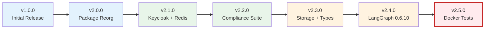

## Current Version

**Latest Release**: v2.7.0 (2025-10-17)
**Highlights**: Agentic loop implementation, Anthropic best practices (9.8/10 adherence), advanced enhancements

## Version Comparison Matrix

| Feature | v2.1 | v2.2 | v2.3 | v2.4 | v2.5 |
|---------|:----:|:----:|:----:|:----:|:----:|
| **Authentication & Sessions** | | | | | |
| Keycloak SSO Integration | ✅ | ✅ | ✅ | ✅ | ✅ |
| Redis Session Management | ✅ | ✅ | ✅ | ✅ | ✅ |
| Session Store Architecture | ✅ | ✅ | ✅ | ✅ | ✅ |
| Provider Pattern | ✅ | ✅ | ✅ | ✅ | ✅ |
| **Compliance & Security** | | | | | |
| GDPR Data Subject Rights | ❌ | ✅ | ✅ | ✅ | ✅ |
| SOC 2 Automation | ❌ | ✅ | ✅ | ✅ | ✅ |
| HIPAA Technical Safeguards | ❌ | ✅ | ✅ | ✅ | ✅ |
| SLA Monitoring (99.9%) | ❌ | ✅ | ✅ | ✅ | ✅ |
| Data Retention Policies | ❌ | ✅ | ✅ | ✅ | ✅ |
| Compliance Storage Backend | ❌ | ❌ | ✅ | ✅ | ✅ |
| **Testing & Quality** | | | | | |
| Unit Tests (437) | ✅ | ✅ | ✅ | ✅ | ✅ |
| Integration Tests | ✅ | ✅ | ✅ | ✅ | ✅ |
| Docker Integration Tests | ❌ | ❌ | ❌ | ❌ | ✅ |
| 100% Test Pass Rate | ❌ | ❌ | ❌ | ✅ | ✅ |
| Property-Based Testing | ✅ | ✅ | ✅ | ✅ | ✅ |
| Contract Testing | ✅ | ✅ | ✅ | ✅ | ✅ |
| **Documentation** | | | | | |
| Mintlify Docs (77 pages) | ✅ | ✅ | ✅ | ✅ | ✅ |
| Architecture Decision Records | 5 ADRs | 5 ADRs | 21 ADRs | 21 ADRs | 21 ADRs |
| **Core Features** | | | | | |
| LangGraph Version | 0.2.28 | 0.2.28 | 0.2.28 | 0.6.10 | 0.6.10 |
| Multi-LLM Support (LiteLLM) | ✅ | ✅ | ✅ | ✅ | ✅ |
| OpenFGA Authorization | ✅ | ✅ | ✅ | ✅ | ✅ |
| Pydantic Version | V1 | V1 | V2 | V2 | V2 |
| Type Safety Coverage | 27% | 27% | 64% | 64% | 64% |
| **Secrets Management** | | | | | |
| Infisical Integration | ✅ | ✅ | ✅ | ✅ | ✅ |
| Infisical Docker Builds | ❌ | ❌ | ❌ | ❌ | ✅ |
| 5 Installation Options | ❌ | ❌ | ❌ | ❌ | ✅ |
| **Deployment** | | | | | |
| Kubernetes/Helm/Kustomize | ✅ | ✅ | ✅ | ✅ | ✅ |
| Multi-Cloud (GKE/EKS/AKS) | ✅ | ✅ | ✅ | ✅ | ✅ |
| Docker Compose | ✅ | ✅ | ✅ | ✅ | ✅ |
| **Observability** | | | | | |
| OpenTelemetry + LangSmith | ✅ | ✅ | ✅ | ✅ | ✅ |
| Grafana Dashboards | 7 | 9 | 9 | 9 | 9 |
| Prometheus Alerts | Basic | 20+ SLA | 20+ SLA | 20+ SLA | 20+ SLA |

## Release Highlights

<CardGroup cols={2}>
  <Card title="v2.8.0 (Unreleased)" icon="flask" href="/releases/v2-8-0">
    Test coverage +35% + Infrastructure improvements
  </Card>
  <Card title="v2.7.0 (Latest)" icon="sparkles" href="/releases/v2-7-0">
    Agentic loop + Anthropic best practices (9.8/10)
  </Card>
  <Card title="v2.6.0" icon="rocket" href="/releases/v2-6-0">
    CI/CD fixes + Documentation improvements
  </Card>
  <Card title="v2.5.0" icon="flask" href="/releases/v2-5-0">
    Docker integration tests + Infisical builds
  </Card>
  <Card title="v2.4.0" icon="check" href="/releases/v2-4-0">
    LangGraph 0.6.10 + 100% test pass rate
  </Card>
  <Card title="v2.3.0" icon="database" href="/releases/v2-3-0">
    Storage backend + Pydantic V2
  </Card>
  <Card title="v2.2.0" icon="shield" href="/releases/v2-2-0">
    Enterprise compliance (GDPR/SOC2/HIPAA)
  </Card>
  <Card title="v2.1.0" icon="key" href="/releases/v2-1-0">
    Keycloak SSO + Production hardening
  </Card>
  <Card title="v2.0.0" icon="package" href="https://github.com/vishnu2kmohan/mcp-server-langgraph/releases/tag/v2.0.0">
    Package reorganization (breaking)
  </Card>
</CardGroup>

## Version Timeline



## Migration Guides

<AccordionGroup>
  <Accordion title="v2.7.0 → v2.8.0 (Unreleased - In Development)">
    **Status**: In Development (not yet released)

    **Planned Features**:
    - Test coverage improvements (+35% overall)
    - Docker-based integration testing infrastructure
    - 61 new comprehensive test cases

    **Note**: This version is currently in development. Current release is v2.7.0.
  </Accordion>

  <Accordion title="v2.3.0 → v2.4.0">
    **Breaking Changes**: None

    **New Features**:
    - LangGraph 0.6.10 (API compatible)
    - 100% test pass rate (437/437)
    - 21 comprehensive ADRs

    **Recommended Actions**:
    1. Update dependencies: `uv sync`
    2. Run tests: `make test`
    3. Review new ADRs for architectural guidance
  </Accordion>

  <Accordion title="v2.2.0 → v2.3.0">
    **Breaking Changes**: None (Pydantic V2 backward compatible)

    **New Features**:
    - Compliance storage backend (5 interfaces)
    - Pydantic V2 migration
    - Type safety enhanced (27% → 64%)

    **Recommended Actions**:
    1. Review Pydantic V2 changes if extending models
    2. Run type checks: `mypy src/`
    3. Test compliance storage integration
  </Accordion>

  <Accordion title="v2.1.0 → v2.2.0">
    **Breaking Changes**: None

    **New Features**:
    - GDPR/SOC2/HIPAA compliance automation
    - SLA monitoring with 20+ Prometheus alerts
    - 2 new Grafana dashboards

    **Recommended Actions**:
    1. Configure compliance settings in `.env`
    2. Import new Grafana dashboards
    3. Review Prometheus alert rules
    4. Set up data retention policies
  </Accordion>

  <Accordion title="v2.0.0 → v2.1.0">
    **Breaking Changes**: None (v2.0.0 was the breaking change)

    **New Features**:
    - Keycloak SSO integration
    - Redis session management
    - Kubernetes/Helm deployment infrastructure
    - 43 MDX documentation files

    **Recommended Actions**:
    1. Set up Keycloak if using SSO: `make setup-keycloak`
    2. Configure Redis for sessions
    3. Review Kubernetes deployment guides
  </Accordion>

  <Accordion title="v1.x → v2.0.0">
    **Breaking Changes**: ⚠️ Major package reorganization

    **Import Path Changes**:
    ```python
    # Before (v1.x)
    from config import settings
    from auth import AuthMiddleware

    # After (v2.x)
    from mcp_server_langgraph.core.config import settings
    from mcp_server_langgraph.auth.middleware import AuthMiddleware
    ```

    **Recommended Actions**:
    1. Update all imports to new structure
    2. Review migration guide in CHANGELOG
    3. Update CI/CD pipelines
    4. Test thoroughly before deploying
  </Accordion>
</AccordionGroup>

## Deprecation Schedule

| Feature | Deprecated In | Removed In | Alternative |
|---------|--------------|------------|-------------|
| HTTP/SSE Transport | v2.0.0 | v2.0.0 | StreamableHTTP transport |
| Pydantic V1 | v2.3.0 | v3.0.0 | Pydantic V2 models |

## Semantic Versioning

This project follows [Semantic Versioning 2.0.0](https://semver.org/):

- **MAJOR** (v2.x.x): Breaking changes (import paths, API changes)
- **MINOR** (vx.Y.x): New features (backward compatible)
- **PATCH** (vx.x.Z): Bug fixes (backward compatible)

## Support Policy

| Version | Status | Support Until | Security Fixes |
|---------|--------|---------------|----------------|
| v2.4.x | **Current** | Active | ✅ Yes |
| v2.3.x | Maintenance | 2025-04-13 | ✅ Yes |
| v2.2.x | Maintenance | 2025-04-13 | ✅ Yes |
| v2.1.x | Maintenance | 2025-04-12 | ✅ Yes |
| v2.0.x | End of Life | 2025-02-11 | ❌ No |
| v1.x | End of Life | 2025-01-10 | ❌ No |

## Getting Help

<CardGroup cols={2}>
  <Card title="CHANGELOG" icon="newspaper" href="https://github.com/vishnu2kmohan/mcp-server-langgraph/blob/main/CHANGELOG.md">
    Detailed release notes
  </Card>
  <Card title="GitHub Releases" icon="github" href="https://github.com/vishnu2kmohan/mcp-server-langgraph/releases">
    Download specific versions
  </Card>
  <Card title="Discussions" icon="comments" href="https://github.com/vishnu2kmohan/mcp-server-langgraph/discussions">
    Community support
  </Card>
  <Card title="Issues" icon="bug" href="https://github.com/vishnu2kmohan/mcp-server-langgraph/issues">
    Report bugs
  </Card>
</CardGroup>
