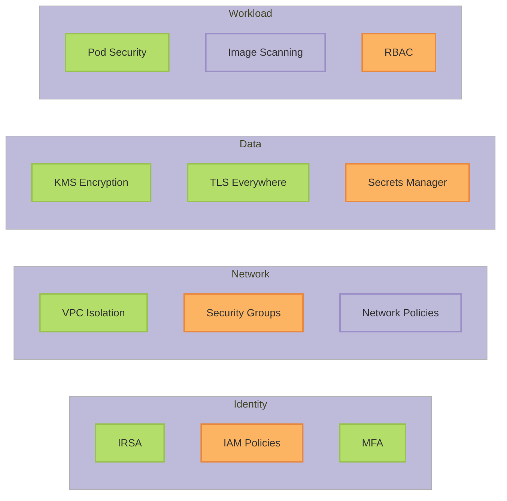

# AWS Security Hardening Guide

Complete security hardening framework for AWS EKS deployments with 50+ security controls across identity, network, data, and workload security.

## Security Framework Overview

<CardGroup cols={2}>
  <Card title="Identity & Access" icon="user-shield">
    IRSA, IAM policies, MFA, no long-lived keys
  </Card>
  <Card title="Network Security" icon="network-wired">
    VPC isolation, security groups, Network ACLs
  </Card>
  <Card title="Data Protection" icon="lock">
    Encryption at rest/transit, KMS, Secrets Manager
  </Card>
  <Card title="Compliance" icon="clipboard-check">
    CIS benchmarks, SOC 2, PCI DSS controls
  </Card>
</CardGroup>

### Security Maturity: 94/100


---

## 1. Identity & Access Management

### 1.1 IRSA (IAM Roles for Service Accounts)

<Check>**Use IRSA for all pod-to-AWS authentication**</Check>

```yaml
# Service account with IRSA annotation
apiVersion: v1
kind: ServiceAccount
metadata:
  name: mcp-server-langgraph
  namespace: mcp-server-langgraph
  annotations:
    eks.amazonaws.com/role-arn: arn:aws:iam::123456789012:role/mcp-langgraph-prod-application
```

**Benefits**:
- No long-lived IAM access keys
- Automatic credential rotation
- Least-privilege per service account
- Full audit trail in CloudTrail

**Implementation**:
```hcl
# terraform/modules/eks/irsa.tf
module "application_irsa" {
  source = "terraform-aws-modules/iam/aws//modules/iam-role-for-service-accounts-eks"

  role_name = "mcp-langgraph-prod-application"

  role_policy_arns = {
    secrets = aws_iam_policy.secrets_policy.arn
    cloudwatch = "arn:aws:iam::aws:policy/CloudWatchAgentServerPolicy"
  }

  oidc_providers = {
    main = {
      provider_arn               = module.eks.oidc_provider_arn
      namespace_service_accounts = ["mcp-server-langgraph:mcp-server-langgraph"]
    }
  }
}
```
### 1.2 IAM Policy Least Privilege

<Check>**Minimize IAM permissions to only what's required**</Check>

```json
{
  "Version": "2012-10-17",
  "Statement": [
    {
      "Effect": "Allow",
      "Action": [
        "secretsmanager:GetSecretValue",
        "secretsmanager:DescribeSecret"
      ],
      "Resource": "arn:aws:secretsmanager:us-east-1:123456789012:secret:mcp-langgraph/*"
    },
    {
      "Effect": "Allow",
      "Action": [
        "kms:Decrypt",
        "kms:DescribeKey"
      ],
      "Resource": "arn:aws:kms:us-east-1:123456789012:key/*",
      "Condition": {
        "StringEquals": {
          "kms:ViaService": "secretsmanager.us-east-1.amazonaws.com"
        }
      }
    }
  ]
}
```

**Testing**:
```bash
# Test IRSA permissions
kubectl run -it --rm aws-cli --image=amazon/aws-cli --restart=Never \
  --serviceaccount=mcp-server-langgraph \
  --namespace=mcp-server-langgraph \
  -- sts get-caller-identity

# Should show: Arn: arn:aws:sts::ACCOUNT:assumed-role/mcp-langgraph-prod-application/...
```
### 1.3 No Long-Lived Credentials

<Warning>
**Never use IAM access keys in pods**

- Don't create IAM users for applications
- Don't store access keys in Kubernetes secrets
- Don't use instance profiles (use IRSA instead)
</Warning>

<Check>**Audit for leaked credentials**</Check>

```bash
# Scan secrets for AWS credentials
kubectl get secrets -A -o json | \
  jq -r '.items[] | select(.data.AWS_ACCESS_KEY_ID != null) | .metadata.namespace + "/" + .metadata.name'

# Should return empty (no secrets with AWS keys)
```

### 1.4 MFA Enforcement

<Check>**Require MFA for human access to AWS Console**</Check>

```json
{
  "Version": "2012-10-17",
  "Statement": [
    {
      "Effect": "Deny",
      "NotAction": [
        "iam:CreateVirtualMFADevice",
        "iam:EnableMFADevice",
        "iam:ListMFADevices",
        "iam:ListUsers",
        "iam:ListVirtualMFADevices",
        "iam:ResyncMFADevice",
        "sts:GetSessionToken"
      ],
      "Resource": "*",
      "Condition": {
        "BoolIfExists": {
          "aws:MultiFactorAuthPresent": "false"
        }
      }
    }
  ]
}
```
---

## 2. Network Security

### 2.1 VPC Isolation

<Check>**All workloads in private subnets (no public IPs)**</Check>

```hcl
# terraform/modules/vpc/main.tf
resource "aws_subnet" "private" {
  count = length(var.private_subnet_cidrs)

  vpc_id            = aws_vpc.main.id
  cidr_block        = var.private_subnet_cidrs[count.index]
  availability_zone = var.availability_zones[count.index]

  map_public_ip_on_launch = false  # No public IPs

  tags = {
    Name                                        = "private-${var.availability_zones[count.index]}"
    "kubernetes.io/role/internal-elb"           = "1"
    "kubernetes.io/cluster/${var.cluster_name}" = "shared"
  }
}
```

**Verification**:
```bash
# Check pods have only private IPs
kubectl get pods -A -o wide

# No pod should have IP in public subnet ranges
```
### 2.2 Security Groups

<Check>**Minimize security group ingress rules**</Check>

```hcl
# EKS node security group
resource "aws_security_group" "node" {
  name_prefix = "${var.cluster_name}-node-"
  vpc_id      = var.vpc_id

  # Allow nodes to communicate with each other
  ingress {
    from_port   = 0
    to_port     = 0
    protocol    = "-1"
    self        = true
    description = "Node-to-node communication"
  }

  # Allow control plane to communicate with nodes
  ingress {
    from_port       = 1025
    to_port         = 65535
    protocol        = "tcp"
    security_groups = [aws_security_group.cluster.id]
    description     = "Control plane to node"
  }

  # Allow all outbound
  egress {
    from_port   = 0
    to_port     = 0
    protocol    = "-1"
    cidr_blocks = ["0.0.0.0/0"]
    description = "Allow all outbound"
  }
}
```

**RDS Security Group**:
```hcl
resource "aws_security_group" "rds" {
  name_prefix = "${var.identifier_prefix}-rds-"
  vpc_id      = var.vpc_id

  # Only allow from EKS nodes
  ingress {
    from_port       = 5432
    to_port         = 5432
    protocol        = "tcp"
    security_groups = [var.eks_node_security_group_id]
    description     = "PostgreSQL from EKS nodes"
  }

  # No egress (database doesn't initiate outbound connections)
}
```
### 2.3 Network Policies

<Check>**Enforce pod-to-pod network policies**</Check>

```yaml
# Default deny all ingress
apiVersion: networking.k8s.io/v1
kind: NetworkPolicy
metadata:
  name: default-deny-ingress
  namespace: mcp-server-langgraph
spec:
  podSelector: {}
  policyTypes:
  - Ingress

---
# Allow from same namespace only
apiVersion: networking.k8s.io/v1
kind: NetworkPolicy
metadata:
  name: allow-same-namespace
  namespace: mcp-server-langgraph
spec:
  podSelector: {}
  policyTypes:
  - Ingress
  ingress:
  - from:
    - podSelector: {}

---
# Allow from ingress controller
apiVersion: networking.k8s.io/v1
kind: NetworkPolicy
metadata:
  name: allow-from-ingress
  namespace: mcp-server-langgraph
spec:
  podSelector:
    matchLabels:
      app: mcp-server-langgraph
  policyTypes:
  - Ingress
  ingress:
  - from:
    - namespaceSelector:
        matchLabels:
          name: ingress-nginx
    ports:
    - protocol: TCP
      port: 8080
```

### 2.4 VPC Endpoints

<Check>**Use VPC endpoints to keep AWS API traffic private**</Check>

```hcl
# S3 Gateway Endpoint (free)
resource "aws_vpc_endpoint" "s3" {
  vpc_id       = aws_vpc.main.id
  service_name = "com.amazonaws.${var.region}.s3"

  route_table_ids = aws_route_table.private[*].id

  tags = {
    Name = "${var.vpc_name}-s3-endpoint"
  }
}

# ECR API Endpoint
resource "aws_vpc_endpoint" "ecr_api" {
  vpc_id              = aws_vpc.main.id
  service_name        = "com.amazonaws.${var.region}.ecr.api"
  vpc_endpoint_type   = "Interface"
  subnet_ids          = aws_subnet.private[*].id
  security_group_ids  = [aws_security_group.vpc_endpoints.id]
  private_dns_enabled = true
}
```

**Benefits**:
- Traffic stays on AWS backbone (no internet)
- ~70% cost savings on data transfer
- Better security (no NAT gateway for AWS APIs)

---

## 3. Data Protection

### 3.1 Encryption at Rest

<Check>**Enable KMS encryption for all data stores**</Check>

**EKS Secrets Encryption**:
```hcl
resource "aws_kms_key" "eks" {
  description             = "EKS secrets encryption key"
  enable_key_rotation     = true
  deletion_window_in_days = 30

  policy = jsonencode({
    Version = "2012-10-17"
    Statement = [
      {
        Effect = "Allow"
        Principal = {
          Service = "eks.amazonaws.com"
        }
        Action = [
          "kms:Decrypt",
          "kms:DescribeKey"
        ]
        Resource = "*"
      }
    ]
  })
}

resource "aws_eks_cluster" "main" {
  encryption_config {
    provider {
      key_arn = aws_kms_key.eks.arn
    }
    resources = ["secrets"]
  }
}
```

**RDS Encryption**:
```hcl
resource "aws_db_instance" "main" {
  storage_encrypted   = true
  kms_key_id          = aws_kms_key.rds.arn
  # ... other config
}
```

**ElastiCache Encryption**:
```hcl
resource "aws_elasticache_replication_group" "main" {
  at_rest_encryption_enabled = true
  kms_key_id                 = aws_kms_key.elasticache.arn
  # ... other config
}
```

### 3.2 Encryption in Transit

<Check>**Enforce TLS for all network communication**</Check>

**RDS TLS**:
```hcl
resource "aws_db_parameter_group" "main" {
  parameter {
    name  = "rds.force_ssl"
    value = "1"
  }
}
```

**ElastiCache TLS**:
```hcl
resource "aws_elasticache_replication_group" "main" {
  transit_encryption_enabled = true
  auth_token_enabled         = true
  # ... other config
}
```

**Application TLS**:
```yaml
apiVersion: v1
kind: Service
metadata:
  name: mcp-server-langgraph
  annotations:
    service.beta.kubernetes.io/aws-load-balancer-ssl-cert: arn:aws:acm:REGION:ACCOUNT:certificate/CERT_ID
    service.beta.kubernetes.io/aws-load-balancer-backend-protocol: http
    service.beta.kubernetes.io/aws-load-balancer-ssl-ports: "443"
spec:
  type: LoadBalancer
  ports:
  - port: 443
    targetPort: 8080
    protocol: TCP
```
### 3.3 Secrets Management

<Check>**Store all secrets in AWS Secrets Manager**</Check>

```bash
# Create secret
aws secretsmanager create-secret \
  --name mcp-langgraph/api-keys \
  --secret-string '{"OPENAI_API_KEY":"sk-...","ANTHROPIC_API_KEY":"sk-ant-..."}'

# Retrieve in application (Python)
import boto3
import json

client = boto3.client('secretsmanager')
response = client.get_secret_value(SecretId='mcp-langgraph/api-keys')
secrets = json.loads(response['SecretString'])
```

**Using External Secrets Operator**:
```yaml
apiVersion: external-secrets.io/v1beta1
kind: SecretStore
metadata:
  name: aws-secrets-manager
  namespace: mcp-server-langgraph
spec:
  provider:
    aws:
      service: SecretsManager
      region: us-east-1
      auth:
        jwt:
          serviceAccountRef:
            name: mcp-server-langgraph

---
apiVersion: external-secrets.io/v1beta1
kind: ExternalSecret
metadata:
  name: api-keys
  namespace: mcp-server-langgraph
spec:
  refreshInterval: 1h
  secretStoreRef:
    name: aws-secrets-manager
    kind: SecretStore
  target:
    name: api-keys
  data:
  - secretKey: OPENAI_API_KEY
    remoteRef:
      key: mcp-langgraph/api-keys
      property: OPENAI_API_KEY
```

### 3.4 Key Rotation

<Check>**Enable automatic KMS key rotation**</Check>

```hcl
resource "aws_kms_key" "main" {
  description             = "Application encryption key"
  enable_key_rotation     = true  # Automatic annual rotation
  deletion_window_in_days = 30

  tags = {
    Name = "mcp-langgraph-prod"
  }
}
```

**Manual secret rotation**:
```bash
# Rotate database password
NEW_PASSWORD=$(openssl rand -base64 32)

# Update in Secrets Manager
aws secretsmanager update-secret \
  --secret-id mcp-langgraph/database \
  --secret-string "{\"password\":\"$NEW_PASSWORD\"}"

# Update in RDS
aws rds modify-db-instance \
  --db-instance-identifier mcp-langgraph-prod \
  --master-user-password "$NEW_PASSWORD" \
  --apply-immediately

# Restart pods to pick up new secret
kubectl rollout restart deployment mcp-server-langgraph -n mcp-server-langgraph
```
---

## 4. Workload Security

### 4.1 Pod Security Standards

<Check>**Enforce restricted Pod Security Standards**</Check>

```bash
# Label namespace
kubectl label namespace mcp-server-langgraph \
  pod-security.kubernetes.io/enforce=restricted \
  pod-security.kubernetes.io/audit=restricted \
  pod-security.kubernetes.io/warn=restricted
```

**Compliant Pod Spec**:
```yaml
apiVersion: v1
kind: Pod
metadata:
  name: mcp-server
spec:
  securityContext:
    runAsNonRoot: true
    runAsUser: 1000
    fsGroup: 1000
    seccompProfile:
      type: RuntimeDefault

  containers:
  - name: app
    image: mcp-server-langgraph:latest
    securityContext:
      allowPrivilegeEscalation: false
      readOnlyRootFilesystem: true
      capabilities:
        drop:
        - ALL

    volumeMounts:
    - name: tmp
      mountPath: /tmp

  volumes:
  - name: tmp
    emptyDir: {}
```

### 4.2 Image Security

<Check>**Scan container images for vulnerabilities**</Check>

**Enable ECR Image Scanning**:
```hcl
resource "aws_ecr_repository" "main" {
  name                 = "mcp-server-langgraph"
  image_tag_mutability = "IMMUTABLE"

  image_scanning_configuration {
    scan_on_push = true
  }

  encryption_configuration {
    encryption_type = "KMS"
    kms_key         = aws_kms_key.ecr.arn
  }
}
```

**Check scan results**:
```bash
# Get scan findings
aws ecr describe-image-scan-findings \
  --repository-name mcp-server-langgraph \
  --image-id imageTag=v1.0.0 \
  --query 'imageScanFindings.findingSeverityCounts'

# Block deployment if critical vulnerabilities found
```
### 4.3 RBAC

<Check>**Implement least-privilege RBAC**</Check>

```yaml
apiVersion: rbac.authorization.k8s.io/v1
kind: Role
metadata:
  name: mcp-server-role
  namespace: mcp-server-langgraph
rules:
- apiGroups: [""]
  resources: ["secrets", "configmaps"]
  verbs: ["get", "list"]
- apiGroups: [""]
  resources: ["pods"]
  verbs: ["get", "list"]

---
apiVersion: rbac.authorization.k8s.io/v1
kind: RoleBinding
metadata:
  name: mcp-server-rolebinding
  namespace: mcp-server-langgraph
subjects:
- kind: ServiceAccount
  name: mcp-server-langgraph
roleRef:
  kind: Role
  name: mcp-server-role
  apiGroup: rbac.authorization.k8s.io
```

---

## 5. Audit & Compliance

### 5.1 CloudTrail

<Check>**Enable CloudTrail for all regions**</Check>

```hcl
resource "aws_cloudtrail" "main" {
  name                          = "mcp-langgraph-audit"
  s3_bucket_name                = aws_s3_bucket.cloudtrail.bucket
  include_global_service_events = true
  is_multi_region_trail         = true
  enable_log_file_validation    = true

  event_selector {
    read_write_type           = "All"
    include_management_events = true

    data_resource {
      type   = "AWS::S3::Object"
      values = ["arn:aws:s3:::mcp-langgraph-*/*"]
    }
  }
}
```

### 5.2 GuardDuty

<Check>**Enable GuardDuty for threat detection**</Check>

```hcl
resource "aws_guardduty_detector" "main" {
  enable = true

  datasources {
    s3_logs {
      enable = true
    }
    kubernetes {
      audit_logs {
        enable = true
      }
    }
  }
}
```

### 5.3 Config Rules

<Check>**Enable AWS Config for compliance**</Check>

```hcl
resource "aws_config_configuration_recorder" "main" {
  name     = "mcp-langgraph-config"
  role_arn = aws_iam_role.config.arn

  recording_group {
    all_supported = true
  }
}

resource "aws_config_config_rule" "encrypted_volumes" {
  name = "encrypted-volumes"

  source {
    owner             = "AWS"
    source_identifier = "ENCRYPTED_VOLUMES"
  }

  depends_on = [aws_config_configuration_recorder.main]
}
```

---

## Security Checklist

<AccordionGroup>
  <Accordion title="Identity & Access (10 controls)">
    <Check>IRSA configured for all service accounts</Check>
    <Check>No IAM access keys in pods</Check>
    <Check>IAM policies follow least privilege</Check>
    <Check>MFA required for console access</Check>
    <Check>Service account tokens auto-mounted only when needed</Check>
    <Check>IAM roles tagged with owner</Check>
    <Check>AWS Organizations SCPs applied</Check>
    <Check>Root account secured with MFA</Check>
    <Check>IAM password policy enforced</Check>
    <Check>CloudTrail enabled and monitored</Check>
  </Accordion>

  <Accordion title="Network Security (12 controls)">
    <Check>All pods in private subnets</Check>
    <Check>Security groups follow least privilege</Check>
    <Check>Network policies applied to all namespaces</Check>
    <Check>VPC Flow Logs enabled</Check>
    <Check>VPC endpoints for AWS services</Check>
    <Check>NAT gateways in multiple AZs</Check>
    <Check>No public RDS/ElastiCache endpoints</Check>
    <Check>Private EKS API endpoint option available</Check>
    <Check>Network ACLs configured (if used)</Check>
    <Check>AWS WAF on load balancer (if public)</Check>
    <Check>DDoS protection via Shield Standard</Check>
    <Check>Route53 DNSSEC enabled (if used)</Check>
  </Accordion>

  <Accordion title="Data Protection (10 controls)">
    <Check>KMS encryption for EKS secrets</Check>
    <Check>RDS encrypted at rest</Check>
    <Check>ElastiCache encrypted at rest</Check>
    <Check>S3 buckets encrypted</Check>
    <Check>EBS volumes encrypted</Check>
    <Check>TLS enforced for RDS</Check>
    <Check>TLS enforced for ElastiCache</Check>
    <Check>TLS enforced for application endpoints</Check>
    <Check>KMS key rotation enabled</Check>
    <Check>Secrets in AWS Secrets Manager (not code)</Check>
  </Accordion>

  <Accordion title="Workload Security (8 controls)">
    <Check>Pod Security Standards enforced (restricted)</Check>
    <Check>ECR image scanning enabled</Check>
    <Check>No privileged containers</Check>
    <Check>Read-only root filesystems</Check>
    <Check>Non-root user in containers</Check>
    <Check>RBAC configured with least privilege</Check>
    <Check>Resource limits on all pods</Check>
    <Check>Admission webhooks (e.g., OPA/Gatekeeper)</Check>
  </Accordion>

  <Accordion title="Monitoring & Logging (10 controls)">
    <Check>CloudWatch Container Insights enabled</Check>
    <Check>EKS control plane logs enabled</Check>
    <Check>CloudTrail logging all API calls</Check>
    <Check>VPC Flow Logs enabled</Check>
    <Check>RDS Enhanced Monitoring enabled</Check>
    <Check>ElastiCache slow log enabled</Check>
    <Check>GuardDuty enabled</Check>
    <Check>Security Hub enabled</Check>
    <Check>CloudWatch alarms for security events</Check>
    <Check>Log retention policies configured</Check>
  </Accordion>
</AccordionGroup>

---

## Compliance Mapping

### CIS AWS Foundations Benchmark

| Control | Implementation | Status |
|---------|----------------|--------|
| 1.12 - Root account MFA | AWS Console enforcement | ✅ |
| 2.1.1 - S3 bucket encryption | KMS encryption enforced | ✅ |
| 2.3.1 - RDS encryption | Enabled in terraform | ✅ |
| 3.1 - CloudTrail enabled | Multi-region trail | ✅ |
| 4.1 - Security groups | Least-privilege rules | ✅ |
| 5.1 - Network ACLs | Default allow (using SGs) | ⚠️ |

### SOC 2 Controls

| Control | AWS Service | Implementation |
|---------|-------------|----------------|
| CC6.1 - Logical access | IAM + IRSA | Role-based access, MFA |
| CC6.6 - Encryption | KMS | At rest + in transit |
| CC7.2 - Monitoring | CloudWatch | Logs + metrics + alarms |
| CC8.1 - Change management | CloudTrail | All API calls logged |

---

## Related Documentation

<CardGroup cols={2}>
  <Card title="EKS Production" icon="kubernetes" href="/deployment/kubernetes/eks-production">
    Production deployment guide
  </Card>
  <Card title="Terraform AWS" icon="code" href="/deployment/infrastructure/terraform-aws">
    Infrastructure documentation
  </Card>
  <Card title="EKS Runbooks" icon="book" href="/deployment/operations/eks-runbooks">
    Operational procedures
  </Card>
  <Card title="Compliance" icon="clipboard-check" href="/security/compliance">
    Compliance framework
  </Card>
</CardGroup>
