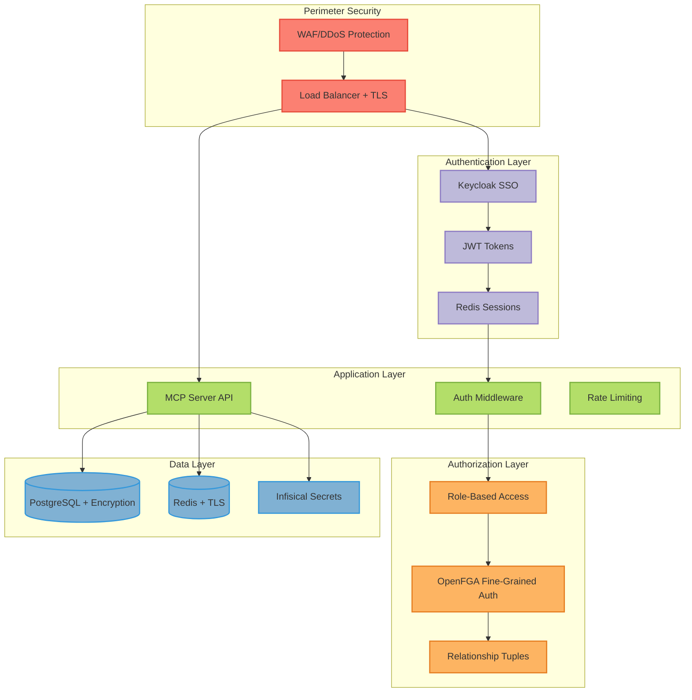

## Overview

The MCP Server with LangGraph implements **defense-in-depth** security with multiple layers of protection. This guide covers the security architecture, threat model, and mitigation strategies.

<Warning>
Security is **everyone's responsibility**. Follow all security best practices and stay informed about vulnerabilities.
</Warning>

## Security Architecture



## Defense-in-Depth Layers

<Tabs>
  <Tab title="Layer 1: Network">
    **Network Security**

    - TLS 1.3 encryption in transit
    - mTLS between services
    - Network policies (Kubernetes)
    - VPC isolation
    - DDoS protection
    - WAF rules

    ```yaml
    # Network Policy
    apiVersion: networking.k8s.io/v1
    kind: NetworkPolicy
    metadata:
      name: mcp-server-langgraph
    spec:
      podSelector:
        matchLabels:
          app: mcp-server-langgraph
      policyTypes:
      - Ingress
      - Egress
      ingress:
      - from:
        - podSelector:
            matchLabels:
              app: nginx-ingress
        ports:
        - protocol: TCP
          port: 8000
      egress:
      - to:
        - podSelector:
            matchLabels:
              app: postgres
        ports:
        - protocol: TCP
          port: 5432
    ```
  </Tab>

  <Tab title="Layer 2: Authentication">
    **Identity & Authentication**

    - Keycloak SSO (OIDC/OAuth2)
    - Multi-factor authentication (MFA)
    - JWT with short expiry (1 hour)
    - Refresh tokens (7 days)
    - Session management
    - Password policies

    ```python
    # JWT validation
    from mcp_server_langgraph.auth.middleware import AuthMiddleware

    middleware = AuthMiddleware()
    user = await middleware.verify_token(token)

    # MFA enforcement
    if not user.has_mfa_enabled():
        raise AuthenticationError("MFA required")
    ```
  </Tab>

  <Tab title="Layer 3: Authorization">
    **Access Control**

    - Role-Based Access Control (RBAC)
    - Fine-Grained Authorization (OpenFGA)
    - Principle of least privilege
    - Resource-level permissions
    - Audit logging

    ```python
    # Check permission
    allowed = await openfga_client.check_permission(
        user=f"user:{user_id}",
        relation="executor",
        object="tool:chat"
    )

    if not allowed:
        raise PermissionError("Access denied")
    ```
  </Tab>

  <Tab title="Layer 4: Application">
    **Application Security**

    - Input validation
    - Output encoding
    - Rate limiting
    - CORS policies
    - Content Security Policy
    - Secure headers

    ```python
    # Input validation
    from pydantic import BaseModel, validator

    class MessageRequest(BaseModel):
        query: str

        @validator('query')
        def validate_query(cls, v):
            if len(v) > 10000:
                raise ValueError("Query too long")
            return v.strip()
    ```
  </Tab>

  <Tab title="Layer 5: Data">
    **Data Security**

    - Encryption at rest (AES-256)
    - Encryption in transit (TLS 1.3)
    - Database encryption
    - Secret management (Infisical)
    - Data masking
    - Secure deletion

    ```yaml
    # PostgreSQL encryption
    ssl: on
    ssl_ciphers: 'HIGH:!aNULL:!MD5'
    ssl_prefer_server_ciphers: on
    ssl_min_protocol_version: 'TLSv1.3'
    ```
  </Tab>
</Tabs>

## Threat Model

### STRIDE Analysis

<CardGroup cols={2}>
  <Card title="Spoofing" icon="user-secret">
    **Threats**:
    - Fake authentication tokens
    - Session hijacking
    - Identity theft

    **Mitigations**:
    - JWT signature verification
    - JWKS rotation
    - Secure session cookies
    - MFA enforcement
  </Card>

  <Card title="Tampering" icon="pen-to-square">
    **Threats**:
    - Request manipulation
    - Token modification
    - Database injection

    **Mitigations**:
    - Input validation
    - Parameterized queries
    - JWT signature checks
    - Integrity checks
  </Card>

  <Card title="Repudiation" icon="undo">
    **Threats**:
    - Denied actions
    - Missing audit trail
    - Log tampering

    **Mitigations**:
    - Comprehensive logging
    - Immutable audit logs
    - Digital signatures
    - Centralized logging
  </Card>

  <Card title="Information Disclosure" icon="eye">
    **Threats**:
    - Data leaks
    - Credential exposure
    - PII disclosure

    **Mitigations**:
    - Data encryption
    - Secret management
    - Access controls
    - Data masking
  </Card>

  <Card title="Denial of Service" icon="ban">
    **Threats**:
    - Resource exhaustion
    - DDoS attacks
    - API flooding

    **Mitigations**:
    - Rate limiting
    - Auto-scaling
    - WAF rules
    - Circuit breakers
  </Card>

  <Card title="Elevation of Privilege" icon="arrow-up">
    **Threats**:
    - Privilege escalation
    - Role manipulation
    - Authorization bypass

    **Mitigations**:
    - Fine-grained permissions
    - Least privilege principle
    - Regular audits
    - Permission boundaries
  </Card>
</CardGroup>

## Authentication Security

### JWT Security

**Token Structure**:
```json
{
  "header": {
    "alg": "RS256",
    "typ": "JWT",
    "kid": "key-2025-10"
  },
  "payload": {
    "sub": "user-123",
    "iss": "https://keycloak.yourdomain.com/realms/langgraph",
    "aud": "mcp-server-langgraph",
    "exp": 1728737200,
    "iat": 1728733600,
    "roles": ["user", "chat-executor"],
    "session_id": "sess_abc123"
  }
}
```

**Security Measures**:
- RS256 algorithm (asymmetric)
- Short expiry (1 hour)
- Audience validation
- Issuer validation
- Key rotation (monthly)

### Session Security

```python
# Secure session configuration
SESSION_COOKIE_SECURE = True      # HTTPS only
SESSION_COOKIE_HTTPONLY = True    # No JavaScript access
SESSION_COOKIE_SAMESITE = "Strict"  # CSRF protection
SESSION_TTL = 3600                # 1 hour
SESSION_SLIDING_WINDOW = True     # Extend on activity
SESSION_MAX_CONCURRENT = 3        # Limit sessions per user
```

**Session Fixation Protection**:
```python
# Regenerate session ID on login
async def login(username: str, password: str):
    user = await authenticate(username, password)

    # Delete old sessions
    await session_mgr.delete_user_sessions(user.id)

    # Create new session
    session = await session_mgr.create_session(
        user_id=user.id,
        metadata={"login_time": datetime.utcnow()}
    )

    return session
```

## Authorization Security

### Principle of Least Privilege

**Default Deny**:
```python
# Deny by default, explicit allow
async def check_access(user_id: str, resource: str, action: str):
    # Check explicit permission
    allowed = await openfga_client.check_permission(
        user=f"user:{user_id}",
        relation=action,
        object=resource
    )

    if not allowed:
        logger.warning(f"Access denied: {user_id} -> {action} {resource}")
        raise PermissionError("Access denied")

    return True
```

**Role Hierarchies**:
```typescript
// OpenFGA model
type organization
  relations
    define admin: [user]
    define member: [user] or admin    // Admins are members
    define viewer: [user] or member   // Members are viewers
```

### Permission Boundaries

```python
# Enforce organization boundaries
async def check_org_access(user_id: str, resource_id: str):
    # Get user's organization
    user_orgs = await openfga_client.list_objects(
        user=f"user:{user_id}",
        relation="member",
        object_type="organization"
    )

    # Get resource's organization
    resource_org = await get_resource_org(resource_id)

    # Verify match
    if resource_org not in user_orgs:
        raise PermissionError("Cross-organization access denied")
```

## Data Security

### Encryption at Rest

**Database Encryption**:
```yaml
# PostgreSQL with encryption
apiVersion: v1
kind: PersistentVolumeClaim
metadata:
  name: postgres-data
spec:
  storageClassName: encrypted-gp3
  accessModes:
    - ReadWriteOnce
  resources:
    requests:
      storage: 100Gi
```

**Application-Level Encryption**:
```python
from cryptography.fernet import Fernet

class EncryptedField:
    """Encrypt sensitive fields before storing"""

    def __init__(self, key: bytes):
        self.cipher = Fernet(key)

    def encrypt(self, value: str) -> str:
        return self.cipher.encrypt(value.encode()).decode()

    def decrypt(self, value: str) -> str:
        return self.cipher.decrypt(value.encode()).decode()

# Usage
cipher = EncryptedField(settings.encryption_key)
user.email = cipher.encrypt("alice@example.com")
```

### Encryption in Transit

**TLS Configuration**:
```yaml
# Ingress with TLS
apiVersion: networking.k8s.io/v1
kind: Ingress
metadata:
  name: mcp-server-langgraph
  annotations:
    cert-manager.io/cluster-issuer: letsencrypt-prod
    nginx.ingress.kubernetes.io/ssl-redirect: "true"
    nginx.ingress.kubernetes.io/force-ssl-redirect: "true"
spec:
  tls:
  - hosts:
    - api.yourdomain.com
    secretName: langgraph-tls
  rules:
  - host: api.yourdomain.com
    http:
      paths:
      - path: /
        pathType: Prefix
        backend:
          service:
            name: mcp-server-langgraph
            port:
              number: 8000
```

**mTLS Between Services**:
```yaml
# Service mesh (Istio)
apiVersion: security.istio.io/v1beta1
kind: PeerAuthentication
metadata:
  name: default
spec:
  mtls:
    mode: STRICT
```

### Secret Management

**Infisical Integration**:
```python
from mcp_server_langgraph.core.config import settings

# Secrets automatically loaded from Infisical
api_key = settings.anthropic_api_key  # Never hardcoded
db_password = settings.redis_password  # Never in Git
```

**Kubernetes Secrets**:
```yaml
# External Secrets Operator
apiVersion: external-secrets.io/v1beta1
kind: ExternalSecret
metadata:
  name: langgraph-secrets
spec:
  refreshInterval: 1h
  secretStoreRef:
    name: infisical
    kind: SecretStore
  target:
    name: mcp-server-langgraph-secrets
  data:
  - secretKey: ANTHROPIC_API_KEY
    remoteRef:
      key: ANTHROPIC_API_KEY
```

## Application Security

### Input Validation

```python
from pydantic import BaseModel, validator, constr
from typing import Optional

class MessageRequest(BaseModel):
    query: constr(min_length=1, max_length=10000)
    conversation_id: Optional[str] = None

    @validator('query')
    def sanitize_query(cls, v):
        # Remove potential injection attempts
        if any(char in v for char in ['<', '>', ';', '--']):
            raise ValueError("Invalid characters in query")
        return v.strip()

    @validator('conversation_id')
    def validate_conversation_id(cls, v):
        if v and not v.startswith('conv_'):
            raise ValueError("Invalid conversation ID format")
        return v
```

### SQL Injection Prevention

```python
# NEVER do this
query = f"SELECT * FROM users WHERE username = '{username}'"  # VULNERABLE

# Always use parameterized queries
query = "SELECT * FROM users WHERE username = %s"
cursor.execute(query, (username,))  # SAFE
```

### XSS Prevention

```python
from html import escape

def sanitize_output(text: str) -> str:
    """Escape HTML to prevent XSS"""
    return escape(text)

# Output encoding
response = {
    "message": sanitize_output(user_input)
}
```

### CSRF Protection

```python
# CSRF token validation
from fastapi import Depends, HTTPException
from fastapi.security import HTTPBearer

security = HTTPBearer()

async def verify_csrf(
    token: str = Depends(security),
    session: Session = Depends(get_session)
):
    if not session.csrf_token:
        raise HTTPException(403, "CSRF token missing")

    if token != session.csrf_token:
        raise HTTPException(403, "CSRF token invalid")
```

### Rate Limiting

```python
from slowapi import Limiter
from slowapi.util import get_remote_address

limiter = Limiter(key_func=get_remote_address)

@app.post("/message")
@limiter.limit("100/minute")
async def send_message(request: Request):
    # Process message
    pass
```

## Security Headers

```python
from fastapi.middleware.cors import CORSMiddleware
from fastapi.middleware.trustedhost import TrustedHostMiddleware

app = FastAPI()

# CORS
app.add_middleware(
    CORSMiddleware,
    allow_origins=["https://yourdomain.com"],
    allow_credentials=True,
    allow_methods=["GET", "POST"],
    allow_headers=["Authorization", "Content-Type"],
)

# Trusted hosts
app.add_middleware(
    TrustedHostMiddleware,
    allowed_hosts=["yourdomain.com", "*.yourdomain.com"]
)

# Security headers
@app.middleware("http")
async def add_security_headers(request, call_next):
    response = await call_next(request)
    response.headers["X-Content-Type-Options"] = "nosniff"
    response.headers["X-Frame-Options"] = "DENY"
    response.headers["X-XSS-Protection"] = "1; mode=block"
    response.headers["Strict-Transport-Security"] = "max-age=31536000; includeSubDomains"
    response.headers["Content-Security-Policy"] = "default-src 'self'"
    response.headers["Referrer-Policy"] = "strict-origin-when-cross-origin"
    response.headers["Permissions-Policy"] = "geolocation=(), microphone=(), camera=()"
    return response
```

## Audit Logging

### What to Log

<AccordionGroup>
  <Accordion title="Authentication Events" icon="key">
    - Login attempts (success/failure)
    - Logout events
    - Token generation
    - MFA challenges
    - Password changes
    - Account lockouts

    ```python
    logger.security(
        "login_success",
        user_id=user.id,
        username=user.username,
        ip_address=request.client.host,
        user_agent=request.headers.get("user-agent"),
        timestamp=datetime.utcnow()
    )
    ```
  </Accordion>

  <Accordion title="Authorization Events" icon="shield">
    - Permission checks (allowed/denied)
    - Role changes
    - Permission grants/revokes
    - Privilege escalation attempts

    ```python
    logger.security(
        "permission_denied",
        user_id=user.id,
        action="executor",
        resource="tool:chat",
        reason="no_permission",
        timestamp=datetime.utcnow()
    )
    ```
  </Accordion>

  <Accordion title="Data Access" icon="database">
    - Sensitive data access
    - Data modifications
    - Export operations
    - Deletion events

    ```python
    logger.audit(
        "data_export",
        user_id=user.id,
        resource_type="conversations",
        record_count=100,
        timestamp=datetime.utcnow()
    )
    ```
  </Accordion>

  <Accordion title="Administrative Actions" icon="user-shield">
    - User creation/deletion
    - Configuration changes
    - Permission model updates
    - System configuration

    ```python
    logger.audit(
        "user_created",
        admin_user_id=admin.id,
        new_user_id=new_user.id,
        roles=new_user.roles,
        timestamp=datetime.utcnow()
    )
    ```
  </Accordion>
</AccordionGroup>

### Secure Logging

```python
import structlog

# Structured logging
logger = structlog.get_logger()

# Mask sensitive data
def mask_sensitive(data: dict) -> dict:
    masked = data.copy()
    for key in ['password', 'token', 'api_key', 'secret']:
        if key in masked:
            masked[key] = '***REDACTED***'
    return masked

# Log with context
logger.info(
    "api_request",
    **mask_sensitive({
        "user_id": user.id,
        "endpoint": "/message",
        "params": request_data
    })
)
```

## Compliance

### GDPR Compliance

```python
# Right to erasure
async def delete_user_data(user_id: str):
    """Permanently delete all user data"""

    # Delete from databases
    await db.delete_user(user_id)
    await db.delete_conversations(user_id)
    await db.delete_sessions(user_id)

    # Remove from OpenFGA
    tuples = await openfga_client.read_tuples(user=f"user:{user_id}")
    await openfga_client.delete_tuples(tuples)

    # Anonymize logs
    await anonymize_logs(user_id)

    logger.audit("gdpr_data_deletion", user_id=user_id)
```

### SOC 2 Controls

- Access controls (AC)
- Change management (CM)
- Logical security (LS)
- Operations (OP)
- Risk management (RM)

**Evidence Collection**:
```python
# Automated evidence collection
async def collect_compliance_evidence():
    evidence = {
        "access_reviews": await get_access_reviews(),
        "security_patches": await get_patch_status(),
        "audit_logs": await get_audit_summary(),
        "backup_tests": await get_dr_test_results(),
        "vulnerability_scans": await get_scan_results()
    }

    await store_evidence(evidence)
```

## Vulnerability Management

### Dependency Scanning

```yaml
# .github/workflows/security-scan.yml
name: Security Scan
on: [push, pull_request]

jobs:
  scan:
    runs-on: ubuntu-latest
    steps:
    - uses: actions/checkout@v3

    - name: Run Trivy
      uses: aquasecurity/trivy-action@master
      with:
        scan-type: 'fs'
        scan-ref: '.'
        severity: 'CRITICAL,HIGH'

    - name: Run Bandit
      run: |
        pip install bandit
        bandit -r src/ -f json -o bandit-report.json

    - name: Run Safety
      run: |
        pip install safety
        safety check --json
```

### Container Scanning

```bash
# Scan Docker images
trivy image openfga/openfga:latest
trivy image bitnami/keycloak:latest

# Scan for vulnerabilities
grype mcp-server-langgraph:latest
```

## Incident Response

### Incident Response Plan

<Steps>
  <Step title="Detection">
    - Monitor security alerts
    - Review audit logs
    - Analyze anomalies
  </Step>

  <Step title="Containment">
    - Isolate affected systems
    - Revoke compromised credentials
    - Block malicious IPs
  </Step>

  <Step title="Investigation">
    - Collect forensic data
    - Analyze attack vectors
    - Identify scope
  </Step>

  <Step title="Eradication">
    - Remove malware
    - Patch vulnerabilities
    - Reset credentials
  </Step>

  <Step title="Recovery">
    - Restore from backups
    - Verify system integrity
    - Resume operations
  </Step>

  <Step title="Lessons Learned">
    - Document incident
    - Update procedures
    - Implement preventions
  </Step>
</Steps>

### Security Contacts

```yaml
# security-contacts.yaml
security_team:
  email: security@company.com
  pagerduty: security-team
  slack: #security-incidents

escalation:
  level_1: security-engineer
  level_2: security-manager
  level_3: ciso
```

## Next Steps

<CardGroup cols={2}>
  <Card title="Security Best Practices" icon="shield-check" href="/security/best-practices">
    Implement security controls
  </Card>
  <Card title="Authentication" icon="key" href="/getting-started/authentication">
    Configure authentication
  </Card>
  <Card title="Authorization" icon="shield" href="/getting-started/authorization">
    Set up authorization
  </Card>
  <Card title="Production Checklist" icon="clipboard-check" href="/deployment/production-checklist">
    Security requirements
  </Card>
</CardGroup>

---

<Check>
**Defense-in-Depth**: Multi-layered security protects your MCP Server at every level!
</Check>
